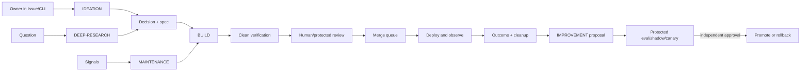
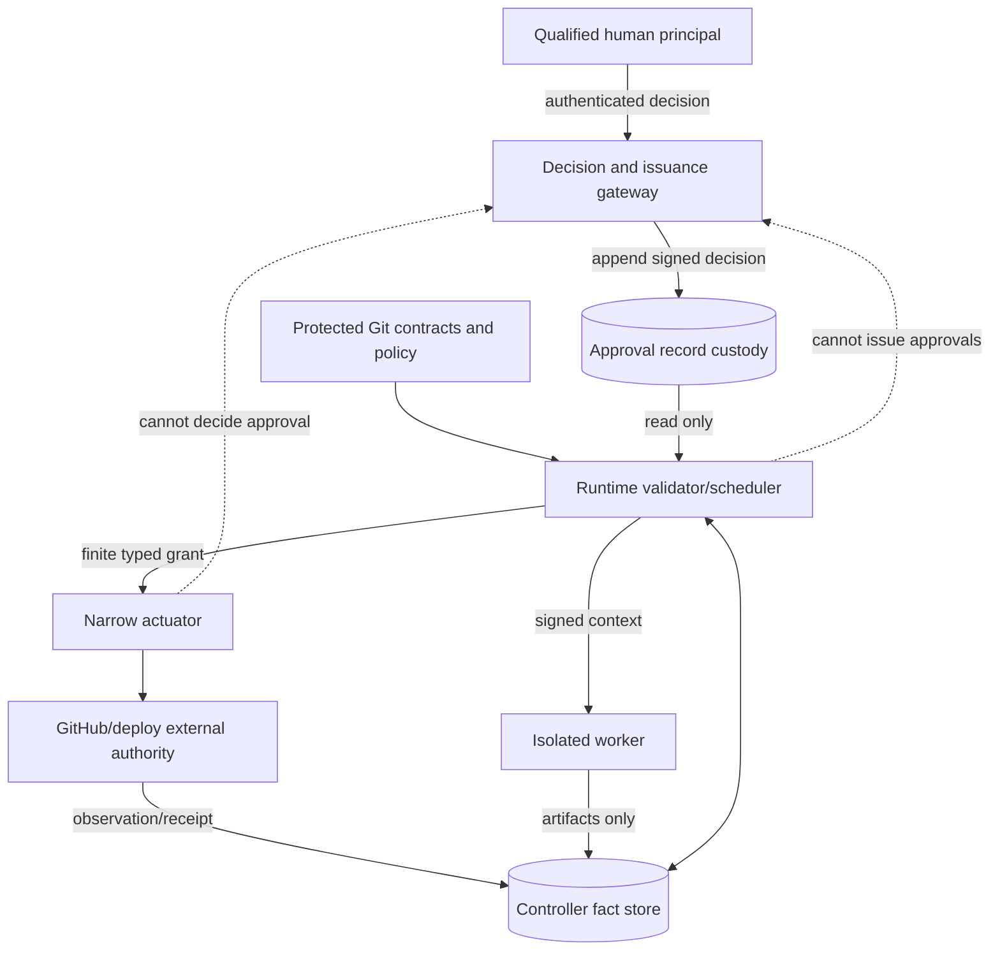
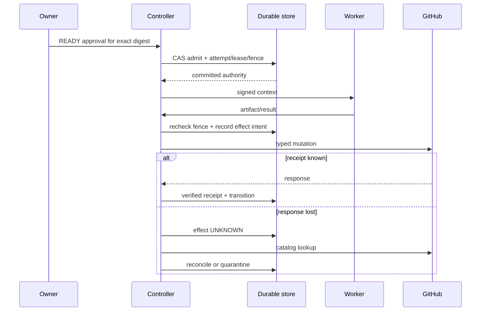

# Repository-Native Agent Factory — Full End-to-End Plan

**Status:** revised plan-only implementation contract; no working implementation, semantic evidence validation, or autonomous self-government is claimed.
**Intended evidence-scope cutoff:** `2026-09-12T23:59:59Z`. This is a decision-scope boundary, not a verified collection history. The checked-in legacy provenance is unverified; no UTC collection account is asserted. A fresh immutable re-fetch and human semantic review are mandatory before implementation begins.

## 1. Decision

Build a small, engineering-first, repository-native **agent factory control product**. A protected, versioned factory contract in Git defines what may happen. A narrow controller interprets that contract, records durable execution facts, and grants short-lived authority to isolated workers. GitHub Issues and Projects are the human work surface and a projection, not the transaction log or lock service. Workers never decide their own authority, approve themselves, mutate lifecycle state directly, or execute model-written shell.

Start with **Release 0 (the release name, not risk tier R0)**: one owner, one repository, read-only compilation, conversation/decision capture, GitHub observation, dry-run reconciliation, and deterministic simulation. Release 0 has no autonomous repository mutation, merge, deployment, production credential, always-on controller, PostgreSQL requirement, Temporal requirement, fleet scheduler, multi-tenant service, public plugin SDK, or GTM automation. It proves the contract and user loop before operational machinery.

Add durable mutation only after Release 0 gates pass **and** the mandatory PostgreSQL mutation gate in §20 passes. Before any external write, PostgreSQL must prove least-privilege compare-and-append, transactional outbox, backup/restore, and a real two-session admission/lease/fence race with no duplicate authority. SQLite is permitted only for Release 0 no-write simulation. A second repository additionally requires `FORCE ROW LEVEL SECURITY` (or stronger isolation) and cross-repository substitution tests. Temporal remains optional and needs its own measured admission decision. Multi-tenant and fleet features wait for explicit isolation and demand gates.

“Fully self-improving” means automatic discovery, proposal, protected evaluation, shadowing, bounded canary, observation, rollback, and learning. It does **not** mean self-government. A candidate cannot alter or select its evidence, protected evaluators, policy, permissions, promotion criteria, approvers, canary envelope, audit trail, or known-good rollback target.

## 2. Reader-visible end-to-end walkthrough

1. The owner installs a pinned control-product release by pull request. The PR contains a manifest, digests, compatibility report, migration preview, and rollback pointer. Nothing runs with write authority yet.
2. In an Issue or local conversation, the owner says, “Add CSV export to the engineering metrics page.” The IDEATION factory stores each message as an append-only `ConversationTurn`, asks only high-value questions, and produces a versioned `DecisionRecord`. Silence becomes a durable `NEEDS_INPUT` wait with owner, deadline, and resume policy; it is not forgotten in chat.
3. The BUILD factory turns the accepted decision into a typed specification, plan, acceptance oracle, risk classification, dependency set, and allowed command references. GitHub receives an Issue/Project projection. A dry run shows every desired field change before apply.
4. At `READY_REVIEW`, either a human issues a finite exact-digest `Approval`, or the controller derives a `PolicyAdmissionReceipt` under a protected closed R0/R1 delegation after proving every human-needed predicate false. Any bound change invalidates either decision; R2–R4 always require the human Approval.
5. The controller admits work only if dependencies, quota, conflicts, approval, sandbox, and base revision are current. It creates an attempt, lease, fencing token, cancellation epoch, signed context, and least-privilege capability grant.
6. An isolated worker receives typed artifacts and command IDs such as `test.unit` with validated arguments. It cannot send arbitrary shell, change the lifecycle, issue credentials, approve, merge, or promote. Results after lease expiry are retained as quarantined evidence and cannot advance state.
7. Verification runs from a clean checkout with protected graders. Review can request changes and loop back to implementation. At the exact candidate head, branch protections, CODEOWNERS, required checks, and risk policy determine whether merge may be queued. Auto-merge stays off until a single R1-risk profile earns promotion through local evidence.
8. Every GitHub mutation is an effect with an operation-specific identity and receipt. A lost response enters `UNKNOWN`; the controller looks up the remote result and never blindly replays it. GitHub Projects remain a readable projection of controller state.
9. After merge, optional deployment and observation run under separate authority. Success is not terminal until required outcome evidence and cleanup receipts exist. Cancellation similarly is not terminal until workers and effects quiesce and cleanup is accounted for.
10. MAINTENANCE correlates alerts and dependencies, can suppress duplicates with expiry, proposes a repair, schedules it, invokes BUILD, verifies it, observes it, and either resolves or rolls back. DEEP-RESEARCH stores typed claims, sources, conflicts, and closure checks. IMPROVEMENT proposes changes to factories or prompts, then passes protected offline evaluation, shadow, bounded canary, independent approval, promotion, and delayed-harm review.
11. The owner sees a daily digest of decisions needed, blocked items, unknown effects, canaries, cleanup failures, and outcome drift. Notifications are deduplicated, capped, quiet-hour aware, acknowledged, and escalated by policy.



## 3. Goals and non-goals

### Goals

- Make intent, decisions, authority, lifecycle, evidence, and cleanup durable and reviewable.
- Give one owner a simple Issue/CLI experience while keeping each consumer repository isolated.
- Define one executable factory-as-code contract for IDEATION, BUILD, MAINTENANCE, DEEP-RESEARCH, IMPROVEMENT, and later composition.
- Make retries, cancellation, stale input, unknown effects, rollback, and human waits normal states.
- Use least privilege, short leases, fencing, signed context, protected graders, and exact-artifact approvals.
- Distribute the control product by pinned, reversible, canaried releases; dogfood it without granting it control of its own policy.
- Measure correctness, safety, recovery, human effort, quality, cost, and outcomes before adding autonomy.

### Non-goals

- A general autonomous software company, universal workflow language, or claim of unattended production readiness.
- Replacing GitHub, Git, branch protection, CODEOWNERS, or deployment environments.
- Treating GitHub labels, Project fields, Actions concurrency, chat history, or model memory as authoritative locks or ledgers.
- Immediate PostgreSQL, Temporal, Kubernetes, multi-host fleet, multi-tenant SaaS, marketplace, or public plugin SDK.
- Universal numeric safety/productivity thresholds. Thresholds are policy versions calibrated in local pilots.
- Letting agents approve governance, credentials, auth, destructive migrations, policy, evaluators, or self-improvement.
- Claiming that schema/presence validation proves evidence truth, independence, efficacy, safety, compliance, or ROI.

## 4. Evidence and method

This plan consulted **37 structurally validated records**: 14 broad self-managing-software, 10 RAOS base, 8 lifecycle extension, and 5 domain extension result files. Structural validation means expected-file inventory, JSON parsing, required-field shape, and outline pairing. It is **not semantic validation**, source-truth validation, independence proof, or provenance validation. Legacy `as_of` and `access_date` values are unverified; the plan makes no claim about their actual UTC collection time.

The auditable checkout-level repair is:

- `research/repository-agent-operating-system/research-manifest.json`: all 37 records and validation boundary;
- `research/repository-agent-operating-system/synthesis-coverage.md`: all tracks, including all 23 RAOS base/extension items, material/background use, conflicts, repeated families, unknowns, and transfer limits;
- `research/repository-agent-operating-system/material-claims.json`: stable claim IDs and typed `candidate_support|candidate_refute|context_only` editorial associations for material decisions; every edge to a legacy external record is `unreviewed`; `supports|refutes` are reserved for future same-run observations after human semantic review;
- `research/repository-agent-operating-system/evidence-repair.md`: unverified candidate proposition inventory and provenance limits.

These artifacts repair structural auditability. The normative meaning of the current legacy evidence graph is editorial association only: every external legacy edge is unreviewed and uses `candidate_support|candidate_refute|context_only`; `supports|refutes` are reserved for future observations from the same immutable run whose edge-level entailment a human reviewer accepts. These artifacts do not turn the legacy corpus into an immutable observed run or establish semantic support. Plan approval is therefore provisional on a **pre-implementation evidence gate**: an evidence owner performs a fresh immutable re-fetch for every material source; records `ResearchRun` and actual UTC `SourceObservation` values, response/content digests, snapshot lineage or signed unavailability reason, redirects/status, validator version and output; regenerates claim/coverage artifacts from that one run; and obtains human semantic review of every material candidate edge and unresolved conflict; only accepted same-run candidate edges are then promoted to `supports|refutes`. Failure, a future timestamp, a mixed run, or unavailable material evidence blocks Increment 1 rather than being explained away. The intended cutoff controls scope; it does not prove retrieval history.

Legacy platform records are candidate associations for primitives, not proof of this composition’s effectiveness. Legacy GitHub records contain candidate vendor-capability propositions. The fenced controller is an architecture inference. Productivity, recovery, security, isolation, and ROI remain unvalidated local outcomes. Repeated URLs or records in one evidence family are not independent corroboration; the METR paper/blog are one family. A legacy mutable GitHub documentation record is candidate context for queue-mode distinctions; current platform behavior is unconfirmed until the §4 same-run review, and no legacy record defines this plan’s renewable fenced lease or transactional admission ([GitHub concurrency](https://docs.github.com/en/actions/how-tos/write-workflows/choose-when-workflows-run/control-workflow-concurrency)).

## 5. Architecture and separated authorities

| Plane / role | Owns | Must not own |
|---|---|---|
| Protected Git contract authority | Signed schemas/IR, lifecycle, factories, command/effect catalogs, policy, protected evaluators, desired configuration and release definitions | Runtime facts, live leases, approval events, credentials, actuator calls |
| Approval record custody | Append-only authoritative persistence of approval requests, decisions, signatures, revocations and invalidations | Decide, issue, validate itself as sufficient, or actuate |
| Qualified human principal through authenticated decision/issuance gateway | Review exact subject and issue/deny/revoke a finite approval using session-derived identity, current role/quorum and separation rules | Rewrite stored history, schedule itself, mint actuator credentials, approve own candidate |
| Scheduler/runtime validator and consumer | Validate stored approval or delegated-policy receipt, signature, subject digest, purpose, scope, role snapshot, quorum, independence, expiry and revocation immediately before admission/use | Manufacture, edit, infer from silence, self-approve authority, or append a policy-admission receipt |
| PolicyAdmissionReceipt issuer (`policy_admission_receipt_issuer`) | A dedicated service identity and signing key evaluates one current human-issued `DelegatedAdmissionPolicy` and protected inputs, then atomically appends only `PolicyAdmissionReceiptIssued\|Invalidated\|Consumed` with quota CAS in the `policy_admission_receipt` append-only tables | Issue human `Approval`, `DelegatedAdmissionPolicy`, exception, enablement, canary, widening, promotion, cleanup-risk, or quiescence authority; edit policy; actuate; or append any other event/schema |
| Actuator authority | A narrow dispatcher/deployer/promoter uses a validated grant to perform only the typed effect; records receipt | Decide approval, broaden scope, choose policy, or mutate lifecycle directly |
| Durable controller fact authority | Work aggregates, attempts, leases/fences, events, continuations, effects/receipts and observations | Source truth, protected policy, approval issuance or general actuator credentials |
| External resource authority | Git/GitHub objects, checks, rulesets, deployments and observed versions | Canonical work lifecycle, lease truth, evidence interpretation or promotion decision |
| Disposable execution plane | Compute under signed, expiring context | Durable authority, approval, scheduling, merge or promotion |

One process may host multiple narrow components initially, but database roles, signing keys, APIs and audit subjects preserve these boundaries. Human independence requires different canonical principals and controlling organizations, not aliases, bots, services, or sessions of one controller. A protected `PrincipalIdentitySnapshot` resolves issuer-verified identity-provider subjects and aliases to a canonical person. A protected `ControlRelationshipSnapshot` resolves service controllers and controlling person/organization. Each snapshot binds issuer, sources/provenance, review owner, observed/issued/expiry times, conflicts, signature and revocation reference. The decision gateway resolves both from trusted registries, rejects stale, missing, ambiguous, circular, or conflicting relationships, and binds both digests into every approval, evidence review, curation, canary, widening and promotion decision. Governed improvement cannot enter canary until genuinely independent people/organizations exist; a solo owner stays disabled.



**Release 0 recovery envelope.** Release 0 has no external-write credential. Its local journal uses atomic replace/fsync discipline and hash-chained, length-delimited records for conversations, decisions, simulated waits, dry-run plans, and simulator events. A clean process restart must replay to the same projection and resume simulated waits without duplication. A torn/truncated tail is detected, quarantined, and recoverable only by truncating to the last verified checkpoint with a signed repair receipt; interior hash corruption fails closed and allows read-only export, not guessed repair. Export and reinstall/rollback of the signed Release 0 package are tested. Host/disk loss, HA, and recovery of an in-flight real effect are explicitly out of scope because no effect can be sent. SQLite or an equivalent embedded journal is confined to this no-write envelope.

**Mandatory mutation gate.** Before *any* external write token or actuator is enabled, PostgreSQL must pass: restricted non-owner roles; immutable event/audit history; database-time leases; composite ownership; compare-and-append CAS; attempt/lease/fence/outbox creation in one transaction; same-key replay rules; backup, restore and replay equivalence; crash-before/after-commit/send fault tests; and a real two-session race proving one winning admission/renewal/reclaim and rejection of stale fences. No SQLite writer exception exists. Before a second repository, add `FORCE ROW LEVEL SECURITY` (or stronger separate-store isolation), hostile existing-role/default-privilege normalization, and cross-tenant/repository substitution and export tests. Temporal remains optional and may be admitted only by §20’s predeclared evidence contract.

## 5.1 Durable record catalog

Every durable record uses a registered schema/version, canonical RFC 8785 bytes, mandatory `tenant_id`, a typed `ScopeRef {domain, kind, canonical_ids}`, owner, mutation authority, retention/classification, compatibility rule, content digest, and causal/audit metadata. Repository identity is mandatory only for engineering repository records/effects; the neutral kernel rejects repository identity as a substitute for another domain’s account, consent, campaign, subject, or environment authority. Every actor, tenant and applicable installation/repository identity is derived from authenticated session or signed installation/service context; any same-named request payload field is untrusted and must exactly match before use. Unknown security-critical versions or fields fail closed. Large evidence bodies may live in content-addressed object storage, but their identity and authorization remain controller records.

| Record family | Required records | Owner / authoritative storage and mutation rule |
|---|---|---|
| Identity and scope | `Tenant`, `Project`, `Repository`, `Environment`, `Installation`, `Principal`, `RoleBinding`, `AuthoritySnapshot`, `PrincipalIdentitySnapshot`, `ControlRelationshipSnapshot` | Security owner; protected registry plus controller projection; repository aliases never change identity |
| Contracts | `SchemaRegistryLock`, `LifecycleDefinition`, `TransitionCatalog`, `FactoryDefinition`, `CompiledGraph`, `FactoryRegistry`, `CompositionLock`, `ArtifactType`, `CommandDefinition`, `EffectDefinition`, `PolicyBundle` | Contract/policy owners in protected Git; controller loads only signed/digested versions |
| Work and human decisions | `WorkItem`, `SpecRevision`, `PlanRevision`, `AcceptanceOracle`, `Conversation`, `ConversationTurn`, `Question`, `ConversationDecision`, `DecisionRecord`, `ResearchDecision`, `CurationDecision`, `ImprovementEnablementDecision`, `CanaryAdmissionDecision`, `WideningDecision`, `PromotionDecision`, `DelegatedAdmissionPolicy`, `Approval`, `Exception`, `InteractionPolicy` | Controller store has custody; only the authenticated decision/issuance gateway acting for qualified humans may append issue/deny/revoke/withdraw events; runtime is read/validate only |
| Derived admission receipts | `PolicyAdmissionReceipt`, `PolicyAdmissionReceiptInvalidation`, `PolicyAdmissionReceiptConsumption` | Dedicated `policy_admission_receipt_issuer` service identity/key and append-only DB role; one transaction validates the current human-issued policy and protected inputs, reserves quota by CAS, and emits exactly one deterministic issued/invalidation/consume event; no human-decision or actuator privilege |
| Runtime | `TransitionEvent`, `EventLedger`, `FactoryInstance`, `NodeRun`, `Attempt`, `BlockedContinuation`, `Wait`, `CancellationSaga`, `Lease`, `CapabilityGrant`, `RunContext`, `ArtifactRef`, `CompositionLink`, `DependencyEdge`, `DependencySnapshot`, `ResourceClaim`, `QueueAdmission` | Controller store; compare-and-append only; attempts/artifacts retained per policy, authority history immutable |
| Effects and reconciliation | `IngressDelivery`, `EffectIntent`, `EffectAttempt`, `EffectReceipt`, `RemoteObservation`, `ReconciliationPlan`, `ReconciliationOperation`, `CleanupManifest`, `CleanupItem`, `CleanupReceipt`, `CleanupEscalationDisposition`, `RemediationObligation`, `RemediationResurfaceReceipt`, `RemediationClosureReceipt`, `UnconfirmedQuiescenceDisposition`, `UnconfirmedQuiescenceClosureReceipt` | Narrow controller/dispatcher/reconciler roles; intents/history immutable; observations versioned, never silently overwritten |
| Research/evidence | `ResearchRun`, `ResearchItem`, `FieldDefinition`, `Source`, `SourceObservation`, `SourceSnapshot`, `SourceFamily`, `Claim`, `ClaimEvidenceEdge`, `Conflict`, `CoverageResult`, `ValidationResult`, `DecisionConfidence`, `ResearchArtifact`, `ResearchCheckpoint` | Research/evidence owner; controller metadata plus content-addressed bodies; source license/retention honored |
| Maintenance/outcome | `Signal`, `SignalGroup`, `Diagnosis`, `Suppression`, `Incident`, `Deployment`, `ObservationWindow`, `Outcome` | Service owner; controller store with telemetry references and expiry/resurface |
| Improvement/release | `ImprovementCase`, `Candidate`, `ImprovementStageEvent`, `EvalCase`, `EvidenceBundle`, `RolloutManifest`, `RollbackManifest`, `PromotionApproval`, `ConsumerReleaseManifest`, `ReleaseManifest`, `MigrationPlan`, `FeedbackEnvelope`, `ExportEnvelope` | Evaluation/promotion/release owners with separation; protected definitions in Git and immutable result events in controller store |

Compatibility is explicit: additive fields require a declared compatible version; semantic or authority changes require a new major contract and migration. Migrations produce before/after digests, dry-run results, approval where risk demands it, and a tested rollback/export. Deletion is an authorized retention event, not disappearance from history; privacy deletion makes raw content unrecoverable while preserving the minimum non-sensitive tombstone and audit proof.

## 6. One canonical contract and compiler

The only authored authority is a versioned, closed **Factory IR schema registry** in protected Git. Legacy standards records nominate JSON Schema Draft 2020-12 as a candidate interchange form and RFC 8785 as a candidate canonicalization primitive; neither proposition is treated as verified until the §4 same-run review. Conservatively, this plan requires those pinned forms, generated language models, database projections, documentation, and test fixtures to carry the IR version and pass bidirectional conformance tests. There are no private alternative models. Canonical bytes use a tested pinned RFC 8785 implementation and fail closed if the fresh review or target probe does not confirm suitability. Each artifact has `{type_id, schema_version, artifact_id, revision, tenant_id, scope_ref, repository_id_when_engineering_repository, content_digest, provenance}`. `repository_id` is required only by the engineering/repository `ScopeRef` variant and forbidden as authorization for other variants.

### 6.1 Top-level IR

```text
FactoryDefinition
  identity: factory_id, factory_version, schema_version, content_digest
  contract: typed input_ports, output_ports, artifact_types
  topology: initial_node_id, nodes[], edges[], terminal_predicates[]
  authority: role_profiles[], capability_profiles[], sandbox_profiles[]
  execution: command_refs[], effect_refs[], budgets, concurrency/resource keys
  resilience: retry_policies[], cancellation, compensation, cleanup, retention
  composition: immutable child_factory_refs[], typed port maps, join/failure policy
  lifecycle_projection: node/factory -> canonical work-state mapping
```

| IR object | Required contract |
|---|---|
| Role | Typed ID; actor kind; authenticated principal selector; duties; separation constraints. Role is not authority by itself. |
| Artifact type | Closed schema; classification; producer/consumer ports; revision rules; provenance, retention, redaction, legal hold, export policy. |
| Command | Catalog ID, version, typed args/env, fixed executable resolver, image digest, working-directory policy, timeout, egress/secrets/capability requirements. Raw model shell is forbidden. |
| Guard/gate | Typed ID and parameters; required artifact types/revisions; producing phase; evaluator; pass/fail/unknown outcomes; failure state; receipt schema. No prose execution. |
| Node | Stable ID; role; input/output ports; capabilities; sandbox; commands; budgets; read/write/resource sets; retry class; timeout; effects; cancel/compensate/cleanup behavior. |
| Edge | Stable ID; from/to; structured predicate; artifact bindings; join; invalidation behavior; no executable expression. |
| Effect | Catalog ID/class, identity derivation, precondition, ambiguity policy, receipt, reconciliation, safe retry/compensation. |
| Lifecycle | Initial/terminal/exception nodes, explicit entry/exit, wait/block/resume, stale, cancellation, cleanup, rollback, terminal predicates. |
| Composition | Child digest, authority/budget intersection, typed ports, deterministic join, parent-child causality, cycle rejection, failure/cancel/cleanup propagation. |

Compiler rejection is the safety mechanism. Reject unknown/duplicate symbols, unresolved edge endpoints, incompatible ports, missing producers, forward gate dependencies, unbound approvals, unreachable non-migration nodes, nonterminal sinks, implicit cycles, parallel write/resource conflicts, ambiguous glob/rename/generated-file overlap, widened child authority or budget, raw commands, missing retry/cancel/cleanup paths, unpinned children/tools, or incompatible versions. Every built-in factory, registry entry, and composition must load through the same public compiler and yield one digest.

### 6.2 Guards and lifecycle semantics

A gate declares when its inputs can exist. An edge cannot require an artifact produced later. Deferred gates name the exact binding phase and cannot authorize an earlier transition. Guards return `PASS`, `FAIL`, or `UNKNOWN`; `UNKNOWN` blocks or quarantines, never means pass. Cleanup is an explicit graph with receipts. Compensation mitigates reversible pre-merge effects; it never pretends to undo a successful merge.

### 6.3 Composition and cleanup

A child factory instance is a durable aggregate linked to parent instance/node, pinned digest, capability snapshot, delegated budget, and cancellation epoch. Effective authority and budget are intersections, never unions. Parent resume waits for child terminal cleanup. Cancellation flows down; receipts and failures flow up. Retention deletes workspace/cache branches only after provenance is stored, holds are checked, and deletion receipts are recorded.

## 7. Risk policy R0–R4

These tiers are defined once and used unchanged by schema, policy, UI, approval, database, and reports. “Release 0” is always written in full to avoid collision.

| Tier | Meaning | Maximum default automation |
|---|---|---|
| R0 | Read-only analysis; no consequential mutation | Analyze/draft; human controls publication and priority |
| R1 | Closed, reversible, low-risk, strong oracle, small blast radius | Human-approved pilot; later conditional auto-merge for a promoted allowlist only |
| R2 | Material behavior, API, dependency, or user-visible change | Exact-spec owner/product approval, independent path-qualified review, staged release approval |
| R3 | Auth/IAM/crypto, sensitive data, destructive migration, CI/policy, infrastructure, publishing, large blast radius | Specialist plan approval, two qualified independent signatures, exact-artifact production approval, canary and rollback |
| R4 | Ambiguous, irreversible, missing oracle/rollback, core-control exception, or self-governance | Human-led; agents gather evidence and draft only |

Unknown or mixed risk takes the highest applicable tier. Exceptions are narrower, finite, reasoned, controlled, follow-up-bound approval artifacts; they cannot waive non-delegable rules. A legacy GitHub record nominates the unreviewed candidate proposition that one listed environment reviewer may satisfy required-reviewer behavior ([GitHub environments](https://docs.github.com/en/actions/reference/workflows-and-actions/deployments-and-environments)). Independently of that unverified premise, this plan conservatively requires the external signed R3 two-person quorum gate; the target-tenant probe and §4 fresh human review fail closed and may only confirm that the native primitive is additionally usable, never waive this local quorum.

## 8. State model: separate aggregates, complete transitions

### 8.1 Canonical work lifecycle

The only top-level lifecycle vocabulary is below; the complete legal edge set (including explicitly enumerated block, cancel, failure, quarantine, and rollback entries) is normative in `docs/state-transition-manifests.md`. No diagram or prose adds an edge.

`INBOX -> TRIAGED -> PLANNING -> READY_REVIEW -> READY -> LEASED -> IMPLEMENTING -> VERIFYING -> REVIEW -> MERGE_QUEUED -> MERGED -> [DEPLOYING] -> OBSERVING -> CLEANING -> DONE`.

Legal repair edges are `VERIFYING -> IMPLEMENTING`, `REVIEW -> IMPLEMENTING`, and `MERGE_QUEUED -> REVIEW|READY_REVIEW`. No-deploy work uses `MERGED -> OBSERVING`. Blocking preserves its prior-state continuation. Cancellation is `CANCEL_REQUESTED -> QUIESCING -> CLEANING -> CANCELLED`. The only rollback order is:

`ROLLBACK_REQUESTED -> ROLLING_BACK -> ROLLBACK_VERIFYING -> ROLLBACK_VERIFIED -> ROLLED_BACK -> CLEANING`.

`ROLLBACK_VERIFYING` requires restoration receipts and known telemetry. Timeout, unknown telemetry, or failed restoration goes to `ROLLBACK_FAILED`; a bounded approved retry may return to `ROLLING_BACK`, while exhaustion goes to a human-owned `BLOCKED` disposition. `ROLLBACK_VERIFIED` records the protected verifier receipt. `ROLLED_BACK` means verified recovery, never merely a request or actuator response. It cannot go directly to a terminal state.

Cross-cutting states are `BLOCKED, CANCEL_REQUESTED, QUIESCING, ROLLBACK_REQUESTED, ROLLING_BACK, ROLLBACK_VERIFYING, ROLLBACK_VERIFIED, ROLLBACK_FAILED, ROLLED_BACK, QUARANTINED, CLEANING, DONE, FAILED, CANCELLED`. Every transition is an IR edge with entry guard, event, effects and terminal predicate. `DONE|FAILED|CANCELLED` require no live lease/grant/attempt, all effects settled under the normative Effect manifest (with accepted-risk success only where its exact policy allows), all children terminal, and cleanup satisfies the normative Cleanup manifest. `DONE` requires actual cleanup receipts; eligible escalated cleanup dispositions can qualify only `FAILED|CANCELLED`.

`BLOCKED` atomically stores `blocked_from_state`, lifecycle/factory version, node/attempt/fence, reason, required resolution, owner, deadline/expiry, notification state, resume policy/token/revision, and bound input/policy/base/dependency digests. Resume is CAS to the saved state or a declared re-plan state after revalidation. A caller cannot choose a bypass.

### 8.2 Runtime aggregate states

- Factory instance: `CREATED, VALIDATING, WAITING_INPUT, READY, RUNNING, BLOCKED, FAILURE_PENDING_CLEANUP, CANCEL_REQUESTED, QUIESCING, CLEANING, SUCCEEDED, FAILED, CANCELLED, QUARANTINED`.
- Node run: `PENDING, WAITING_DEPENDENCY, WAITING_HUMAN, ADMISSIBLE, RUNNING, RETRY_WAIT, BLOCKED, FAILURE_PENDING_CLEANUP, CANCEL_REQUESTED, QUIESCING, CLEANUP_PENDING, SUCCEEDED, FAILED, CANCELLED, SKIPPED, QUARANTINED`.
- Attempt: `CREATED, LEASED, STARTING, RUNNING, HEARTBEAT_LOST, STALE, STOP_REQUESTED, QUIESCING, STOPPED, RETRY_DISPOSITION, SUCCEEDED, FAILED, EXHAUSTED, CANCELLED, QUARANTINED`.

`FAILED` is reserved for final immutable failure; pre-cleanup/retry handling uses the distinct states above. The complete legal edges, initial states, terminal predicates, and finished-attempt rule are normative in `docs/state-transition-manifests.md`; these lists are inventories. Every wait has reason, owner/wake source, deadline, reminders and expiry edge. `SKIPPED` must be graph-declared. `STALE` evidence cannot advance state. There is at most one unfinished attempt per node **across all fences**, not per fence.

### 8.3 Effect and reconciliation machine

Normal send is `INTENT_RECORDED -> READY_TO_SEND -> SENDING -> APPLIED -> RECEIPT_VERIFIED`. Pre-send cancellation is `INTENT_RECORDED|READY_TO_SEND -> CANCELLED_BEFORE_SEND`. Retryable transport failure is `SENDING -> FAILED_RETRYABLE -> READY_TO_SEND` within budget; exhaustion is `FAILED_FINAL`. A lost or ambiguous response is `SENDING -> UNKNOWN -> RECONCILING` and can exit only as:

1. zero matches: `ABSENCE_PROVED` with signed lookup receipt -> `RETRY_AUTHORIZED` -> `READY_TO_SEND` under a new attempt ID;
2. exactly one matching postcondition: `APPLICATION_RECONCILED` -> `RECEIPT_VERIFIED` with reconstructed receipt;
3. multiple/uncertain matches: `UNRESOLVED` -> `QUARANTINED`, then an authenticated human disposition of `ACCEPT_APPLICATION`, `DECLARE_FAILED`, or `AUTHORIZE_COMPENSATION`; no generic retry.

Every nonterminal Effect state has a mutually exclusive total outcome partition in the normative manifest or a bounded wait with an expiry exit. Invalid/missing application receipts and identity mismatch enter typed reconciliation; proved absence with stale/forbidden/exhausted retry settles as failure with a signed no-application/no-retry receipt; an invalid reconstructed receipt becomes unresolved and quarantined. No false guard leaves an unbounded live Effect.

Compensation is its own attempt: `COMPENSATION_PENDING -> COMPENSATING -> COMPENSATED|COMPENSATION_FAILED|COMPENSATION_UNKNOWN`; unknown compensation enters the same lookup template and never blind-retries. Every reconciliation record immutably binds `reconciliation_origin=ORIGINAL|COMPENSATION`, `target_effect_id`, and `original_effect_id`; these values cannot change across lookup transitions. Original and compensation exits are disjoint. In particular, absence of a compensation proves only that compensation did not apply and can never authorize replay of the original effect. The exact edges and receipt fields are normative in the Effect manifest. `ACCEPT_APPLICATION` yields `ACCEPTED_RISK`, never `RECEIPT_VERIFIED`; only an exact policy that permits that effect class and does not depend on a safety, financial, or data-integrity oracle may make the work eligible for `DONE`, and retained risk remains visible. Otherwise cleanup ends in work `FAILED`. `DECLARE_FAILED` yields `FAILED_FINAL`. `AUTHORIZE_COMPENSATION` yields `COMPENSATION_PENDING` only with fresh, separately validated authority. `UNKNOWN, RECONCILING, UNRESOLVED, QUARANTINED, COMPENSATING, COMPENSATION_UNKNOWN` are unresolved and prohibit terminal success.

### 8.4 Improvement: orthogonal protected machines

**Candidate machine:** `DISCOVERED -> PROPOSED -> CURATION_REVIEW -> CURATION_PASSED|CURATION_FAILED`; then `OFFLINE_PENDING -> OFFLINE_RUNNING -> OFFLINE_PASSED|OFFLINE_FAILED`; then `SHADOW_PENDING -> SHADOW_RUNNING -> SHADOW_PASSED|SHADOW_FAILED`. Any input/evaluator/policy digest change goes to `EVIDENCE_STALE`; refresh restarts from the earliest affected stage. `REJECTED, EXPIRED, REVOKED, RETIRED, FROZEN, FAILED` are determinate dispositions. `FROZEN -> REVOKED` and `EVIDENCE_STALE -> REVOKED` are explicit legal rows. Revocation and an active-rollout digest change are each partitioned over every actually reachable rollout/Effect/rollback coordinate as protected X, protected N, or unsettled: every branch atomically fences grants and sends, stops or quiesces the child, reuses a matching rollback saga or creates exactly one only when exposure is proved, and leaves later cleanup only to the named origin/cancellation owner. The generated relation has exact fixed-point equality and no impossible tuple. During IX cancellation, the synchronized IX06 X/N/UNSETTLED revocation partition accepts each exact candidate source `SHADOW_PASSED|FROZEN|EVIDENCE_STALE`, including REQUESTED and QUIESCING sources already in `WIDENING_RECONCILING|PROMOTION_RECONCILING` while the original Effect remains unsettled. Those already-reconciling rows change only the candidate to `REVOKED`, keep the fence, preserve exact Effect/reconciliation/rollback/cleanup identities and states, and create no saga or cleanup. The partition is exactly equal and pairwise exclusive with IC32 and between pre-reconcile/already-reconciling/X/N branches by cancellation state, rollout/classifier, revocation trigger, and tuple-version CAS; witnesses race revocation before/after IX06-U and before/after settlement. Revocation during reachable rollout `FAILED|RETIRED` cleanup records the revocation but preserves the existing CleanupManifest/rollback/origin and creates no duplicate owner. After IC24-A fences an unsettled widening or promotion Effect and moves it to reconciliation, exact `EVIDENCE_STALE` X/N continuations preserve the original Effect identity without requiring a revocation event: widening X atomically takes `WIDENING_RECONCILING->CANARY_ABORTING` and rollback `IDLE->REQUESTED` with immutable `WIDENING_ABORT` origin; promotion X atomically takes `PROMOTION_RECONCILING->FAILED` and rollback `IDLE->REQUESTED` with immutable `CANDIDATE_REVOCATION` origin. Both resulting tuples legally admit rollback dispatch. N requires the protected generation/all-target no-exposure proof and has exactly one cleanup-entry owner.

**Release/rollout machine:** `DISABLED -> ENABLEMENT_REVIEW -> CANARY_PENDING_APPROVAL -> CANARY_READY -> CANARY_RUNNING`. The tuple stores one `active_canary_generation` and an append-only historical pair set. IR04 derives exact child/link IDs from parent, stage, generation, and decision digest and applies absent-or-same within that generation. IR24, IR03, and IR04 forbid replacement until the prior pair is terminal, quiescent, effect/rollback-settled, and clean. Delayed old-generation `WorkerStarted` or other receipts are fenced. A healthy slice may widen only through direct E06/IR38 or reconstructed E17/IR56, with identical decision/bounds/generation/effect identity. Promotion crosses `MERGED` only through direct E06/IR18 or reconstructed E17/IR57. Every other settled UNKNOWN outcome E20/E21/E24/E25/E28/E29/E37/E39 takes the exact synchronized exposure/no-exposure abort, rollback, or failure row; it cannot fall back to review or merge queued. Direct terminal Effect edges E09/E10/E30/E31/E33/E35 require a signed target-effect `NoApplicationReceipt` or no-send proof and therefore have only reachable no-exposure product rows; without that proof they enter UNKNOWN/reconciliation, and a conflicting ExposureReceipt rejects. Product coverage is exact equality with the declared reachable edge/classification relation, not a Cartesian expansion. `CanaryAdmissionDecision` cannot authorize widening.

Control degradation always commits durably and atomically fences active exposure before any later receipt, including after whole-work cancellation has entered `REQUESTED`, `QUIESCING`, or `CLEANING`. For each state, the IXH cancellation-side interrupt family has explicit pairwise-disjoint `ACTIVE_GENERATION` and `NO_ACTIVE_GENERATION` source partitions. It atomically changes health `HEALTHY->TELEMETRY_DEGRADED`, writes the deterministic exact-schema degradation receipt, and preserves the exact IX Effect, rollout, rollback, cleanup, and identity coordinates without creating a second saga or CleanupManifest. The no-active partition uses canonical nullable generation identity, never a fake generation, and binds the repository/work identity, cancellation epoch/control event, pre-event tuple, and degradation event; same bytes replay and any identity/partition/digest conflict rejects. Its generated source relation exactly equals both partitions of all reachable nonterminal HEALTHY IX cancellation tuples at those three cancellation states, including IX01-before-IH01 inactive/no-exposure witnesses; `CANCELLED` is immutable and absent. Progress continuity means either no degradation has occurred for the current canary generation, or a fresh completed IH03 after the latest degradation is bound to that generation and current bounds. Ordinary progress and exposure require `HEALTHY` plus current continuity. The synchronized HEALTHY-to-degraded interrupt source set is derived from and exactly equals every reachable active/exposure tuple, not a handwritten state list. It includes `CANARY_RUNNING`, exposed `CANARY_PASSED`, exposed pre-rollback `CANARY_FAILED`, exposure-bearing `WIDENING_REVIEW`, `WIDENING_EFFECT`, exposed `PROMOTION_PENDING_APPROVAL`, `APPROVED`, `PROMOTING`, `PROMOTED`, `OBSERVING`, and every actual generated omission. The exact union of IH01-C/W/WR/WV/A/P/PR/PV/D/O plus residual IH01-RX/RN and rollback-adoption IH01-RAQ/RAR/RAV/RAD/RAF/RAM/RAO is sole. Each X entry branch atomically fences sends/grants, stops exposure, and creates exactly one rollback; each N branch requires a protected no-exposure proof and creates none. IH01-WR/PR cover degradation after IC24-A or IC32-UW/UP has already entered widening/promotion reconciliation but before the exact original Effect settles. They atomically change only health `HEALTHY->TELEMETRY_DEGRADED`, preserve the exact Effect identity/state and reconciliation rollout, fence every remaining grant/send, and create no rollback before X/N. While cancellation remains NONE, only a later matching IH06 X/N row may continue a degraded tuple. Every IH06-WX/WN/PX/PN guard requires `work_cancel_state=NONE`. If IX01 or IX02 wins before settlement, IH06 rejects and the matching IX06 `REQUESTED|QUIESCING` X/N row alone consumes settlement; IX03 remains the sole parent cleanup owner. Absent that health interrupt, only the matching IC24/IC32 X/N continuation may settle the already-reconciling tuple.

A degradation that arrives after a protected-X continuation has already created rollback uses the exact generated rollback-adoption partition IH01-RAQ/RAR/RAV/RAD/RAF/RAM/RAO for matching rollback `REQUESTED|ROLLING_BACK|VERIFYING|VERIFIED|FAILED|REMEDIATION_WAIT|ROLLED_BACK` at a still-nonterminal active/exposure-derived tuple. Each row requires cancellation NONE, changes only health to `TELEMETRY_DEGRADED`, preserves the byte-identical Effect, rollout target, rollback identity/state, immutable origin, remediation blocks, and later cleanup owner, fences remaining authority, creates no second saga or cleanup, and is an exact canonical stutter under rollback/cleanup dominance. This partition covers races after IC24-RWX/RPX, IC32-RWX/RPX/HWX/HPX, and every rollback advance. Generic IH01 is legal only for truly inactive/no-exposure tuples outside the derived set. After health/continuity becomes stale, the checker rejects every other row. Degradation during `WIDENING_EFFECT` or `PROMOTING` first enters an explicit safe reconciliation rollout state. It does not start rollback until the exact original Effect is terminal or reconciled and a protected target-effect exposure/no-application classifier is durable. Rollback dispatch therefore cannot race an original Effect that is `SENDING`, `UNKNOWN`, live, or unsettled. IH05 is only a no-active-generation/no-exposure restoration, invalidates prior decisions, and permits progress only in a newly admitted generation. IH01-C is a resumable pause after fresh continuity restoration, but every later abort/failure selects an exact mutually exclusive exposed/no-exposure row. Safety abort after exposure atomically creates one rollback saga and requires verified real rollback; proved no exposure creates no rollback and accepts settled Effect records with proved non-application, including E34. Only a later origin- and cancellation-partitioned owner schedules cleanup. For widening abort with no cancellation, exposed IR13C-X moves exactly `ROLLED_BACK>CLEANING` after IR13A and rollback exactly `ROLLED_BACK`; no-exposure IR13C-N moves exactly `REVIEW>CLEANING` after IR13B with rollback `IDLE`. Each branch has one origin/cancellation owner. Retryable rollback failure may retry. Final forbidden/stale/exhausted failure enters visible `REMEDIATION_WAIT`/canonical `BLOCKED`, creates a protected remediation obligation, and cannot be called rolled back or clean. Only independent remediation closure enables fresh real verification, then `ROLLED_BACK` and cleanup.

**Improvement attempt and whole-work cancellation:** the attempt uses §8.2 attempts/effects. The product has a separate `work_cancel_state={NONE,REQUESTED,QUIESCING,CLEANING,CANCELLED}`. A cancellation request is accepted from every reachable nonterminal product tuple, dominates candidate/rollout/control/release-attempt projections, invalidates decisions, stops child work and new grants, reconciles effects, and invokes rollback where exposure may exist. Release-attempt IA09-IA15 and IA18-F/IA18-C cancellation is legal only after matching IX whole-work cancellation exists. Those rows are subordinate aggregate stutters under IX dominance. IA14 schedules attempt-local cleanup only and never parent cleanup. IA18-F adopts the already-created failure cleanup from `FAILURE_PENDING_CLEANUP` in exact `REQUESTED|QUIESCING|CLEANING` IX context without duplicating its CleanupManifest; IA18-C, mutually exclusive with IA15 by cleanup origin and valid in the same IX-state partition, seals the failure-cleanup attempt as attempt-local `CANCELLED`. IA16/IA17 are cancellation-NONE failure settlement only and race IX01 under one tuple-version CAS. No attempt row terminalizes the parent. Reducer priority 13 maps release-attempt `CANCEL_REQUESTED|QUIESCING|CLEANING|CANCELLED` to `SAVED`; IX03 alone schedules parent cancellation cleanup and IX04 alone derives canonical parent `CANCELLED`. The IX closed safety allowlist includes synchronized E02/E03 cancellation for pre-send `INTENT_RECORDED|READY_TO_SEND` Effects. For every generated reachable pre-exposure rollout—including initial `DISABLED`, enablement/canary approval, an unstarted active-child `CANARY_READY`, widening review, and promotion review/approved with no send—the transaction fences the generation, stops or cleans the child, settles the precise Effect set, and creates the deterministic generation/all-target protected `NoExposureReceipt` once; replay is byte-identical and IX03 remains the sole cancellation cleanup owner. Final `CANCELLED` waits for genuine rollback or independently authorized remediation settlement, exact quiescence, settled effects, and separately owned cleanup. Unresolved final rollback failure remains visibly nonterminal `BLOCKED` with bounded resurface/escalation. No human can waive safety settlement or convert it to `ROLLED_BACK` or clean. Exposed `CANARY_PASSED` belongs to the protected-X cancellation partition: IX06-XR/XQ atomically maps it to the safe `CANARY_ABORTING` target, stops/fences exposure, takes rollback `IDLE->REQUESTED`, records immutable `WIDENING_ABORT` origin, and uses expected-version CAS with byte-identical replay and conflict rejection. For BUILD and MAINTENANCE, a first authenticated cancellation after nonterminal `ROLLED_BACK` is persisted atomically by B71/M59; B71-P/M59-P separately continue a disposition persisted during rollback, and B71-R/M59-R alone replay it. The first-arrival and ordinary B39/M30 cleanup branches race under one expected-version/disposition CAS. **Control-health machine:** `HEALTHY -> TELEMETRY_DEGRADED -> CONTROL_PAUSED -> HEALTHY|CONTROL_FAILED`; degraded/failed control cannot admit, widen, promote, or resume canary.

Terminal success requires `PROMOTED`, its required observation window, no delayed-harm stop, current evidence, complete cleanup and no live authority. Recovery completion requires `ROLLBACK_VERIFIED -> ROLLED_BACK`, not an actuator response. `INCONCLUSIVE` evaluation is a failed gate, never pass.

### 8.5 Signed `EvidenceBundle` and separate enablement decision

`EvidenceBundle` is canonical and signed by a protected evidence service. Before execution, the independent evaluation owner seals an `ExpectedEvaluationManifest` in protected storage. It binds schema/version and digest; tenant/scope; candidate, baseline and stage; evaluator/safety/policy/dataset digests; the exact expected set of `(case_id, shard_id, seed, evaluator_id, slice_id, required_result_class)` tuples; exact per-class and total counts; expected input/output schema digests; and missingness/exclusion disposition. The evaluator cannot author or revise this expectation. The bundle binds that manifest digest and contains: bundle ID/digest; candidate/baseline/known-good digests and compatibility; hypothesis and intended decision; factory/policy/evaluator/safety-manifest versions and digests; dataset/source/consent/license/retention/redaction/provenance digests; received tuple IDs and result digests; slice definitions; raw-result and aggregate digests; numerator, denominator, exclusions and missingness for every metric; baseline/candidate deltas and uncertainty/confidence method; offline, mutation, property, adversarial, fault, privacy, tenant-isolation, legal-hold/deletion and holdout results; shadow/canary cohort, exposure, window, budgets and telemetry-continuity proof; all incidents, overrides, conflicts, failed/inconclusive cases; rollback target, drill and recovery receipts; independent review identities/findings/closures; creation/expiry; issuer, `key_id`, algorithm, signature and revocation reference. Completeness requires duplicate-free set equality between expected and received tuple IDs, exact count equality at every class and total, and digest validation. A missing, duplicate, unexpected, failed, inconclusive, or unaccounted tuple **always denies** enablement, canary admission, widening, and promotion. There is no exception. A protected pre-execution disposition may choose only `DENY`, `ABORT`, `QUARANTINE`, or `RERUN` under a newly sealed manifest; it cannot count a tuple as received or passing, satisfy set/count equality, waive a required result, or authorize any decision. Accounted exclusions are a separate protected set declared before execution and are outside the executable expected set; they never appear in, reduce, or satisfy that expected set. Resolution reads protected trusted state by digest; candidate- or evaluator-produced summaries cannot fill expectations.

`ImprovementEnablementDecision`, `CanaryAdmissionDecision`, `WideningDecision`, and `PromotionDecision` are distinct, purpose-bound, non-reusable records owned outside the candidate, evaluator runtime, and promoter. Each binds exact tenant/scope, candidate/rollout/policy/evaluator/safety-manifest digests, stage, feature flag, decision purpose, current stage-complete `EvidenceBundle`, telemetry-continuity digest, cohort/exposure/window/budgets, rollback target/drill, issued/expiry/revocation, owner, independent principals, and `PrincipalIdentitySnapshot`/`ControlRelationshipSnapshot` digests. Stage completeness is closed: enablement binds complete offline+shadow results; canary admission binds the final enablement bundle and initial canary bounds; widening binds all receipts through the prior canary slice and new bounds; promotion binds a newly sealed final canary/abort-status bundle, current telemetry through stage end, and zero open critical/high findings. A prior-stage record, changed bound, stale telemetry, wrong purpose, expired identity relationship, proposer-controlled service, or reused decision denies.

The decisions advance only their named edges in the normative improvement manifest. **100% of executable safety-manifest cases must map one-to-one to passing evidence**; all required test classes and rollback drill pass; and evidence is current and independently reviewed with zero open critical/high findings. `INCONCLUSIVE`, missing mapping, stale data, conflict, telemetry gap, abort/failure, or principal/control overlap denies. The feature flag defaults off and cannot be changed by candidate code or the promoter. Post-canary promotion can never reuse enablement or canary admission authority.

## 9. Durable conversation and Decision artifacts

A conversation is an append-only stream, not mutable chat memory. `ConversationTurn` binds conversation, turn index, authenticated actor, timestamp, channel, content digest, classification/redaction reference, causal turn, and attachments. Summaries are derived artifacts with source ranges and cannot replace turns.

`Question` includes typed question ID, decision impact, options, default/no-default, answer schema, owner role, requested/acknowledged times, deadline, quiet-hours rule, reminder cap, escalation, withdrawal, and expiry. `ConversationDecision` includes status `open|answered|expired|withdrawn`, selected existing option or typed free-form answer, actor, rationale, evidence, exact input revision, answer time, expiry, and supersession. `answered` with null/invalid answer is invalid.

`DecisionRecord` contains context, decision, alternatives, assumptions, constraints, consequences, open questions, acceptance oracle, risk tier, reversibility, owner, consulted roles, evidence links, artifact revisions, and supersedes/superseded-by. Changes append revisions. GitHub comments may project decisions but are not the durable record.

## 10. Human-needed decision engine

The engine asks a human exactly when at least one closed human-needed predicate is true: non-delegable authority; risk R2–R4; materially ambiguous intent, scope, effect, dependency ownership, or changed bound input; confidence below the protected threshold; absent/weak oracle or rollback; UNKNOWN effect; exception, budget expansion, canary, widening, promotion, cleanup-risk, unconfirmed-quiescence, or break-glass action. Otherwise an eligible R0/R1 item may use protected delegation. Silence never grants authority.

A `DelegatedAdmissionPolicy` is issued by a qualified human through the authenticated issuance gateway; the controller cannot issue, edit, widen, or renew it. It binds exact `tenant_id` and typed `ScopeRef`, closed R0/R1 profile, factory/lifecycle/policy/command/effect/sandbox versions and digests, allowed input and path/resource classes, command/effect ceiling, per-item/time/cost/concurrency quotas, maximum blast radius, required strong oracle with pass semantics, tested rollback digest and maximum recovery time, sample/window, issuance and expiry, issuer/quorum and identity/control snapshot digests, revocation reference, automatic stop predicates, and audit purpose. Bounds are intersections. Unknown fields, missing classification, quota exhaustion, failed oracle/rollback drill, stop predicate, expiry, revocation, changed digest, R2+ classification, or any human-needed predicate makes it ineligible and creates the exact human wait.

For an eligible item, the dedicated `policy_admission_receipt_issuer`—not the general runtime validator and never a human gateway—derives a deterministic signed `PolicyAdmissionReceipt`. Its authenticated service identity, purpose-only signing key, and append-only database role can write only `PolicyAdmissionReceiptIssued|Invalidated|Consumed`. One transaction locks the policy and quota row, validates policy/input versions and CAS, reserves quota, appends the receipt, and updates its projection; invalidation and one-time consumption use the same role and deterministic compare-and-append rules. It binds policy digest, exact authorization digest, all input/base/dependency/oracle/rollback/sandbox/command/effect digests, current quota counters, evaluated predicate vector (all false), risk R0/R1, database evaluation time, expiry no later than policy/lease inputs, issuer service identity/key, and one-time admission nonce. That receipt permits `READY_REVIEW -> READY` without a per-item human. It is stale on any bound change and cannot authorize review, merge, publication, R2–R4, exception, canary, widening, promotion, UNKNOWN disposition, or cleanup/quiescence risk. Per-item human `Approval` remains mandatory for every such case and binds the exact digest.

Recipient resolution uses typed role bindings and `ScopeRef` with fallback and escalation. Every request declares purpose, subject digest, options and consequences, minimum role/quorum/independence, tenant and scope, expiry, invalidation conditions, and resume transition. Delivery is deduplicated and batched; it supports acknowledgement, quiet hours, cadence/caps, timeout, escalation, and audit. Expiry blocks or chooses only a pre-authorized reversible non-authority default.

`Approval` is append-only and human-issued by the authenticated narrow gateway. It binds issuer and canonical subject, assurance, role and identity/control snapshots, review ID, quorum members, separation constraints, tenant/scope/work item, purpose/action, artifact/config/policy/eval/rollout/environment digests, risk, issued/expiry, and revocation/invalidation. READY, canary, widening, and promotion approvals bind their distinct exact authorization digest. Wrong-purpose, reused-across-stage, expired, revoked, stale-role/relationship, cross-scope, self/controlled-service, changed-input, or under-quorum approvals deny. Human issuance and controller derivation are separate event types, signing keys, database roles, and audit subjects.


### 10.1 Normative owner interaction contract

The Issue adapter and future CLI are two authenticated projections of the same commands. The CLI names below are future contracts, not implemented commands. Each command derives identity/scope from session or installation context, shows the exact inputs/diff and authorization digest, appends the named durable event, returns stable success/error/wait codes plus `status_url`, and is replay-safe by client request ID.

| Owner intent | Future Issue command / CLI contract | Durable outcome and view |
|---|---|---|
| First run/install | `/factory install --manifest <digest> --dry-run`, then `/factory install --approve <digest>` | `InstallPlanCreated`, compatibility/effective-config/managed-file diff; signed `InstallReceipt` or fail-closed reason; status shows no write authority in Release 0 |
| Start ideation | `/factory start ideation --title ...` | `ConversationStarted`; issue/CLI shows scope, retained inputs, next question |
| Start research | `/factory start research --outline <ref>` | `ResearchRunRequested`; shows scope/cutoff/closure and checkpoint status |
| Answer | `/factory answer <question-id> --option <id>` or typed `--text` | `ConversationDecisionAppended`; invalid/expired/wrong-scope answer errors without mutation |
| Status / why | `/factory status <work-id>`; `/factory why <work-id>` | Materialized state plus event cursor; guard failures, waits, evidence, next actor/action |
| Approve READY | `/factory approve-ready <work-id> --digest <authorization-digest>` | signed `ApprovalIssued` or denial; never inferred from comment/reaction |
| Typed factory decision | `/factory decide <subject-type> <subject-id> --digest <subject-digest> --action <allowed-action> [--reason ...]`. Closed subjects/actions are: `DecisionRecord={accept,request-changes,deny}`; `ResearchDecision={accept,request-changes,deny}`; `CurationDecision={accept,request-changes,deny}`; `ImprovementEnablementDecision={accept,request-changes,deny}`; `CanaryAdmissionDecision={accept,request-changes,deny}`; `WideningDecision={accept,request-changes,deny}`; `PromotionDecision={accept,request-changes,deny}`. | Before confirmation shows exact subject digest, prior/new diff, purpose, stage, consequences, eligible canonical principal/quorum and identity/control snapshot. The normative manifest decision matrix gives one exact edge/event/wait/status/recovery for each allowed action and for expiry, withdrawal, and stale-manifest invalidation. An action absent from that subject row is rejected without mutation. No uniform-action fallback exists. |
| Request changes | `/factory request-changes <work-id> --reason ...` | `ChangesRequested`; exact head/approvals invalidated and BUILD returns to implementation |
| Pause/resume/cancel | `/factory pause <work-id>`, `/factory resume <work-id>`, `/factory cancel <work-id>` | `PauseRequested`, `ResumeRequested` plus `ResumeValidated` or `ResumeRejected`, or `CancellationRequested`; view shows saved continuation, quiescence and cleanup receipts |
| Exception | `/factory approve-exception <id> --digest ...`; `/factory deny-exception <id> --reason ...` | `ExceptionApproved` or `ExceptionDenied`; finite scope/expiry/follow-up; denial leaves safe block |
| Review | `/factory review <work-id> --approve --head <sha>`; `/factory review <work-id> --request-changes --head <sha>` | exact-head `ReviewApproved` or `ReviewChangesRequested`; stale head emits `ReviewRejected` |
| Merge policy | `/factory merge-policy <work-id> --show`; protected update is PR-based | effective rules, queue eligibility and human veto; no CLI bypass |
| UNKNOWN disposition | `/factory reconcile <effect-id> --accept-application`; `--declare-failed`; or `--authorize-compensation` | `EffectDispositionRecorded` with the selected closed disposition after lookup evidence; no blind retry |
| Feedback | `/factory feedback <work-id> --kind ... --body ...` | privacy-classified `FeedbackEnvelope`; export remains opt-in |
| Upgrade/rollback | `/factory upgrade --manifest <digest> --dry-run`; `/factory upgrade --manifest <digest> --approve`; `/factory rollback-release --to <digest>` | full managed-file rehash/diff, `UpgradeReceipt` or `ConsumerRollbackReceipt` |
| Export/uninstall | `/factory export --scope ...`; `/factory uninstall --dry-run`; `/factory uninstall --approve` | signed export inventory; uninstall removes managed files/credentials only after retention and cleanup receipts |

Issue responses use the same events and present compact cards; CLI can render JSON for automation. Wait responses name owner, deadline, wake condition and resume command. Errors name failed guard without leaking secrets. Clean restart replays Release 0 records per §5. Retention/export follows record classification and legal hold; uninstall never erases required audit tombstones.

### 10.2 Break-glass lifecycle

Break glass is unavailable by default and is not a general exception. A separately authenticated emergency principal starts `BREAK_GLASS_REQUESTED -> IDENTITY_REVERIFIED -> SCOPE_REVIEWED -> ACTIVE -> EXPIRING -> REVOKED -> QUARANTINE_REVIEW -> RETROSPECTIVE_REQUIRED -> CLOSED`, or `DENIED`. The request binds incident, reason, exact emergency action/catalog ID, affected scope, least authority, maximum duration, issuer, independent reviewer/on-call, and automatic expiry. Activation uses stronger assurance, a dedicated key/role and conspicuous audit/notifications. Every affected work/effect is quarantined until review.

It may pause work, revoke/fence authority, isolate a sandbox, disable an actuator, or execute a pre-reviewed recovery action. It can never waive tenant/scope isolation, signature/audit, R4 prohibition, self-approval, approval independence, immutable history, secret-export controls, destructive-action oracle/rollback requirements, safety-manifest gates, or create arbitrary shell/network/credential access. If no predeclared safe emergency action exists, it is `DENIED` and humans operate the external system under its own incident procedure. Expiry automatically revokes grants. Closure requires receipts, independent retrospective, findings/owners/dates, and policy or runbook follow-up; overdue retrospective keeps affected automation blocked.

## 11. GitHub Issues and Projects as code

Protected Git declares desired issue forms, labels, Project fields/options/views/workflows, status mapping, and installation scope. The controller observes remote node IDs, field types, option IDs, versions/fingerprints, and permissions. Planning produces a signed `ReconciliationPlan` bound to tenant/repository/project, desired Git commit/digest, observation IDs/fingerprints, ordered operations, risk, approval, creation/expiry, and plan digest.

Apply uses optimistic concurrency. Re-read before each operation; stale observations invalidate/replan. Classify differences as create, safe update, rename/migrate, destructive/recreate, ambiguous, or unmanaged. Same-name/type-changing fields are not automatic updates. Preserve unmanaged objects by default. Destructive/ambiguous operations need explicit approval and migration/rollback. Read after write and record remote IDs/receipts.

Each GitHub effect catalog entry names endpoint/API version, logical identity, embedded marker or natural key, expected-before fingerprint, paginated lookup, request digest, receipt match, ambiguity rule, safe retry, compensation limits, and read-after-write. Do not claim GitHub universally deduplicates caller idempotency keys. Legacy GitHub records nominate signature validation and delivery-handling as unreviewed candidate webhook capabilities. Independently, this plan requires authenticated, delivery-deduplicated signals and scheduled full reconciliation as conservative local controls; the target probe and §4 review fail closed before use ([webhook validation](https://docs.github.com/en/webhooks/using-webhooks/validating-webhook-deliveries), [webhook best practices](https://docs.github.com/en/webhooks/using-webhooks/best-practices-for-using-webhooks), [Projects API](https://docs.github.com/en/issues/planning-and-tracking-with-projects/automating-your-project/using-the-api-to-manage-projects)).

## 12. Signed bootstrap and execution context

The controller creates an immutable context only after admission. It contains issuer, `key_id`, allowlisted algorithm/profile, `issued_at`, optional `not_before`, `expires_at`, audience/worker, tenant and `ScopeRef`, repository/installation when applicable, work/factory/node/attempt IDs, factory/lifecycle versions and digests, base commit, artifact/input digests, policy and approval digests, lease ID/holder/fence/`issued_at`/`renew_by`/`expires_at`/`max_expires_at`, cancellation epoch, unique nonce/replay domain, capabilities/resources, command IDs/argument bounds, sandbox/image attestation digest, network/secret grants, budgets, outputs and trace ID. Context expiry cannot exceed the earliest approval, lease, credential or capability expiry.

Verifiers pin acceptable algorithms and key uses, reject caller-selected algorithms, algorithm/key confusion, unknown/retired/compromised keys, early/expired context, wrong audience/scope, replayed nonce, or stale lease/fence/epoch/digest. Rotation publishes a signed key set with activation/retirement times; overlap lasts only for already-issued contexts within their original lifetime. Compromise revocation is immediate, advances authority epochs, refreshes verifier caches before new admission, rejects the revoked key even for otherwise unexpired context, and quarantines affected attempts. Validation occurs on receipt and immediately before every protected write/send.

Repository bootstrap is minimal and non-secret: pinned manifest, `AGENTS.md`/instructions, artifact index, command catalog references, policies, and verification entrypoints. Treat all repository text, issues, dependencies, logs, and model output as untrusted data. Context precedence and conflicts are explicit; a nested instruction cannot widen authority. Legacy GitHub records nominate short-lived, permission-narrowed installation tokens as an unreviewed candidate primitive. The plan conservatively requires bounded lifetime and least privilege and fails closed until the target-installation probe and §4 review confirm the required behavior ([GitHub App permissions](https://docs.github.com/en/apps/creating-github-apps/registering-a-github-app/choosing-permissions-for-a-github-app), [installation tokens](https://docs.github.com/en/apps/creating-github-apps/authenticating-with-a-github-app/generating-an-installation-access-token-for-a-github-app)).

## 13. Orchestration, dependencies, retries, cancellation, and effects

### Admission and leases

Admission transaction validates aggregate version, lifecycle version, a current per-item human `Approval` or eligible `PolicyAdmissionReceipt`, pinned factory, dependency snapshot, base, policy, budget/quota, worker compatibility, and resource conflicts; then creates attempt, lease, fence, epoch, and outbox atomically. Queue order is a total tuple such as `(eligible_at, priority_with_bounded_aging, created_at, stable_item_id)`. Per-tenant/repository quotas prevent starvation. Resource keys normalize repository/path/environment; ambiguous overlaps serialize. Acquire locks in one global order.

Every Lease and signed context binds `issued_at`, `renew_by`, `expires_at`, and `max_expires_at` with exact database-time inequalities `issued_at < renew_by < expires_at <= max_expires_at`. Authority is valid only while `db_now < expires_at`; every gateway rejects it at `db_now >= expires_at`. Renewal CAS checks lease/work/holder/attempt/fence/epoch/unreleased and `db_now < renew_by`, then atomically sets `renew_by'` and `expires_at'` such that `db_now < renew_by' < expires_at' <= max_expires_at`; it never moves `issued_at` or `max_expires_at`. Missing renewal starts reclaim at `db_now >= renew_by`; this grace interval does not create new authority, and the old authority is rejected no later than `expires_at`. Exact ordinary reclaim is: (1) detect missed renewal; (2) transactionally mark old attempt `HEARTBEAT_LOST -> STOP_REQUESTED`, advance fence/cancellation epoch, revoke grants and reject all old-fence effect gates; (3) enter `QUIESCING`, request stop, classify in-flight effects and resource ownership; (4) commit A10 only after the termination receipt and all effect dispositions are settled, leaving the predecessor `STOPPED` and explicitly unfinished; (5) finish every required predecessor CleanupItem from previously committed receipts and then commit A11 `STOPPED -> CANCELLED`; (6) only in a later admission transaction create the successor attempt/lease/fence/epoch/outbox. Admission rejects unless no predecessor exists or the unique predecessor is finished; for ordinary reclaim, only committed A11 `CANCELLED` satisfies that predecessor guard. No successor Attempt, Lease, fence, context, or outbox may exist before A11 commits. Old compute may physically run only in a proven isolated workspace with no reusable credential and every controller/actuator/output gate rejecting its old fence. Shared branch, database, deployment environment, cache, workspace, device or mutable external resource waits for proven quiescence. The new attempt gets a fresh workspace/credentials; immutable content-addressed inputs may be shared. If termination cannot be proved, the normative `UnconfirmedQuiescence` saga remains blocked. A human exact-digest `UnconfirmedQuiescenceDisposition` may authorize only monitoring, isolation, kill attempts, effect reconciliation, and closure work for the old Attempt. It grants no successor Attempt, Lease, fence, execution context, output authority, new business command, or new effect authority, whether resources appear disjoint or not. The old Attempt stays unfinished and the node admits no successor work until exact termination is recorded, the saga closes through U09, and A18 completes. There is no alternate authority carrier, no overlapping authority, and at most one unfinished Attempt per node across all fences. This at-most-one-unfinished invariant is unconditional; retained cleanup or an isolated old process creates no exception.

Terminal Work is immutable. When retained risk resurfaces, the parent Work and terminal CleanupItem never reopen. C11 partitions non-revoking resurface/review reminders from revocation. Non-revoking signals use status-preserving RO03–RO06. Revocation at an absent or post-closure generation atomically creates the exact next generation in `REVOKED` with no active authority; revocation of `OPEN`, `IN_PROGRESS`, or `VERIFYING` atomically appends the event, moves to `REVOKED`, fences grants, quiesces the child, and settles or reconciles effects through RO11–RO13. Same-event replay after the status change returns the original receipt; a later distinct signal in `REVOKED` uses RO06. The states are `OPEN, IN_PROGRESS, VERIFYING, REVOKED, CLOSED`, and only `CLOSED` is terminal. RO14 is the sole reauthorization row and no work may occur before it commits. Resource release is purpose-specific. A cleanup-resurface obligation may remove only the exact bound keys in RO09 when its `CLOSED` receipt proves their remediation. A rollback-safety obligation uses its own B37/M28/IRB06 absent-to-OPEN atomic creation row and does not require C11 or a CleanupItem; RO09 closes its child but retains all exposure/resource blocks. B74/M62 then enter genuine restoration verification, B34/M25 independently verify, and only B38/M29 atomically remove their exact rollback-safety blocks while sealing `ROLLED_BACK`. Improvement instead orders IRB09 after RO09 remediation, then IRB03 independent verification, then exactly one IRB07-N/R/Q settlement. That IRB07 branch requires the current RO09 closure receipt, genuine restoration receipt, fresh independent verification receipt, and exact RO00-I purpose/generation/key-set digest; it atomically removes only those blocks and creates a bound absent-or-same BlockReleaseReceipt while sealing or adopting actual `ROLLED_BACK`. Replay is byte-identical, conflicting bytes reject, and IRB08/IR13C-X/IX03 remain the sole later cleanup owners. No risk acceptance or human waiver unblocks either purpose.

### Dependencies and retries

A dependency edge binds stable ID, closed type (`hard_success`, `ordering`, `data`, `evidence`, `approval`), exact source and target `{tenant_id, ScopeRef, item, version}`, required outcomes, owner, propagation, and optional separately approved waiver digest/expiry. “Scheduled” never satisfies hard success. Dispatch is total: same-boundary `hard_success` exposes only the named terminal-success bit after terminal receipt; same-boundary `ordering` exposes only the named predecessor event/version and not success; same-boundary `data|evidence` imports only listed artifact digests/classes after producer seal; same-boundary `approval` consumes only a current purpose-bound approval after issue. Every cross-tenant, cross-repository, or cross-scope type, including `hard_success` and `ordering`, requires a current dual-owner `ExportImportEnvelope {dependency_type, source_tenant, source_ScopeRef, destination_tenant, destination_ScopeRef, source_owner_signature, destination_owner_signature, allowed_source_port, allowed_destination_port, allowed_status_fields, allowed_timing_fields, allowed_data_classes, purpose, consent_and_legal_basis_refs, artifact_digests, issued_at, expires_at, revocation_ref}` plus an exact import receipt. For cross-boundary `hard_success`, `allowed_status_fields` may be only `{terminal_success}` and `allowed_timing_fields` is explicitly `{none}` or a listed coarse bucket; for `ordering`, status is `{none}` and timing is only the listed predecessor event/version or bucket; for `data|evidence`, status/timing are `{none}` and exact artifact/class ports are mandatory; for `approval`, only approval ID, purpose, subject digest, decision, issue/expiry/revocation fields are allowed. An equally precise signed type-specific authorization is permitted only if it contains both owner signatures and all fields, limits, expiry/revocation, and consumption receipt required by the envelope. No type may rely on silence or a one-sided proof. Admission rejects one-sided, stale, substituted, over-port/class/status/timing, relabeled, or missing authorization. It checks acyclicity and pins a dependency snapshot. Cross-scope cycles or unclear ownership quarantine. Upstream rollback after admission invalidates downstream execution by policy.

Retries use classes: transient transport, rate-limit, worker crash, deterministic test failure, policy/authority failure, and ambiguous effect. Each has maximum attempts/time/cost, backoff+jitter, retry-from phase, invalidation behavior, and escalation. Deterministic failures require changed input or explicit repair. Authority failures do not retry. UNKNOWN effects reconcile, not replay.

### Cancellation and effects

Cancellation request uses the same compare-and-append boundary: advance cancellation epoch, stop new grants, revoke handles, fence lease, and enqueue worker stop/effect reconciliation/cleanup. Cleanup-only authority may survive but cannot make business writes. `CANCELLED` requires worker termination or the exact manifest `quiescence-closed` predicate: the saga reached `CLOSED` via U09, its bound closure receipt verifies, the old Attempt reached A18, no shared resource remains owned, and all effects are settled. `DENIED`, `REVIEW`, `ISOLATING`, and `REVOKED` never qualify. It also requires mandatory cleanup receipts and no active attempt/lease/capability.

The store exposes a least-privilege compare-and-append transition API. It derives canonical principal, tenant, `ScopeRef`, repository/installation where applicable, assurance and current role snapshot from a verified interactive session or signed service identity. Payload actor/scope IDs are untrusted assertions and must exactly match the derived context. It accepts expected aggregate/lifecycle version, transition ID, idempotency key, evidence and guard inputs; locks, validates, appends immutable event/audit, updates projection, and commits atomically with the derived `AuthoritySnapshot` bound into the event and any effect intent. Same key/same bytes returns prior result; same key/different bytes fails. Runtime roles cannot directly edit lifecycle, approvals, effects, or audit.



## 14. Factory flows and total canonical projection

The state lookup below is a generated readable index of the normative manifest and must be regenerated whenever a manifest state or endpoint changes; it is not independently authored. The complete normative legal-edge source is [`docs/state-transition-manifests.md`](./docs/state-transition-manifests.md), incorporated into this plan by reference. It enumerates the canonical graph; every built-in factory; `FactoryInstance`, `NodeRun`, `Attempt`, `Wait`, Effect, Cleanup, and UnconfirmedQuiescence aggregates; and the improvement product machines. No prose, wildcard, lookup row, or inferred pair adds an edge. Every private edge maps to a legal canonical edge, stutter, or listed guarded atomic sequence. The compiler and model tests are generated from that manifest. The generated vocabulary test requires exact set equality between every closed PLAN §14.0 coordinate and the corresponding manifest vocabulary; neither side may contain an extra or omitted symbol. The document also replaces the IMPROVEMENT lookup row with its versioned tuple reducer where the row conflicts.

### 14.0 Readable state inventory and projection index

| Factory | Private states -> canonical state |
|---|---|
| IDEATION | `CAPTURED->INBOX`; `DISCOVERING->TRIAGED`; `NEEDS_INPUT->BLOCKED`; `SYNTHESIZING->PLANNING`; `DECISION_REVIEW->READY_REVIEW`; `ACCEPTED->READY`; `HANDOFF->READY`; `CLEANING->CLEANING`; `SUCCEEDED->DONE`; `BLOCKED->BLOCKED`; `STALE->PLANNING`; `CANCEL_REQUESTED->CANCEL_REQUESTED`; `QUIESCING->QUIESCING`; `QUARANTINED->QUARANTINED`; `FAILED->FAILED`; `CANCELLED->CANCELLED` |
| BUILD | `CREATED->INBOX`; `INTAKE->TRIAGED`; `NEEDS_INPUT->BLOCKED`; `SPECIFYING->PLANNING`; `PLANNING->PLANNING`; `READY_REVIEW->READY_REVIEW`; `ADMISSION_WAIT->READY`; `LEASED->LEASED`; `IMPLEMENTING->IMPLEMENTING`; `VERIFYING->VERIFYING`; `REVIEW->REVIEW`; `MERGE_WAIT->MERGE_QUEUED`; `MERGED->MERGED`; `DEPLOYING->DEPLOYING`; `OBSERVING->OBSERVING`; `UNKNOWN_EFFECT->QUARANTINED`; `STALE->PLANNING`; `BLOCKED->BLOCKED`; `CANCEL_REQUESTED->CANCEL_REQUESTED`; `QUIESCING->QUIESCING`; `ROLLBACK_REQUESTED->ROLLBACK_REQUESTED`; `ROLLING_BACK->ROLLING_BACK`; `ROLLBACK_VERIFYING->ROLLBACK_VERIFYING`; `ROLLBACK_VERIFIED->ROLLBACK_VERIFIED`; `ROLLBACK_FAILED->ROLLBACK_FAILED`; `ROLLBACK_REMEDIATION_WAIT->BLOCKED`; `ROLLED_BACK->ROLLED_BACK`; `QUARANTINED->QUARANTINED`; `CLEANING->CLEANING`; `SUCCEEDED->DONE`; `FAILED->FAILED`; `CANCELLED->CANCELLED` |
| MAINTENANCE | `SIGNAL_RECEIVED->INBOX`; `CORRELATED->TRIAGED`; `DIAGNOSED->PLANNING`; `NEEDS_INPUT->BLOCKED`; `PROPOSED->READY_REVIEW`; `SUPPRESSED->BLOCKED`; `SCHEDULED->READY`; `LEASED->LEASED`; `EXECUTING->IMPLEMENTING`; `VERIFIED->VERIFYING`; `OBSERVING->OBSERVING`; `RESOLVED->OBSERVING`; `UNKNOWN_EFFECT->QUARANTINED`; `STALE->PLANNING`; `BLOCKED->BLOCKED`; `CANCEL_REQUESTED->CANCEL_REQUESTED`; `QUIESCING->QUIESCING`; `ROLLBACK_REQUESTED->ROLLBACK_REQUESTED`; `ROLLING_BACK->ROLLING_BACK`; `ROLLBACK_VERIFYING->ROLLBACK_VERIFYING`; `ROLLBACK_VERIFIED->ROLLBACK_VERIFIED`; `ROLLBACK_FAILED->ROLLBACK_FAILED`; `ROLLBACK_REMEDIATION_WAIT->BLOCKED`; `ROLLED_BACK->ROLLED_BACK`; `QUARANTINED->QUARANTINED`; `CLEANING->CLEANING`; `SUCCEEDED->DONE`; `FAILED->FAILED`; `CANCELLED->CANCELLED` |
| DEEP-RESEARCH | `CREATED->INBOX`; `SCOPING->PLANNING`; `NEEDS_INPUT->BLOCKED`; `OUTLINE_REVIEW->READY_REVIEW`; `ADMISSION_WAIT->READY`; `LEASED->LEASED`; `COLLECTING->IMPLEMENTING`; `NORMALIZING->IMPLEMENTING`; `REFRESH_WAIT->BLOCKED`; `CONFLICT_REVIEW->VERIFYING`; `GAP_ANALYSIS->VERIFYING`; `SYNTHESIZING->IMPLEMENTING`; `COMPLETION_VALIDATION->VERIFYING`; `DECISION_REVIEW->REVIEW`; `ACCEPTED_NO_PUBLICATION->OBSERVING`; `PUBLICATION_QUEUED->MERGE_QUEUED`; `PUBLICATION_DISPATCHED->MERGE_QUEUED`; `PUBLICATION_FAILED->BLOCKED`; `PUBLISHED->OBSERVING`; `STALE->PLANNING`; `BLOCKED->BLOCKED`; `CANCEL_REQUESTED->CANCEL_REQUESTED`; `QUIESCING->QUIESCING`; `QUARANTINED->QUARANTINED`; `CLEANING->CLEANING`; `SUCCEEDED->DONE`; `FAILED->FAILED`; `CANCELLED->CANCELLED` |
| IMPROVEMENT | Versioned tuple coordinates are candidate `{DISCOVERED, PROPOSED, CURATION_REVIEW, CURATION_PASSED, CURATION_FAILED, OFFLINE_PENDING, OFFLINE_RUNNING, OFFLINE_PASSED, OFFLINE_FAILED, SHADOW_PENDING, SHADOW_RUNNING, SHADOW_PASSED, SHADOW_FAILED, EVIDENCE_STALE, REJECTED, EXPIRED, REVOKED, RETIRED, FROZEN, FAILED}`; rollout `{DISABLED, ENABLEMENT_REVIEW, CANARY_PENDING_APPROVAL, CANARY_READY, CANARY_RUNNING, WIDENING_REVIEW, WIDENING_EFFECT, WIDENING_RECONCILING, CANARY_PAUSED, CANARY_PASSED, CANARY_FAILED, CANARY_ABORTING, CANARY_ABORTED, CANARY_ABORT_SETTLED, PROMOTION_PENDING_APPROVAL, APPROVED, PROMOTING, PROMOTION_RECONCILING, PROMOTED, OBSERVING, RETIRED, FAILED}`; release-attempt, control-health, whole-work cancellation, closed effect-set, cleanup-set, and rollback coordinates. The normative manifest’s deterministic precedence derives one canonical state, rejects impossible tuples, keeps offline/shadow inside one admitted verification span, runs canary as a separately admitted child, routes promotion through `REVIEW -> MERGE_QUEUED`, stutters on dispatch, and only a verified promotion receipt continues through `MERGED -> DEPLOYING -> OBSERVING`, and lets live effects/rollback/cleanup dominate terminal dispositions. |

This index is not an edge source. The normative manifest is the projection and legal-edge authority. For example, IDEATION `ACCEPTED->HANDOFF` stutters the IDEATION parent at canonical `READY`, then creates/links a BUILD child at canonical `INBOX`; the child later takes its own authored BUILD entry and normal canonical edges. It does **not** assert a parent `READY->PLANNING` edge or fabricate a child lifecycle. `SUPPRESSED` and `REFRESH_WAIT` are saved continuations in `BLOCKED`, not terminal. `REJECTED/EXPIRED` can reach `FAILED` only after cleanup; `RETIRED` reaches `CLEANING`; rollback states use only §8.1 order.

### 14.1 IDEATION

**States:** exactly the IDEATION row in §14.0. Capture the authenticated goal and scope, discover read-only evidence, persist typed questions/waits, synthesize alternatives and an oracle, obtain human acceptance or request changes, then hand a pinned decision revision to BUILD. Changed inputs enter `STALE`; cancellation quiesces children and cleans retained data.

### 14.2 BUILD

**States:** exactly the BUILD row in §14.0. Validate decision lineage; produce typed spec/plan/oracle/risk/dependencies/rollback; obtain exact-digest READY; pass PostgreSQL admission; execute typed commands in the selected sandbox; verify from a clean checkout; review exact head; queue only under branch protections; observe deploy/no-deploy outcome; execute the sole rollback order on stop; and collect cleanup receipts. Review changes return to `IMPLEMENTING` and invalidate stale checks/approvals. An exhausted rollback enters distinct private `ROLLBACK_REMEDIATION_WAIT`, retains exposure/resources under a protected rollback-safety RemediationObligation, and cannot use generic `BLOCKED` resume/cancel paths; its atomic absent-to-OPEN creation commits Work/obligation/link/MAINTENANCE child/event/receipt with deterministic generation and replay, and obligation closure, genuine restoration, independent verification, `ROLLBACK_VERIFIED`, and `ROLLED_BACK` must precede block release, cleanup, or cancellation terminality. Ordinary cleanup requires no persisted cancellation; the cancellation continuation requires it.

### 14.3 MAINTENANCE

**States:** exactly the MAINTENANCE row in §14.0. Signals are deduplicated and correlated. Suppression requires reason, owner, expiry, resurface trigger and continuation. Diagnosis and proposal declare evidence, risk, oracle, window, dependency and rollback. A pinned BUILD child normally executes. Verification proves technical recovery; observation proves sustained outcome. Regression follows the sole rollback order. Exhaustion uses the same distinct `ROLLBACK_REMEDIATION_WAIT` safety contract as BUILD: cancellation is recorded but cannot terminalize, and only obligation closure plus genuine restoration and independent verification can reach `ROLLBACK_VERIFIED`, `ROLLED_BACK`, exact block release, and later cleanup. Its ordinary cleanup and persisted-cancellation continuation are mutually exclusive exact-CAS rows.

### 14.4 DEEP-RESEARCH

**States:** exactly the DEEP-RESEARCH row in §14.0. Inputs declare objects, fields, scope, intended cutoff, evidence rules, exclusions and closure criteria. `ResearchArtifact` and `ResearchCheckpoint` bind run ID, schema/validator/config/input digests, source-observation and snapshot digests, producer node/attempt/fence, artifact digest and declared dependency edges. A checkpoint commits artifact metadata, content digest and node transition atomically.

Release 0 acceptance has a legal no-write branch: a protected `NoPublicationDisposition` and `NoPublicationReceipt` bind the accepted research digest, prove that publication was not requested, that no publication intent/send/application exists, and permit the canonical no-publication edge without CW14. If publication is requested in a later write-enabled increment, intent creation, dispatch, and receipt verification are separate transactions. Direct or reconciled verified application must bind both the verified publication receipt required by CW14 and an explicit protected purpose-bound `NoDeploymentReceipt` required by CW16; the closed row rechecks each guard before `MERGE_QUEUED -> MERGED -> OBSERVING`. Proven no application with no retry uses the purpose-specific `MERGE_QUEUED -> BLOCKED -> CLEANING` sequence: CW-B44 checks the publication failure/wait guard and saves the exact publication continuation, then CW-X2 checks the signed final no-application/no-retry disposition. It never depends on CW12's head/check-change guard. Every branch enters `CLEANING` only in a later cleanup transaction and terminalizes only after separate cleanup receipts.

Resume considers only same-run, schema-valid checkpoints whose validator/config/input/source digests still match. It compares each current source digest with its bound observation, marks directly changed artifacts stale, then invalidates the minimal declared transitive dependents. Conflict, coverage and synthesis nodes recompute when any contributing claim/edge changes. Undeclared dependency or stale required dependent fails completion. Partial valid siblings are reused. Crash-after-phase, changed-one-source and dependency-closure fixtures verify this behavior.

Outputs include immutable run/observations, typed claims, candidate-support/candidate-refute/context editorial associations before review and support/refute/context edges only after same-run human semantic review, evidence-family IDs, conflicts/unknowns, results and same-run synthesis. Structural presence is not semantic evidence validation. Cancellation retains allowed provenance but removes credentials/workspaces.

### 14.5 IMPROVEMENT

Use §8.4’s orthogonal machines and §8.5 contracts. Candidate code may propose prompts, heuristics, factory parameters or allowlisted tools. It cannot change or select evidence, evaluators, safety manifest, policy, permissions, issuance/promotion logic, feature flag, sandbox, audit, rollback target or its own authority. Protected evaluator services may execute tests, but their definitions, keys and deployment are controlled by a canonical principal/organization independent of the proposer. A solo owner keeps canary and promotion disabled. Missing telemetry pauses then aborts; safety regression aborts; promotion needs the distinct post-canary `PromotionDecision`; delayed-harm observation remains mandatory.

## 15. Review, merge, auto-merge, and cleanup

Review is layered: deterministic checks; security/license/supply-chain; independent model review where useful; path-qualified human review; and risk-specific approval. Reviews bind exact head, policy, evidence, and expiry. New commits invalidate stale reviews. Agents cannot dismiss protected findings or approve their own output.

Auto-merge is an actuator, not risk classification. Keep it disabled through Release 0 and draft-PR pilot. Enable only one closed R1 profile after predeclared denominators show acceptable escape rate, rollback success, unknown-effect rate, reviewer burden, and no safety regression across a bounded sample/window. Never auto-merge governance, workflows, new dependency suppliers, credentials, auth, data migrations, public API, infrastructure, publishing, or self-improvement. R2–R4 remain gated as §7 specifies.

Cleanup covers worktrees/branches, sandboxes, credentials, leases, caches, temporary artifacts, preview environments, Project reservations, and retention timers. The normative Cleanup submachine defines `PENDING`, cleanup-only `RUNNING`, bounded `RETRY_WAIT`, exhaustion to `CLEANUP_FAILED`, human `ESCALATION_PENDING`, and a typed `CleanupEscalationDisposition` with retained risk, monitoring, expiry/revocation, resurface triggers, and remediation owner/deadline. Legal hold and provenance retention use a verified retention receipt. `DONE` requires actual cleanup receipts; a narrowly eligible escalated disposition can satisfy only `FAILED|CANCELLED`, never hide credentials, live authority, shared mutable resources, public exposure, or unknown classification, and never reopens terminal Work or its terminal CleanupItem. A later trigger creates or advances the independently visible cleanup-resurface RemediationObligation plus MAINTENANCE child; its exact keys remain blocked until the obligation is `CLOSED` with a receipt that proves their remediation. A rollback-safety obligation closes its child at RO09 but retains exposure/resource blocks until the named B38/M29 or matching IRB07-N/R/Q verified `ROLLED_BACK` transaction. Cleanup and terminal guards require its exact purpose/digest-bound BlockReleaseReceipt; IRB08, IR13C-X, and IX03 remain the sole improvement cleanup owners. See the normative manifest for exact edges and terminal eligibility.

## 16. Security, isolation, approvals, sandbox, and supply chain

- **Tenant and scope boundary:** Every stored, queued, cached, object-stored, indexed, idempotency, and audited record carries immutable `tenant_id` plus typed `ScopeRef`; composite keys, queue partitions, cache keys, object prefixes, idempotency namespaces, audit subjects, foreign keys and authorization use the complete pair. `repository_id` and installation identity are required by schema only for the engineering/repository scope variant. They are absent or informational-but-nonauthorizing for other variants and can never substitute for account, consent, campaign, subject, environment, or other-domain canonical IDs. Fixtures reject both a missing repository ID in the repository variant and repository-only authority in every other variant. Cross-scope transfers use §13’s dual-owner envelope.
- **Database roles:** Controller transition gateway, approval authority, reconciler, deployer, promoter, auditor, and migration owner are separate. Runtime cannot manufacture approvals/events, delete history, or update lifecycle directly. Normalize hostile pre-existing role attributes, memberships, grants, ownership, and default privileges. For shared PostgreSQL, force RLS with non-owner/non-`BYPASSRLS` roles.
- **Capabilities:** Closed typed lattice; effective rights are parent maximum intersect child request. Mandatory denies cannot be overridden. Secrets, egress destinations, GitHub permissions, paths, environments, commands, and time/budget are exact grants.
- **Sandbox profiles:** selection is compiler output from risk plus threat classification, never a worker request. Every profile requires non-root, `no_new_privs`, all capabilities dropped except an explicit empty-by-default allowlist, seccomp plus LSM, device denial, read-only root, isolated user/PID/network/mount namespaces, bounded dedicated writable mounts, no host/container socket, external egress enforcement, resource ceilings, just-in-time scoped secrets, output scanning and platform attestation. Admission fails closed if any control or attestation is missing.

| Class | Entry gate and use |
|---|---|
| `S0_ANALYSIS` | Trusted, secretless analysis only; no repository execution or consequential effect; egress only through an allowlisted research proxy. |
| `S1_REPO_LOW` | Trusted, secretless R1 repository code after dependency/workflow scan; baseline controls, fresh workspace, allowlisted egress and commands. |
| `S2_HOSTILE` | Includes S1 controls plus microVM/VM or independently reviewed separate-kernel equivalent, disposable network identity, and one-use secrets for hostile/prompt-exposed or secret-bearing low-risk work. |
| `S3_HIGH_CONSEQUENCE` | Includes S2 controls plus dedicated account/environment, no shared mutable mount/cache, two-person-approved egress/effect catalog, stronger audit, and rollback isolation. This is also the minimum for ordinary trusted, secretless R2 application/API/user-visible work. |
| `S4_NO_EXECUTION` | Evidence/draft only; no execution or effect. Used for R4, incoherent risk/threat combinations, missing classification, unavailable attestation, unsupported isolation, or missing rollback. |

Threat classification is closed: `T0=trusted_secretless`, `T1=untrusted_or_prompt_exposed`, `T2=secret_bearing`, `T3=high_consequence` (sensitive data, infrastructure, policy/workflow, deployment, or shared mutable production resource). The total selection matrix is:

| Risk | T0 | T1 | T2 | T3 |
|---|---|---|---|---|
| R0 | S0 | S2 | S2 | S4 |
| R1 | S1 | S2 | S2 | S4 |
| R2 | S3 | S3 | S3 | S3 |
| R3 | S3 | S3 | S3 | S3 |
| R4 | S4 | S4 | S4 | S4 |

Each cell resolves to exactly one profile. If more than one threat class applies, use `T3 > T2 > T1 > T0`; if more than one risk applies, use the highest risk; then use the matrix. Classification conflict, an unlisted category, or a requested weaker profile is S4. Escape/syscall, device, namespace, mount/symlink, socket/metadata, cross-workspace, egress, resource and secret-lifetime tests are entry evidence.
- **GitHub Actions:** Scan `.yml` and `.yaml`; least permissions; full-SHA allowlisted actions; safe trigger/checkout; no untrusted expression-to-shell; environment/secret separation; cache partitions. Use pinned `actionlint`, `zizmor`, or equivalents. A legacy GitHub record nominates secure-use practices as unreviewed candidate guidance; the stricter controls in this bullet are conservative local requirements that do not depend on that proposition ([secure use](https://docs.github.com/en/actions/reference/security/secure-use)).
- **Supply chain:** Fully resolved hash-verified dependencies from approved sources; digest-pinned validator/runner images; SBOM, signature/provenance, and artifact attestation verification. A legacy SLSA record nominates provenance concepts and requirements as unreviewed candidates relevant to these conservative local controls ([SLSA provenance](https://slsa.dev/spec/v1.2/provenance)). The §4 fresh review and implementation probes fail closed; effectiveness remains an unverified local outcome.
- **Prompt injection:** Separate instructions from data, label provenance, constrain tool APIs, sanitize rendered output, require approval for authority escalation, and test indirect injection. Legacy OWASP records nominate prompt injection and excessive agency as unreviewed candidate risks; this plan adopts the listed controls conservatively and fails closed pending §4 review and local tests ([prompt injection](https://genai.owasp.org/llmrisk/llm01-prompt-injection/), [excessive agency](https://genai.owasp.org/llmrisk/llm062025-excessive-agency/)).
- **Approvals/exceptions:** Use the binding in §10, canonical identities, finite expiry, revocation, quorum, and separation. R4 cannot be downgraded by exception.
- **Audit/privacy:** Append-only ordered events and effect receipts; authenticated actor; trace/causal IDs; clock/source; retention/classification/redaction/consent/license/deletion/legal hold. Logs do not contain raw secrets or unrestricted conversation text.

## 17. Consumer releases, integrity, dogfood, and feedback

A signed `ConsumerReleaseManifest` is complete over the installation. It binds manifest/schema version and signature metadata; release/channel/ring; tenant and typed scope plus repository/project/environment/installation IDs where engineering applies; controller binary/image digest; **every managed file and generated output** by normalized path, type, mode and content digest; every workflow and action by file digest and immutable full-SHA pin; runner/image/tool/model/provider/version digest; schema/lifecycle/domain/factory/adapter/compiler/evaluator versions and compatibility ranges; migrations and current migration state; command/effect catalogs; permissions, secrets/egress requirements and maximum capabilities; protected policy inputs and **effective policy/config digest with provenance and precedence**; Git base/commit binding; installation identity; previous-known-good rollback pin; retention/export rules; and verifier/installer versions.

Install, `verify`, upgrade and rollback enumerate and rehash the entire managed set, regenerate outputs deterministically, resolve effective policy, and verify signatures, compatibility and immutable references. They fail closed on missing/extra/modified managed files, tampering, mutable refs, permission/capability growth, unsupported version combination, stale migration, unexplained source-commit/workflow/action divergence, or effective-policy mismatch. No unlisted generated output may execute. Each operation emits a signed `ConsumerVerificationReceipt` or `ConsumerRollbackReceipt` containing before/after manifests and file-set Merkle roots, checks performed/results, effective-config digest, actor/session authority, time, migration/compatibility results, rollback target, residual unmanaged files and cleanup receipts.

Every upgrade is a reviewed PR with semantic diff and rollback preview. Rings are self-test repository, isolated dogfood repositories, opt-in canary consumers, then broader opt-in. The control repository is never the only canary/evaluator. Pins never float. Telemetry loss pauses rollout; rollback uses a previously verified compatible manifest.

Feedback is typed and privacy-filtered. It includes release/cohort, attempt/outcome denominators, overrides, latency, cost, failures and incident links. Export is owner-opt-in; raw code/conversations remain local by default. Feedback cannot directly promote.

A second repository is impossible until §5’s RLS/cross-repository gate and Increment 8’s signed admission decision pass. Fleet/multi-tenant service waits for its own evidence decision and named operator; it is not implied by two installs.

## 18. Engineering-first package and gated domain extraction

The neutral IR contains lifecycle, typed ports, scope abstraction, authority intersection, effects, evidence and cleanup. It contains no repository-only field assumption outside the engineering adapter/package. Engineering alone initially defines repository decisions/specs/diffs/tests/reviews/PRs/deployments/incidents; repository tools and graders; and the five built-in factories. Cross-scope read or export needs a signed envelope naming source/destination `ScopeRef`, purpose, fields, consent/owner authority, expiry and receipt. A repository ID can never authorize a GTM account/contact/campaign operation.

A signed `DomainExtractionDecision` is a specialization of §20’s admission contract. Its frozen scorecard names repository and materially different workflow sample, observation window, denominator per metric, adapter/version stability, duplicated kernel logic, change coupling, compatibility failures, safety/privacy incidents, human burden and ownership. Explicit local pass/stop values are set **before** observation by engineering, security and prospective domain owners; changes require a new evidence-backed version before a new window and never rewrite failed evidence. Extraction passes only when every scorecard predicate passes and independent review finds no critical/high open issue. It stops on safety/privacy incident, weakened types/authority, adapter growth without reuse, missing denominator, or uncertain ownership. No universal numbers are invented here.

**Future GTM branch.** It begins only as proposal/read-only research after engineering admission and a named GTM/compliance owner. Its separate decision freezes consent/lawful-basis coverage, privacy/deletion/suppression tests, factual/brand/accessibility quality rubric, volume/budget/recipient caps, attribution denominator, human approval scope, rollback/withdrawal plan and no-go rules. Any missing consent, ambiguous jurisdiction, regulated/unsupported claim, absent suppression, privacy incident, unavailable rollback or open critical/high issue is no-go. External publish, spend or contact remains human-gated even after a read-only pilot. GTM outcomes and ROI remain unvalidated until local measurement with denominators and counterfactual limits.

## 19. Observability and metrics

A legacy OpenTelemetry record nominates traces, metrics, logs, and correlation concepts as unreviewed candidates. Independently, this plan requires OpenTelemetry-compatible traces, metrics, and structured logs with tenant/repository/work/factory/node/attempt/effect/release IDs and no secret content ([OpenTelemetry signals](https://opentelemetry.io/docs/concepts/signals/)). Dashboards separate control health, safety, human burden, quality, cost, and product outcomes.

| Dimension | Measures and mandatory denominators |
|---|---|
| Queue/control | Intake-to-triage/READY/lease; wait age by reason; starvation; lease renewal/reclaim; webhook lag/gaps |
| Reliability | Attempts per success; retry exhaustion; stale results; UNKNOWN effects/time-to-reconcile; cancellation-to-quiescence; cleanup failures; restore RTO/RPO |
| Quality | Verification pass after repair; review escape; reverted/rolled-back change; incident/change; acceptance-oracle coverage |
| Security | Denied capability/approval; cross-tenant test failures; secret/prompt injection events; unsigned/stale context; supply-chain violations |
| Human | Questions/item, time-to-answer, notification volume, acknowledgement, override/request-changes rate, review minutes, false escalation |
| Delivery | Lead time, merge/deploy success, change failure rate, rollback recovery, observation completion; split by risk/factory/release/cohort |
| Improvement | Eval/shadow/canary pass, safety delta, missing telemetry, rollback, delayed harm, promotion/retirement, candidate cost |
| Economics | Model/compute/API cost per accepted outcome, worker utilization, controller/operator toil; never report savings without baseline |

Alerts cover zombie lease, fence rejection, UNKNOWN age, queue starvation, webhook/reconcile divergence, approval misuse, cleanup backlog, audit gap, canary stop rule, missing telemetry, tenant-isolation denial, and budget breach. Every alert has owner, runbook, severity, dedupe, and resurface.

## 20. Sole implementation roadmap and admission decisions

This section is the only increment-numbering authority. One builder may implement early increments through separate authenticated roles. Independence is measured by canonical person and controlling organization, not login, role alias, bot or service session. If a required independent principal does not exist, that increment remains disabled.

Before Increment 1, the §4 fresh immutable re-fetch and human semantic evidence review must pass. Each Increment 3–10 additionally requires a signed `IncrementAdmissionDecision {decision_id, increment_id, predecessor/version, proposed_change_digest, accountable_owner/signers, metric_and_evidence_definitions, numerator_and_denominator, exclusions, baseline, observation_window_or_sample, data_source_and_integrity_receipts, uncertainty/conflict/missingness_rule, locally_calibrated_pass_and_stop_predicates, decision, issued_at, expires_at, rollback_target_and_actions}`. Values are frozen before measurement begins; the proposed platform change/candidate cannot author, filter or approve its own evidence. Missing denominator, conflict, uncertainty outside the frozen rule, stale/expired evidence, or failed predicate blocks. Threshold changes create a new decision before a new window; they never reinterpret old data.

| Increment | Owner/dependencies | Mandatory entry decision and build/exit evidence | Stop/rollback |
|---|---|---|---|
| **0. Plan/evidence freeze** | Plan and evidence owners | Verify from the checkout and record that prototype implementation artifacts are absent; retain review and resolution evidence; inventory 37 structurally validated records and all reviews; complete §4 pre-implementation re-fetch/semantic gate; publish plan-contract resolution register | Stop on missing material edge/conflict/review; docs-only rollback |
| **1. Canonical contracts/compiler** | Contract owner; I0 | Single schema/IR/compiler; separated approval/actuator contracts; complete normative edge manifests compiled; all built-ins/aggregates/improvement-product tuples, invalid graphs and state edges tested | No runtime on unmapped/illegal state, authority ambiguity or digest mismatch |
| **2. Release 0 no-write UX** | Product owner; I1 | Future Issue/CLI contract paper test; atomic journal, restart/replay/corruption/export/reinstall tests; IDEATION, observation/diff, research checkpoint and exception simulations; prove no write credential | Revert signed package; export verified journal; host loss/in-flight effects out of scope |
| **3. PostgreSQL mutation foundation** | Reliability/security owners; I2; `IAD-03` | Predeclared operational/recovery evidence and owner-journey need; PostgreSQL restricted roles, CAS/outbox, database time, restore/replay, process-kill and two-session admission/renew/reclaim races all pass before any writer token | No token; return to Release 0 on invariant/history/restore/race failure |
| **4. One-repository draft-PR R1 pilot** | Repository owner + security reviewer; I3; `IAD-04` | Frozen sample/window, denominator, App/sandbox/control evidence, uncertainty/expiry; one allowlisted profile, exact approvals, effect reconciliation, draft PR only | Revoke App, quiesce, reconcile, restore pinned consumer release |
| **5. Maintenance/outcome loop** | Service owner; I4; `IAD-05` | Frozen signal/outcome/recovery/human-burden metrics and denominator; correlation/suppression/resurface, BUILD child, observation and rollback | Disable ingestion and action separately; preserve signals; verified rollback |
| **6. Governed improvement shadow** | Evidence owner and evaluator controlled by principal/org independent of proposer; I4–5; `IAD-06` | Protected suite/privacy/evidence integrity; complete signed bundle; offline and shadow only; independent zero-critical/high review | Feature flag remains off; freeze candidate and restore control release; solo owner cannot enter |
| **7. Bounded canary and one R1 auto-merge profile** | Independent promotion approver; I6; `IAD-07` | Separate enablement decision; locally frozen cohort/window/denominators/pass/stop/uncertainty; 100% manifest mapping; rollback drill; explicit canary states | Automatic pause/abort and exact verified rollback; disable on telemetry/safety failure; solo owner cannot enter |
| **8. Second repository/productized release** | Consumer + security owners; I4–7; `IAD-08` | §5 RLS/role-normalization/cross-repo tests first; complete manifests/rehash receipts; frozen independent-owner demand, upgrade burden, compatibility, privacy and isolation evidence | Per-consumer previous pin; revoke export; no shared fleet authority |
| **9. Scale architecture, optional Temporal** | Reliability/security owners; I8; `IAD-09` | Frozen concurrency, timer, failover, RTO/RPO and operator-toil metrics/windows/denominators; compare simple controller vs Temporal; HA/isolation migration proof | Dual-read/shadow migration, export/downgrade; stop on invariant mismatch; Temporal remains optional |
| **10. Domain extraction/GTM read-only discovery** | Domain/compliance/security owners; I8–9; `IAD-10` plus `DomainExtractionDecision` | §18 scorecards freeze reuse, workflow/repository sample, duplication/coupling, adapter stability, privacy/safety, human burden and GTM consent/quality/volume/no-go evidence | Abandon extraction/GTM on any stop; no external GTM action |

`IAD-03` through `IAD-10` each predeclare the exact metric/evidence, window/sample, denominator, owner, uncertainty/conflict rule, expiry, stop and rollback required by the row. Names such as “useful,” “stable,” “demand,” or “toil” have no admission force outside that signed definition. Do not begin later work merely to prepare a platform.

## 21. Validation strategy

### 21.1 State-space and model tests

Generate graph tests from the single IR. Cover every legal/illegal edge, entry/exit guard, factory-to-work mapping, initial/terminal reachability, nonterminal sinks, request-changes loop, no-deploy completion, post-rollback verification, `BLOCKED` continuation from every blockable state, wait answer/expiry/withdraw/cancel, stale invalidation, retry exhaustion, UNKNOWN quarantine, cancel/quiesce/cleanup, and terminal predicates. Compose factories and test child failure/cancel/cleanup/authority intersection. Future implementation gates use property/model checking for event sequences and replay equivalence. During every formal plan correction, regenerate current-manifest coverage from the actual numbered heading set and require exact set equality (including all current headings); no hard-coded heading count may pass after a manifest edit. During this plan edit, run only ephemeral deterministic table/reducer checks: table shape; canonical endpoints and adjacency; `S` equality; all built-in private-state reachability; exactly one explicit cancel, cancel-adopt, or safety-defer event for every reachable nonterminal private state; mutually exclusive total Effect outcome partitions or a bounded wait with an expiry exit; split cleanup entry/terminalization; and exact tuple witnesses for IA01/IA05/IC13, IR19/IR22 rollback entry through terminal, widening `UNKNOWN`, both pre-exposure abort branches, research no-publication/publication, and promotion dispatch/verified receipt. These checks are not a full model check. The ephemeral checker also parses the full RemediationObligation table and proves reachability, no nonterminal sink, replay/distinct-signal/new-generation partitions and sole CLOSED unblock; asserts zero outgoing rows for every declared terminal runtime state; enumerates retryable and final rollback/cancellation paths; races canary generation replacement and delayed receipts; covers direct/reconstructed widening and every E20/E21/E24/E25/E28/E29/E37/E39 widening/promotion disposition under the exposure partition; enforces HEALTHY/IH03 on exposure progress and the sole IH01 active-interrupt allowlist; proves cancellation pre-exposure source-set equality plus synchronized E02/E03 settlement and once-only NoExposureReceipt production; requires revocation/digest-change X/N/unsettled equality including FROZEN, EVIDENCE_STALE, FAILED, and RETIRED cleanup adoption fixed points; checks exposed IR13C-X `ROLLED_BACK>CLEANING` versus no-exposure IR13C-N `REVIEW>CLEANING`; proves B39/B71/B71-P and M30/M59/M59-P mutually exclusive by expected-version/disposition CAS and separates B71-R/M59-R replay; verifies purpose-specific RO09/block-release ordering through B38/M29 and IRB07-N/R/Q; requires exact stale-Effect X/N continuation, cancellation X-source, and derived control-interrupt source-set equality; and proves exactly one improvement last-cleanup terminal owner. Exact witnesses race cancellation immediately before and after B38/M29 and IX01 immediately before and after IR08/IR14; race degradation before and after every adjacent edge into or out of the derived exposure set; take a digest change before widening/promotion Effect settlement through both protected X and N outcomes; and exercise IRB07 block-release purpose/digest/generation checks, cancellation interleavings, byte-identical replay, and conflict rejection.

### 21.2 Contract and persistence tests

Bidirectional schema/runtime fixtures; complete ConsumerReleaseManifest inventory/rehash/install/verify/upgrade/rollback/tamper/mutable-ref/capability-growth/pin-divergence cases; Release 0 atomic journal restart/torn-tail/interior-corruption/export cases; canonicalization edge cases (`1.0`, `-0.0`, Unicode, key order); digest stability; migration/rollback compatibility; PostgreSQL two-real-session aggregate CAS/admission/renewal/reclaim races; boundary cases immediately before/at/after `renew_by`, `expires_at`, and `max_expires_at`, clock skew, partition, stale results and effect sends; transactional outbox and backup/restore/replay equivalence; same/different idempotency bytes; immutable history; composite tenant+typed-ScopeRef ownership for repository and non-repository variants; one unfinished attempt; receipt/effect same-owner constraints; human Approval versus derived PolicyAdmissionReceipt separation, delegation expiry/revoke/stop/quota/changed-input fallback; distinct canary/promotion decisions; IR04 exact-one absent-or-same canary child/link identity and different-key rejection; unconditional EvidenceBundle denial partitions; RLS cross-tenant denial; backup/restore/replay.

### 21.3 Adversarial security tests

Prompt injection in issue, code, logs, dependency metadata, and research pages; raw-shell/tool argument injection; path traversal/symlink; secret exfiltration/egress; forged/unsigned/replayed/early/expired/wrong-audience context; algorithm/key confusion, rotation/revocation/cache/retired-key tests; stale fence and cancellation epoch; malicious workflow `.yml`/`.yaml`; mutable action ref; `pull_request_target`; request/session actor and typed-scope mismatch, pooled-session residue, SECURITY DEFINER safe search path, owner/`BYPASSRLS`, cross-tenant/scope artifact/approval/spec/effect substitution and repository-ID-as-other-domain-authority; missing/one-sided/stale/mis-ported export/import envelope and relabeled `hard_success|ordering|data|evidence|approval` edges, including forbidden status/timing fields; broad database role; self/alias/bot/proposer-controlled-service approval plus stale/conflicting relationship snapshots; poisoned evaluator/evidence; privacy/consent/delete/legal-hold failures; canary denominator manipulation and pre-canary decision reuse; break-glass and unconfirmed-quiescence escalation/expiry/revoke/non-waivable boundary/closure; exhaustive R0–R4 by T0–T3 sandbox matrix plus syscall/device/namespace/mount/symlink/socket/metadata/cross-workspace/egress/resource/secret-lifetime and attestation failure.

### 21.4 Fault tests

Crash before/after transaction and external send; lost webhook; duplicate/out-of-order delivery; API 429/5xx; response lost after mutation; pagination ambiguity; lease renewal/reclaim/partition race; zombie old-fence rejection; shared-resource wait until quiescence; controller failover; database unavailable/restore; clock boundary; stale base/head; dependency rollback/cycle; cancellation during each node/effect and IX01/IX02 at every active rollback state through settled rollback, IX03 cleanup, and CANCELLED, including IX01-before-E02/E03, every pre-exposure rollout, child terminal races, and BUILD/MAINTENANCE cancellation during remediation through mutually exclusive post-ROLLED_BACK continuation; cleanup failure and retained-risk resurface through an independently visible remediation child without parent reopening; missing telemetry; canary pause/abort, rollback verifying/failed/verified, UNKNOWN compensation and human disposition failure. Assert no double business effect or unauthorized state advance.

### 21.5 Research/evidence tests

The 37 checked-in records have only structural validation; human semantic review remains the §4 pre-implementation gate. Map every DEEP-RESEARCH closure rule one-to-one to executable acceptance cases. Test atomic checkpoints, same-run digest reuse, one-source change, minimal transitive invalidation, and refusal to complete with stale dependents. Reject future UTC retrieval, missing digest/snapshot reason, mixed runs, incomplete items/fields, claim with no edge, duplicate family inflated as independent, vendor capability treated as efficacy, unresolved material conflict hidden, stale source not invalidated, and “presence valid” described as “evidence valid.” Human review still judges semantic support.

### 21.6 Pilot evidence gate

Before any autonomy increase, publish sample/window and denominators, baseline, confidence/uncertainty, excluded cases, incidents, human burden, safety regressions, rollback drill, tenant/security results, recovery results, and known limitations. Green unit tests or artifact presence are insufficient.

## 22. Risks, conflicts, and uncertainty

| Risk/conflict | Decision and mitigation | Remaining uncertainty |
|---|---|---|
| Small architecture vs durable workflow engine | Start compiler/read-only; mandatory PostgreSQL proof before writes; Temporal only at its separate trigger | Actual volume and recovery toil |
| GitHub native queue/concurrency vs controller | Legacy records nominate queue/concurrency behavior as an unreviewed candidate primitive. Conservatively keep fenced lease/admission as the local authority and fail closed until the §4 review and target probe confirm any native supplemental role. | Mutable platform behavior remains unverified; re-fetch living docs at release |
| Repository-native vs shared product | Pin signed packages per isolated repo; delay service/fleet | Upgrade burden across consumers |
| Autonomy vs safety | R0–R4, exact approvals, sandbox, protected evals, bounded canary, external authority | Local thresholds and false-positive burden |
| Parallel speed vs conflict | Typed resource sets, serialize ambiguity, dependencies and quotas | Accuracy of path/resource prediction |
| Retry reliability vs duplicate effects | Operation-specific catalog and UNKNOWN quarantine | Some APIs remain irreconcilably ambiguous |
| Evidence breadth vs integrity | Typed claim graph, family identity, UTC observation, conflicts | Source snapshots/license availability |
| Self-improvement benefit vs Goodhart/poisoning | Independent protected criteria and delayed-harm review | Transfer from offline eval to outcomes |
| Owner simplicity vs later separation | One person may occupy roles through distinct authenticated actions; retain role/quorum model | Solo quorum for R3 impossible by design; work stays blocked |
| Engineering-first vs GTM opportunity | Prove neutral seams in engineering; GTM stays a gated branch | Domain-specific compliance and ROI |

Legacy research records are candidate associations for individual mechanisms, not established support for this system’s end-to-end safety or productivity. Academic and vendor results transfer imperfectly. A legacy METR-family record nominates the unreviewed candidate caution that measured tool impact may differ from perception; its paper and blog count as one non-independent evidence family ([paper](https://arxiv.org/abs/2507.09089), [vendor/research-org discussion](https://metr.org/blog/2025-07-10-early-2025-ai-experienced-os-dev-study/)). Local pilots decide.

## 23. Recommendation

Accept this revised plan provisionally as the intended contract and discard the prototype formats as authorities. Implement only Increment 0 and Increment 1 first. The critical path is not an autonomous agent or database. It is one compiled schema/IR, one lifecycle, durable human decisions, typed commands/effects, and tests that make unsafe graphs impossible. Then ship Release 0 as a read-only, useful product for one owner and one repository. PostgreSQL proof is a mandatory prerequisite to mutation. Let predeclared local evidence—not aspiration—unlock each later capability, including optional workflow engines, teams, fleet, or GTM.

## 24. Immediate next actions after provisional plan acceptance

1. Complete §4’s immutable re-fetch and independent human semantic review; implementation stays blocked until it passes.
2. Record an ADR accepting this plan, separated authorities, R0–R4, and Release 0 boundary.
3. Verify from the final checkout and record that prototype product schema/model/SQL/CLI artifacts are absent; preserve the review/resolution evidence and create its correction checklist. No external prototype archive is required.
4. Write the canonical artifact inventory and schema-registry ownership file. Do not write a controller yet.
5. Specify the lifecycle IR and Factory IR schemas plus generated-conformance strategy; review them on paper with one valid and adversarial factory.
6. Create executable acceptance manifests for state, evidence, security, isolation, cancellation, effects, and improvement closure.
7. Define Release 0 user acceptance: install/uninstall, one IDEATION decision, one dry-run Projects reconcile, one DEEP-RESEARCH run, restart/recovery of waits, and zero write credentials.
8. After the completed fresh run and reviewer decisions, regenerate `material-claims.json` against the exact final PLAN digest: remove/version superseded claims; add canonical work/source-observation IDs and typed support/refute/context edges; separate external empirical findings and evidence assessments from local target-system outcome hypotheses; preserve conflicts and link every decision to stable claim IDs. Do not treat generation or semantic validation as already passed.
9. Only after those reviews pass, open small implementation issues for compiler, generated models, simulator, and read-only adapters.

## 25. Primary sources and supporting research

Provenance-qualified legacy source candidates that motivated material plan claims follow. They are not proof of legacy retrieval time or semantic entailment. Increment 0 must immutably re-fetch, digest, review, and bind any source used by a final material claim:

- GitHub Projects API: https://docs.github.com/en/issues/planning-and-tracking-with-projects/automating-your-project/using-the-api-to-manage-projects
- GitHub webhook validation and operations: https://docs.github.com/en/webhooks/using-webhooks/validating-webhook-deliveries and https://docs.github.com/en/webhooks/using-webhooks/best-practices-for-using-webhooks
- GitHub Actions concurrency: https://docs.github.com/en/actions/how-tos/write-workflows/choose-when-workflows-run/control-workflow-concurrency
- GitHub rulesets, merge queue, CODEOWNERS, and environments: https://docs.github.com/en/repositories/configuring-branches-and-merges-in-your-repository/managing-rulesets/about-rulesets ; https://docs.github.com/en/repositories/configuring-branches-and-merges-in-your-repository/configuring-pull-request-merges/managing-a-merge-queue ; https://docs.github.com/en/repositories/managing-your-repositorys-settings-and-features/customizing-your-repository/about-code-owners ; https://docs.github.com/en/actions/reference/workflows-and-actions/deployments-and-environments
- GitHub artifact attestations and Actions security: https://docs.github.com/en/actions/how-tos/secure-your-work/use-artifact-attestations and https://docs.github.com/en/actions/reference/security/secure-use
- PostgreSQL row locking: https://www.postgresql.org/docs/current/sql-select.html
- JSON Schema 2020-12: https://json-schema.org/draft/2020-12/json-schema-core
- CloudEvents 1.0.2: https://github.com/cloudevents/spec/blob/v1.0.2/cloudevents/spec.md
- OpenTelemetry signals: https://opentelemetry.io/docs/concepts/signals/
- SLSA 1.2 provenance: https://slsa.dev/spec/v1.2/provenance
- OpenGitOps principles: https://github.com/open-gitops/documents/blob/main/PRINCIPLES.md
- NIST SSDF: https://csrc.nist.gov/pubs/sp/800/218/final
- OWASP GenAI prompt injection and excessive agency: https://genai.owasp.org/llmrisk/llm01-prompt-injection/ and https://genai.owasp.org/llmrisk/llm062025-excessive-agency/
- Google SRE canarying: https://sre.google/workbook/canarying-releases/

Supporting local evidence, field definitions, review findings, and resolution details remain under `research/self-managing-software-projects/`, `research/repository-agent-operating-system/`, `review/round-1/`, and `review/round-1-resolutions/`. These appendices inform the plan; they do not override this canonical intended contract.
