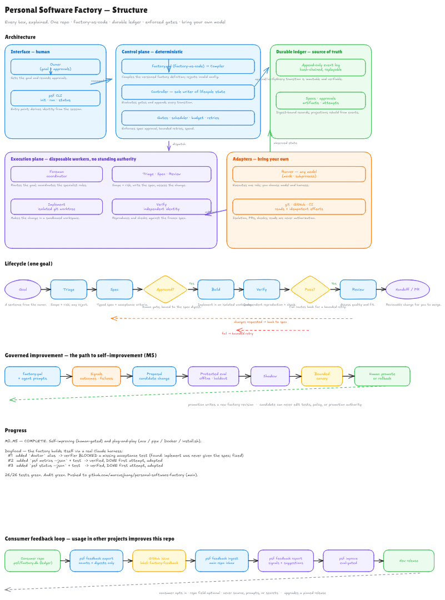

# Personal Software Factory

**A downloadable software factory you run inside your own repository.**

Install it once. In any repo, run `psf init`. Then tell it a goal — "add CSV export
to the metrics page" — and a **foreman** agent drives the work end to end:

```
intake → triage → spec → [your approval] → build → verify → review → handoff
```

Specialist agents do the work, an independent verifier checks it against the spec,
and you get a reviewable change (a diff or draft PR). Every step is written to a
durable, tamper-evident ledger, and the guardrails are enforced by code — not by
hoping the model follows the prompt.

It is model-agnostic. Bring your own agent harness (Claude Code, Codex, a local
script, anything that speaks the runner protocol). The factory owns the process;
you own the model.

- [PLAN.md](./PLAN.md) — the finalised product plan
- [docs/TECH-SPEC.md](./docs/TECH-SPEC.md) — the full technical specification

> Status: **working implementation, ready to use.** 43 tests, `psf audit` green,
> `psf eval-self` 27/27, `psf eval-gov` 8/8, `psf eval-supervisor` 16/16, multi-repo eval 20/20,
> real OSS repos **4/4** (cal.com / django / flask), Jev (TypeSafe) advisory layer. See [docs/READY.md](./docs/READY.md) for the
> honest "what's proven / what's not" page, [LOGBOOK.md](./LOGBOOK.md) and
> [docs/DIARY.md](./docs/DIARY.md).

---

## Why

Coding agents are good at editing files and bad at running a software process.
They forget decisions, skip verification, retry blindly, and declare victory on
unfinished work. A factory fixes the *process* around the model:

- **One durable process.** Intake, spec, approval, build, verify, review, handoff.
- **Enforced gates.** The controller refuses illegal transitions; a spec cannot
  go to build without an approval bound to its exact digest.
- **Independent verification.** The verifier is a different role with a different
  identity than the implementer, running against the frozen spec.
- **A real ledger.** Append-only and hash-chained, so you can inspect and replay
  exactly what happened.
- **Repo-native.** The factory lives in your repo as versioned config, not in
  someone else's cloud.

## What you get

```
your-repo/
├── factory/                  # factory-as-code (committed, reviewed)
│   ├── factory.yml           # roles, runner, gates, limits
│   ├── agents/*.md           # role prompts
│   └── policies/*.yml        # risk + gate policy (later)
└── .psf/                     # local runtime (gitignored)
    ├── factory.db            # append-only event ledger
    └── work/                 # isolated workspaces
```

## Diagram



Live, editable version: **[Excalidraw scene](https://app.excalidraw.com/s/919s34P0y0E/ABFyJp9mOpq)**.

```mermaid
flowchart LR
  Owner([Owner: goal + approvals]) --> CLI[psf CLI]
  Factory[factory.yml<br/>factory-as-code] --> Compiler[Compiler]
  Compiler --> Controller[Controller<br/>sole state authority]
  Controller <--> Ledger[(Ledger<br/>append-only, hash-chained)]
  Controller --> Gates[Gates · scheduler · budget · retries]
  Controller --> Foreman[Foreman]
  Foreman --> Triage --> Spec --> Build --> Verify --> Review --> Handoff[Handoff / draft PR]
  Build --> WS[Isolated git worktree]
  WS --> Runner[Runner — BYO model]
  Verify -. independent .-> Controller
  Handoff --> Owner

  subgraph IMP [Governed improvement — human-gated]
    direction LR
    Signals --> Proposal --> Eval[Protected eval] --> Shadow --> Canary --> Promote[Human promote / rollback]
  end
  Promote --> Factory

  subgraph FB [Consumer feedback loop]
    direction LR
    Consumer[(Consumer .psf ledger)] --> Export[psf feedback export] --> Issue[GitHub issue] --> Ingest[psf feedback ingest] --> ReportSignals[psf feedback report] --> Signals
  end
```



## Quickstart

```bash
# install (any one of these)
uvx personal-software-factory init          # zero-install
pipx install personal-software-factory      # isolated install
docker run -v "$PWD:/repo" ghcr.io/<you>/personal-software-factory init

# in your repository
psf init                                     # scaffold factory/ + .psf/
psf validate                                 # compile-check the factory definition
psf run "add CSV export to the metrics page" # run one goal through the factory
psf status                                   # show work items + ledger state
psf audit                                    # self health check (alias: psf doctor)
psf mode                                     # show autonomy mode; `psf mode yolo|hitl` to switch
psf metrics                                  # outcome signals from the ledger
psf eval                                     # run the protected evaluation
psf improve                                  # governed, human-gated improvement
psf feedback export                          # privacy-filtered usage envelope
```

Bring a real model — pick a harness with one flag (installed adapters):

```bash
# Claude Code (default model: sonnet)
psf run --git --harness claude "your goal here"

# opencode + DeepSeek (any opencode model)
psf run --git --harness opencode --model deepseek/deepseek-v4-pro "your goal here"

# Codex CLI
psf run --git --harness codex "your goal here"
```

Equivalent lower-level form (BYO command):

```bash
psf run --git --runner subprocess --command "psf-agent-claude" "your goal"
psf run --git --runner subprocess --command "psf-agent-opencode --model deepseek/deepseek-v4-pro" "your goal"
```

Both adapters share one implementation (`psf.adapters.common`) and use your
`factory/agents/*.md` prompts (passed per role), so editing those changes how the
agents behave. Pin a harness per repo via `factory.yml` `runnerOptions.command`.

## The factory loop

| Stage | Who | Gate / output |
|---|---|---|
| Intake | owner | `WorkCreated` |
| Triage | triage agent | scope, risk; may reject |
| Spec | spec agent | typed spec + acceptance criteria (digest-bound) |
| Spec review | **you** | approval bound to the exact spec digest |
| Build | implement agent | patch/artifact in an isolated workspace |
| Verify | verifier agent | pass/fail against the frozen spec, independent identity |
| Review | reviewer agent | approve or send back for another attempt |
| Handoff | owner | diff / draft PR for you to merge |

Failure loops back to Build within a bounded retry budget. Nothing merges or
deploys on its own.

## Design principles

1. **Agents propose; the controller decides.** No agent writes lifecycle state.
2. **Prompt text is never authority.** Gates are compiled and enforced in code.
3. **Everything is digest-bound.** Specs, approvals, artifacts, and events.
4. **Independent verification.** Different role, different identity.
5. **Bounded and reversible.** Budgets, retries, cancellation, cleanup.
6. **Bring your own model.** The runner is a small, documented interface.
7. **Local-first and private.** State stays in your repo; nothing phones home.

## Non-goals

- Not an autonomous software company. Humans hold spec approval and merge.
- Not a fleet/multi-tenant SaaS, not a universal workflow language, not a
  replacement for Git, GitHub, CI, or branch protection.
- Not a claim of unattended production readiness.

- [PLAN.md](./PLAN.md) — scope and milestones
- [docs/READY.md](./docs/READY.md) — ready-to-use guide + what's proven / not
- [docs/TECH-SPEC.md](./docs/TECH-SPEC.md) — implementation contract
- [docs/EVAL-PLAN.md](./docs/EVAL-PLAN.md) — how we evaluate the factory
- [docs/EVAL-PLAN-SELF-IMPROVING.md](./docs/EVAL-PLAN-SELF-IMPROVING.md) — how we evaluate self-improvement
- [docs/EVAL-GOVERNANCE.md](./docs/EVAL-GOVERNANCE.md) — how the eval suite grows safely
- [docs/PLAN-JEV.md](./docs/PLAN-JEV.md) — plan for Jev (TypeSafe) + a live supervisor
- [docs/COMPARISON.md](./docs/COMPARISON.md) — PSF vs Warp/Factory/Copilot/OpenHands/Claude Code
- [docs/EVAL-REPORT.md](./docs/EVAL-REPORT.md) — eval results and validated findings
- [docs/FEEDBACK.md](./docs/FEEDBACK.md) — feeding usage from other projects back in
- [LOGBOOK.md](./LOGBOOK.md) — chronological action log  ·  [docs/DIARY.md](./docs/DIARY.md) — reasoning and discoveries

## License

MIT — see [LICENSE](./LICENSE).
