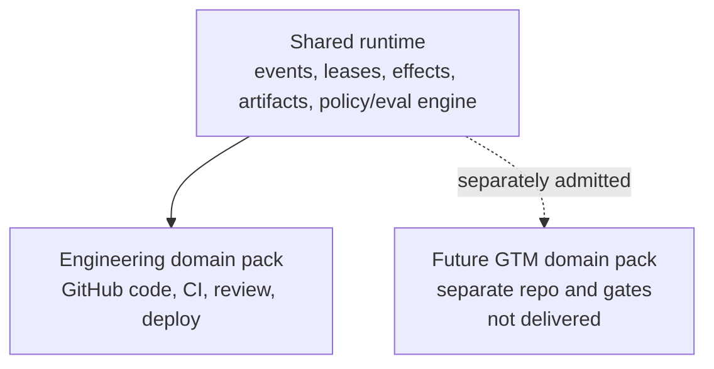

# ADR 0001: Repository Agent Operating System

- **Status:** Proposed
- **Date:** 2026-09-13
- **Decision owners:** Repository, platform, security, and product owners
- **Scope:** Architecture and operating model only. This ADR does not claim a working or production deployment.

## Context

Repository automation often mixes mutable labels, chat history, workflow runs, model reasoning, and GitHub APIs into one implicit state machine. That fails under retries, missed webhooks, stale workers, partial side effects, prompt injection, and human edits. It also lets the mechanism proposing work drift toward authorizing its own work.

We need a repository-native operating model that:

- makes desired configuration and reviewed specifications inspectable in Git;
- preserves durable runtime events, exact approvals, attempts, leases, fencing, effects, and idempotency;
- uses GitHub Issues/Projects/PRs as useful human collaboration surfaces without treating a label as a lock or approval;
- supports exact intake-to-outcome delivery and durable ideation/build/maintenance sub-lifecycles;
- permits reusable factory-as-code workflows, including structured deep research;
- supports improvement without self-authorization;
- begins with the engineering domain while leaving shared infrastructure usable by separately governed future domains.

GitHub Projects is an API-managed remote service whose GraphQL mutations use discovered node IDs and separate item-add/field-update calls ([Projects API guide](https://docs.github.com/en/issues/planning-and-tracking-with-projects/automating-your-project/using-the-api-to-manage-projects)). GitHub Actions concurrency allows limited running/pending behavior and arbitrary ordering, so it is not a durable fair claimant lock ([Actions concurrency](https://docs.github.com/en/actions/how-tos/write-workflows/choose-when-workflows-run/control-workflow-concurrency)). `GITHUB_TOKEN` is repository-scoped and organization Project automation needs a GitHub App or other separately authorized credential ([Actions and Projects](https://docs.github.com/en/issues/planning-and-tracking-with-projects/automating-your-project/automating-projects-using-actions)).

## Decision

### 1. Three authorities and two planes

Use:

- **Git** for desired configuration, schemas, policies, reviewed specs/plans/evals, factory definitions, and versions;
- **PostgreSQL** for canonical runtime events, approvals, attempts, fenced leases, idempotency/effect records, observations, reconciliation state, and projections;
- **GitHub** as authority for its remote issues, PRs, checks, reviews, merge queue, deployments, and Project resources, reconciled as a human-facing projection.

A deterministic control plane admits work, evaluates policy, records transitions, brokers capabilities, and reconciles GitHub. Disposable execution-plane agents plan, research, implement, review-assist, and produce evidence. Agents are proposal-only. They never authorize themselves.

### 2. Lifecycle and readiness

Use canonical lifecycle states:

`INBOX`, `TRIAGED`, `PLANNING`, `NEEDS_CLARIFICATION`, `READY_REVIEW`, `READY`, `LEASED`, `IMPLEMENTING`, `VERIFYING`, `REVIEW`, `MERGE_QUEUED`, `MERGED`, `DEPLOYING`, `OBSERVING`, `DONE`, plus `BLOCKED`, `CANCELLED`, and `ROLLED_BACK`.

`READY` is derived only from a deterministic Definition of Ready and an unexpired human approval bound to the exact canonical digest of work item, repository, base SHA, spec, plan DAG, acceptance oracles, risk, policy, and capability profile. A label/status is not sufficient. Material revision invalidates readiness.

Admission creates an attempt and a single database-enforced lease with monotonically increasing fence. Every worker effect carries current attempt/fence, expected revision, and idempotency key. PostgreSQL row locking such as `SKIP LOCKED` may coordinate dispatchers ([PostgreSQL SELECT](https://www.postgresql.org/docs/current/sql-select.html)).

### 3. Delivery separation

Separate implementation, clean verification, human/CODEOWNER review, merger, deployer, and promotion identities. Bind evidence and approval to exact head/artifact digests. A new push invalidates old evidence. Merge queue required checks run against `merge_group` ([GitHub merge queue](https://docs.github.com/en/repositories/configuring-branches-and-merges-in-your-repository/configuring-pull-request-merges/managing-a-merge-queue)). Production deploy uses separately reviewed environment policy; implementation credentials cannot deploy.

### 4. Reconciliation and effects

Webhooks are authenticated, deduplicated, queued, and followed by an authoritative read. Scheduled full scans repair lost/out-of-order deliveries. External effects record intent before the call and receipt afterward. Ambiguous outcome becomes `unknown` and blocks blind retry. Preserve unmanaged/unknown GitHub objects. Destructive, permission, or ambiguous drift requires a reviewed migration.

GitHub recommends HMAC validation and rapid asynchronous webhook handling ([validation](https://docs.github.com/en/webhooks/using-webhooks/validating-webhook-deliveries), [best practices](https://docs.github.com/en/webhooks/using-webhooks/best-practices-for-using-webhooks)).

### 5. Durable sub-lifecycles

Model three linked sub-lifecycles in the same event system:

- **IDEATION:** conversational revision, bounded research, synthesis, alternatives, human decision, and exact evidence/decision digests;
- **BUILD:** the readiness, lease, implementation, verification, review, merge, cleanup, deploy, and observation path;
- **MAINTENANCE:** authenticated signal, correlation/deduplication, diagnosis, proposal/scheduling, governed remediation, verification, observation, and resolution/rollback.

Conversation is never the only durable state. Each revision, source, finding, decision, artifact, and parent/child relation is recorded. IDEATION and MAINTENANCE can create BUILD work items, but cannot bypass BUILD gates.

### 6. Factory as code

Represent reusable workflows as protected, versioned, typed DAG factories in Git. Factory modules declare schemas, transition predicates, roles/gates, worker/tool/capability profiles, sandbox, budgets, leases/retries, effects/compensation, cleanup/retention, evaluation, and GitHub projection. Instances pin a compiled factory digest. PostgreSQL stores runs and node attempts.

Composition rejects cycles, unresolved inputs, conflicting capabilities, and overlapping parallel write sets. Joins use deterministic predicates, not model consensus. Factories can instantiate only preapproved authority; they cannot create new authority.

A deep-research factory composes scope/items/fields, source plan, parallel bounded collection, structured cited JSON, validation/deduplication/conflict review, synthesis, exact-digest human decision, and refresh/archival. Research inputs remain untrusted data.

GitHub supports reusable workflows and organization workflow templates, useful as packaging mechanisms but not substitutes for runtime authority ([reusable workflows](https://docs.github.com/en/actions/how-tos/reuse-automations/reuse-workflows), [workflow templates](https://docs.github.com/en/actions/how-tos/reuse-automations/create-workflow-templates)).

### 7. Maximum safe self-improvement

Permit an automated system to collect telemetry, draft changes, propose eval cases, run human-curated offline/adversarial evals, shadow with no authority, execute a bounded canary only after human admission, and automatically roll back on predefined guardrails.

Require an independent human to approve the exact candidate/eval/rollout digest for promotion. Agents cannot alter or approve permissions, risk tiers, gates, evaluator/oracles, thresholds, rulesets, CODEOWNERS, exceptions, secrets/egress, retention, production deploy, or their own promotion. The path is proposal -> curated eval -> offline -> shadow -> canary -> human exact-digest promotion, with rollback throughout.

### 8. Runtime/domain split

Build a shared **runtime layer** for event envelopes, PostgreSQL journal/leases/effects, policy evaluation, identity/capability brokerage, sandbox interfaces, artifact/provenance storage, eval execution, reconciliation primitives, observability, and factory compilation.

Build **domain packs** above it. Engineering is the first domain. Its workflows, tools, graders, approvals, compliance rules, GitHub adapters, and lifecycle mappings are engineering-specific.

Go-to-market (GTM) is a possible future domain in a separate, separately gated repository/domain. It may reuse the shared orchestration, artifact, evaluation, and policy infrastructure, but must define and review its own workflows, data boundaries, tools/connectors, graders, approval roles, retention, legal/privacy/compliance controls, and deployment/publishing semantics. No engineering approval, agent capability, or factory automatically transfers to GTM. This ADR and the current documentation do not deliver GTM capability.

## Alternatives considered

### GitHub Project/labels as the canonical state and lock

Rejected. They are mutable human-facing remote resources without the required transactional claim/fencing/event semantics. Manual labels cannot prove exact readiness or approval.

### Git as both desired state and runtime event store

Rejected. Commits are suitable for reviewed desired artifacts, not high-frequency heartbeats, compare-and-swap leases, idempotency, or external effect receipts. Automatically committing observed statuses also creates loops and noisy authority.

### GitHub Actions concurrency as scheduler/lease

Rejected as the primary mechanism. GitHub documents at most one running and one pending member, replacement of pending runs, arbitrary order, and case-insensitive groups. Retain it only as an extra dedupe/backpressure guard.

### Let agents directly update lifecycle and approve low-risk work

Rejected for the baseline. Prompt injection, stale context, checklist gaming, and incentive conflict make self-authorization unsafe. Future narrow automation still needs a separate promoted deterministic policy/evaluator identity and cannot govern its own promotion.

### Single long-lived privileged agent

Rejected. It expands blast radius, mixes duties, retains contaminated state, and weakens reproducibility. Prefer disposable workers and scoped, short-lived capability.

### Buy/adopt a durable workflow engine immediately

Deferred. A small PostgreSQL controller with inbox/outbox/effect ledger is sufficient for an initial single-repository pilot. Adopt a workflow engine only when measured long waits, volume, and recovery complexity justify it; external effect idempotency remains necessary.

### One universal domain factory for engineering and GTM

Rejected. Shared runtime primitives are useful, but tools, graders, authorization, data sensitivity, and compliance differ. Cross-domain reuse must stop below domain policy.

## Consequences

### Positive

- Clear authority and audit boundaries.
- Crash-safe exclusive claims and stale-worker rejection.
- Exact binding among intent, implementation, verification, review, artifact, and release.
- Human-facing GitHub workflow without relying on UI fields for authorization.
- Portable reviewed factory definitions with durable executions.
- Bounded self-improvement with rollback and independent promotion.
- Shared runtime can support future domains without silently transferring domain authority.

### Costs and trade-offs

- PostgreSQL, controller, token broker, reconciler, artifact storage, and operational ownership are required.
- Event schemas, canonical hashing, role mapping, drift migrations, and effect reconciliation add complexity.
- Human exact-digest gates increase latency for consequential work.
- Clean environments and identity separation cost compute and engineering effort.
- GitHub API preview/evolution, pagination, rate limits, and opaque IDs require capability detection and maintenance.
- Eventual consistency means GitHub may briefly lag canonical state; operators must understand the projection model.

## Guardrails and validation before pilot

A pilot must prove, not assume:

- exact DoR/approval invalidation and label-spoof rejection;
- competing dispatcher exclusion and stale fence rejection;
- inbox/outbox replay and unknown-effect recovery;
- webhook loss plus full reconciliation;
- prompt-injection attempts cannot expand capability or reveal secrets;
- clean verifier and exact-SHA evidence/review/merge-group binding;
- cancellation, cleanup, backup/restore, credential rotation, kill switch, deploy rollback;
- factory compiler cycle/schema/capability/write-set checks;
- self-improvement cannot change its own eval, gate, permission, or promotion;
- engineering domain policy cannot invoke any future GTM connector or authority.

Start observe-only, then claim-only for one low-risk repository and one worker, then draft PRs with full human gates. Expand only after local denominator-based evidence and human approval. No production capability is implied by accepting this ADR.

## References

- [GitHub rulesets](https://docs.github.com/en/repositories/configuring-branches-and-merges-in-your-repository/managing-rulesets/about-rulesets)
- [GitHub CODEOWNERS](https://docs.github.com/en/repositories/managing-your-repositorys-settings-and-features/customizing-your-repository/about-code-owners)
- [GitHub App permissions](https://docs.github.com/en/apps/creating-github-apps/registering-a-github-app/choosing-permissions-for-a-github-app)
- [GitHub App installation tokens](https://docs.github.com/en/apps/creating-github-apps/authenticating-with-a-github-app/generating-an-installation-access-token-for-a-github-app)
- [GitHub secure use of Actions](https://docs.github.com/en/actions/reference/security/secure-use)
- [CloudEvents 1.0.2](https://github.com/cloudevents/spec/blob/v1.0.2/cloudevents/spec.md)
- [OpenTelemetry signals](https://opentelemetry.io/docs/concepts/signals/)
- [SLSA provenance requirements](https://slsa.dev/spec/v1.2/provenance)
- [Google SRE canarying releases](https://sre.google/workbook/canarying-releases/)

## Amendment: control-product distribution and dogfooding

The repository ships immutable, compatibility-declared releases for isolated consumer repositories. Each consumer installs a pinned digest through a reviewed PR and a separately approved GitHub App repository selection. Effective configuration compiles product defaults, organization policy, repository overrides, and approved instance parameters; mandatory security/gate constraints cannot be weakened downstream. Every run records the resolved sources and digest.

Consumers receive upgrade PRs, never silent floating updates. Each PR includes compatibility and permission deltas, migration plan, eval evidence, canary ring, and prior rollback pin. Rollout proceeds self-test/sandbox -> opt-in low-risk -> bounded cohort -> general, with exact-digest human promotion. Privacy-filtered outcome envelopes may feed reviewed evaluation proposals, but raw consumer source/prompts/data remain isolated and feedback never self-promotes.

This repository dogfoods the last promoted stable release through the same consumer contract in a separate tenant. Stable code governs candidate work. Candidate code cannot approve, merge, publish, install, or promote itself. After independent promotion, a normal upgrade PR changes the self-consumer pin; guardrails can restore the prior immutable release. This avoids the circular trust of a candidate controlling the checks that authorize it.
