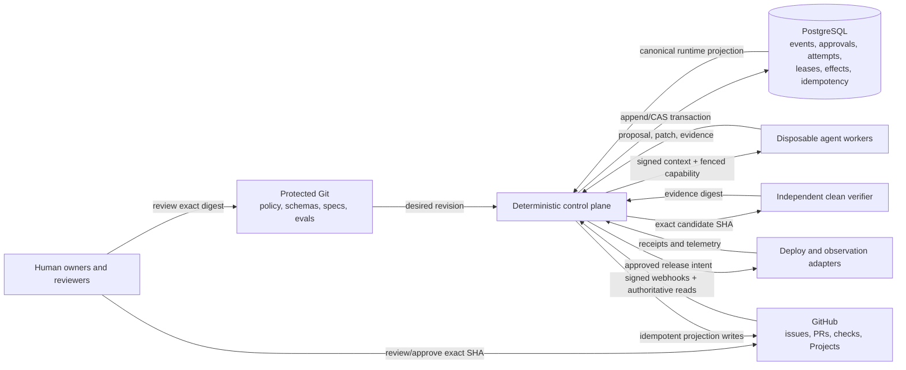
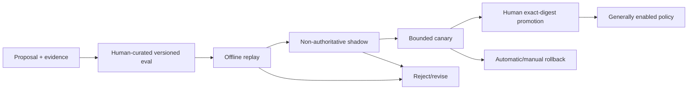

# Repository Agent OS Architecture

**Status:** Proposed reference architecture. This document describes a design, not a claim that production capability exists.

## 1. Decisions and authority

The system uses three authorities. They do not collapse into one store.

| Concern | Authority | Notes |
|---|---|---|
| Desired configuration, schemas, policies, reviewed specifications, plans, evaluation cases | Protected Git revision | Changes use pull requests, rulesets, CODEOWNERS, and exact-head review. Git is not the live task database. |
| Runtime lifecycle events, approvals, attempts, leases, fencing epochs, idempotency keys, effects, reconciliation cursors | PostgreSQL | The controller commits authoritative runtime transitions here. Records are append-oriented; projections are rebuildable. |
| Issues, pull requests, checks, reviews, merge queue, Project items and fields | GitHub | GitHub owns these remote resources. Their managed fields are a human-facing projection of canonical runtime state. |

A label, Project field, issue comment, agent message, or model output is never authorization. A deterministic controller verifies policy and records an accepted transition. Agents can propose specs, patches, comments, tests, evaluation cases, and policy changes. They cannot approve their own work, mint capabilities, weaken policy, or promote themselves.

GitHub issue forms are useful for structured intake, but submitted values become ordinary Markdown and the feature has schema limits. Canonical typed state must not depend on parsing headings ([GitHub issue-form syntax](https://docs.github.com/en/communities/using-templates-to-encourage-useful-issues-and-pull-requests/syntax-for-githubs-form-schema)). Project v2 automation uses GraphQL and opaque node/option IDs, which the adapter discovers rather than stores as portable policy ([GitHub Projects API guide](https://docs.github.com/en/issues/planning-and-tracking-with-projects/automating-your-project/using-the-api-to-manage-projects)).

## 2. Two planes

### Control plane

The control plane is deterministic code, not an LLM. It includes:

- webhook ingress, signature verification, durable inbox, and normalization;
- policy compiler and Definition of Ready (DoR) evaluator;
- spec and approval digest service;
- lifecycle state machine and append-only event journal;
- admission scheduler, attempt manager, fenced lease service, and capability broker;
- effect ledger and transactional outbox;
- GitHub Project/issue/PR reconciler;
- risk classifier, human-gate verifier, kill switch, and audit export;
- self-improvement evaluation and promotion controller.

### Execution plane

The execution plane contains disposable workers:

- planner and clarification/spike worker;
- implementation worker;
- clean-room verifier;
- optional review assistant;
- deploy and observation runners with narrowly scoped capabilities.

Workers receive a signed, bounded context bundle tied to exact hashes and a current lease. Enforcement remains in the controller/capability proxy. Instructions and prompts explain allowed work but do not grant it.



## 3. Trust boundaries

| Boundary | Input is treated as | Enforcement |
|---|---|---|
| Git protected base -> controller | Reviewed desired policy, only after signature/revision/ruleset checks | Fetch exact commit; schema and semantic validation; content digest |
| GitHub webhook -> ingress | Untrusted until authenticated; still not authorization | HMAC-SHA256 on raw body, delivery-ID dedupe, enqueue then acknowledge, authoritative reread ([validation](https://docs.github.com/en/webhooks/using-webhooks/validating-webhook-deliveries), [best practices](https://docs.github.com/en/webhooks/using-webhooks/best-practices-for-using-webhooks)) |
| Issue/comment/code/log/tool output -> model | Untrusted data, possibly prompt-injected | Trust labels, bounded context, tool allowlist, egress and secret isolation |
| Controller -> worker | Signed facts and limited requested actions | Manifest digest, expiry, worker identity, attempt and fence verification |
| Worker -> side effect | Proposal until policy gateway accepts it | Current lease/fence, expected revision, idempotency/effect key, capability scope |
| Verification -> merge | Evidence only for exact candidate | Fresh environment, exact SHA, required-check identity, evidence digest |
| GitHub UI -> canonical lifecycle | Observation or requested transition | State-machine validation and DB compare-and-append |
| Self-improvement proposer -> promotion | Untrusted proposal | Curated eval, independent results, human approval of exact digest, staged rollout |

Use a GitHub App with the minimum repository and organization permissions. `GITHUB_TOKEN` does not provide organization Projects access; GitHub recommends an App installation token for organization Projects ([GitHub Actions and Projects](https://docs.github.com/en/issues/planning-and-tracking-with-projects/automating-your-project/automating-projects-using-actions)).

## 4. Components and records

### Repository artifacts

A future implementation should define reviewed files for lifecycle policy, DoR, risk tiers, GitHub schema mapping, command catalog, sandbox policy, specifications, plans, evaluation cases, and rollout policy. The exact paths and schemas are implementation details, but each artifact needs a stable logical key, schema version, canonicalization rule, and content digest. Opaque GitHub node IDs belong in rebuildable runtime bindings, not Git.

### PostgreSQL aggregates

Minimum logical records are `work_item`, `spec_revision`, `approval`, `event`, `attempt`, `lease`, `effect`, `artifact`, `github_observation`, `reconcile_run`, `inbox`, and `outbox`.

Every accepted event includes an event ID, schema version, aggregate ID and version, actor principal/class, correlation and causation IDs, policy commit, spec/plan/base hashes where relevant, before/after state, timestamp, payload hash, and idempotency key. Effects record intent before an external call, then confirmed/unknown/compensated status and remote receipts.

A lease contains `lease_id`, work item, attempt, owner, scope, monotonic `fence`, issue and expiry times, last heartbeat, cancellation epoch, approved hashes, and capability profile. Competing dispatchers can select work with PostgreSQL row locking and `SKIP LOCKED`; the database constraint and fence remain the lock, not Actions concurrency or an issue assignee ([PostgreSQL SELECT](https://www.postgresql.org/docs/current/sql-select.html), [GitHub Actions concurrency](https://docs.github.com/en/actions/how-tos/write-workflows/choose-when-workflows-run/control-workflow-concurrency)).

### GitHub adapter

The adapter discovers and paginates live objects, normalizes them by logical key, calculates drift, and emits a no-side-effect plan before applying bounded changes. It preserves unknown objects by default. Project item add and field update are separate operations, so each has its own effect record and read-after-write check ([Projects API guide](https://docs.github.com/en/issues/planning-and-tracking-with-projects/automating-your-project/using-the-api-to-manage-projects)).

## 5. Lifecycle

Canonical states are:

`INBOX`, `TRIAGED`, `PLANNING`, `NEEDS_CLARIFICATION`, `READY_REVIEW`, `READY`, `LEASED`, `IMPLEMENTING`, `VERIFYING`, `REVIEW`, `MERGE_QUEUED`, `MERGED`, `DEPLOYING`, `OBSERVING`, `DONE`, with side states `BLOCKED`, `CANCELLED`, and `ROLLED_BACK`.

```mermaid
stateDiagram-v2
  [*] --> INBOX
  INBOX --> TRIAGED: authenticated and deduplicated
  TRIAGED --> PLANNING: owner, risk floor, scope
  PLANNING --> NEEDS_CLARIFICATION: blocking unknown/decision
  NEEDS_CLARIFICATION --> PLANNING: attributable answer or bounded spike
  PLANNING --> READY_REVIEW: deterministic DoR candidate passes
  READY_REVIEW --> READY: exact hash-bound human approval
  READY_REVIEW --> PLANNING: rejected or revised
  READY --> PLANNING: approval invalidated
  READY --> LEASED: atomic admission recheck
  LEASED --> IMPLEMENTING: context and sandbox verified
  IMPLEMENTING --> VERIFYING: exact candidate registered
  VERIFYING --> REVIEW: clean evidence passes
  VERIFYING --> IMPLEMENTING: correctable failure and valid lease
  REVIEW --> IMPLEMENTING: changes requested; new head
  REVIEW --> MERGE_QUEUED: merge predicate passes
  MERGE_QUEUED --> MERGED: GitHub confirms merged SHA
  MERGE_QUEUED --> REVIEW: queue/check/base change
  MERGED --> DEPLOYING: approved deployment begins
  MERGED --> OBSERVING: no deployment required
  DEPLOYING --> OBSERVING: deployment receipt verified
  OBSERVING --> DONE: observation window and outcome pass
  DEPLOYING --> ROLLED_BACK: rollback policy/human command
  OBSERVING --> ROLLED_BACK: guardrail breach
  ROLLED_BACK --> DONE: rollback verified and follow-up linked
  INBOX --> CANCELLED
  TRIAGED --> CANCELLED
  PLANNING --> CANCELLED
  NEEDS_CLARIFICATION --> CANCELLED
  READY_REVIEW --> CANCELLED
  READY --> CANCELLED
  LEASED --> CANCELLED
  IMPLEMENTING --> CANCELLED
  VERIFYING --> CANCELLED
  REVIEW --> CANCELLED
  state BLOCKED
```



`BLOCKED` is a reasoned side state reachable from any nonterminal state when a dependency, policy, capability, drift, or external condition prevents progress. A recorded unblock transition returns to the explicitly saved prior state; it never skips a gate.

## 6. State invariants

1. Only the controller appends canonical lifecycle transitions. Agents and GitHub UI changes submit requests or evidence.
2. `READY` is derived. It requires a deterministic DoR pass and an unexpired approval bound to the canonical digest of work item, repository, base SHA, spec, plan DAG, acceptance oracles, risk tier, capability profile, and policy commit.
3. A material change to any bound claim invalidates approval and returns the item to `PLANNING` or `READY_REVIEW`. A label named `READY` has no authority.
4. Admission rechecks readiness, dependency success, risk, budgets, worker capability, base compatibility, and conflicts in the same transaction that creates the attempt and lease.
5. At most one active implementation lease exists for a serialized work item/write set. Fences strictly increase. Every accepted worker write carries the current attempt and fence.
6. Lease expiry or cancellation revokes capabilities before requeue. Late output is retained as quarantined evidence but cannot advance state.
7. Every external side effect has a stable logical idempotency key, an intent recorded before the call, and a receipt or `unknown` outcome. Unknown effects block blind retry.
8. Verification and approval bind to the exact current head SHA. A push invalidates older evidence and reviews. Required checks must run for that SHA; merge queue checks run on `merge_group` ([merge queue](https://docs.github.com/en/repositories/configuring-branches-and-merges-in-your-repository/configuring-pull-request-merges/managing-a-merge-queue)).
9. `MERGED` requires a GitHub read confirming the merged commit. `DONE` additionally requires completed cleanup and, when applicable, deploy/observation outcome.
10. Project status is eventually consistent projection state. Projection failure cannot erase a canonical lease or manufacture authorization.
11. Policy, permissions, rulesets, CODEOWNERS, evaluators, and promotion thresholds cannot be changed or approved by the agent whose work they govern.
12. Destructive or ambiguous drift fails closed. Unknown remote objects are preserved unless a reviewed migration names them.

## 7. Approval digest

Canonicalize and hash at least:

```text
work_item_id | repository_id | base_sha | spec_hash | plan_dag_hash |
acceptance_oracle_hash | risk_tier | policy_commit_sha |
capability_profile_hash | issued_at | expires_at
```

The approval record also stores the verified principal, authorized role, quorum set, source review/comment ID, reason, and revocation state. The controller recomputes this digest at readiness and again at lease, review, merge, and deploy gates. Approval is a database fact supported by GitHub review evidence, not a mutable checkbox.

## 8. Reconciliation and consistency

Webhooks reduce latency but do not establish truth. The reconciler combines signed webhook delivery with scheduled full reads. It classifies drift as:

- **projection lag:** canonical event is valid; update the managed GitHub field;
- **human transition request:** validate and either accept into the event log or restore projection with an explanation;
- **safe additive schema drift:** plan and repair using an approved desired revision;
- **destructive/access/ambiguous drift:** freeze affected writes and require a reviewed migration;
- **unmanaged drift:** observe or alert; do not overwrite.

GitHub recommends rapid webhook acknowledgment and asynchronous processing, and provides delivery identifiers for redelivery/deduplication ([webhook best practices](https://docs.github.com/en/webhooks/using-webhooks/best-practices-for-using-webhooks)). REST and GraphQL rate limits must be observed during complete pagination and retries ([REST rate limits](https://docs.github.com/en/rest/using-the-rest-api/rate-limits-for-the-rest-api), [GraphQL limits](https://docs.github.com/en/graphql/overview/rate-limits-and-query-limits-for-the-graphql-api)).

## 9. Self-improvement boundary

The only allowed path is:



The proposer cannot curate the decisive evaluation alone, approve its result, change the threshold, widen permissions, or promote the artifact. Offline, shadow, and canary records bind the candidate model/prompt/tool/workflow/config digest, dataset digest, evaluator version, metrics, and known exceptions. Promotion always has a rollback pointer and expiry/review date.


## 10. Durable sub-lifecycles

The top-level lifecycle coordinates delivery, while three durable sub-lifecycles preserve domain work that would otherwise disappear into chat or logs.

| Sub-lifecycle | Durable states | Output and admission rule |
|---|---|---|
| **IDEATION** | `CAPTURED`, `RESEARCHING`, `SYNTHESIZING`, `DECISION_REVIEW`, `DECIDED`; side states `NEEDS_INPUT`, `BLOCKED`, `CANCELLED` | Attributed conversation revisions, structured cited research, alternatives, decision record, exact evidence digest. A decision may propose BUILD work but cannot bypass DoR/readiness. |
| **BUILD** | The canonical planning-through-`DONE` states in this document | Reviewed spec, patch, clean evidence, merged/deployed artifact, observed outcome, cleanup receipts. |
| **MAINTENANCE** | `SIGNAL_RECEIVED`, `CORRELATED`, `DIAGNOSED`, `PROPOSED`, `SCHEDULED`, `EXECUTING`, `VERIFIED`, `OBSERVING`, `RESOLVED`; side states `SUPPRESSED`, `BLOCKED`, `CANCELLED`, `ROLLED_BACK` | Authenticated/deduplicated signal group, diagnosis and remediation evidence. Consequential remediation creates a normally gated BUILD item. |

Each sub-lifecycle uses the same event envelope, approval, idempotency, artifact, and parent/child link contracts. Conversational revision is append-only and attributable. New evidence produces a new revision. It never silently rewrites an earlier decision.

## 11. Workflow factories and composition

A factory is protected Git configuration that compiles a typed workflow DAG. A module declares input/output schemas, transition predicates, worker role, capability and sandbox profile, risk/gates, budgets, lease/retry/idempotency and compensation policy, cleanup/retention, evaluation suite, and projection mapping. An instance pins the compiled factory digest; its runs and node attempts live in PostgreSQL.

The compiler must reject cycles, missing or incompatible edges, unbound authority, capability conflicts, and overlapping parallel writes/resources. Nodes exchange digest-addressed artifacts. Deterministic join predicates consume validated outputs; model consensus cannot authorize the join. Factories instantiate preapproved authority only. They cannot manufacture a new permission or approver.

A deep-research factory composes scope/question revision, research items and field/evidence schema, bounded parallel research, structured source-cited JSON, schema/coverage/source-quality validation, deduplication and conflict review, synthesis, exact-digest human decision, and archival/refresh. Research content stays untrusted. Factory evolution follows offline replay, shadow, canary, and human exact-digest promotion.

## 12. Runtime and domain boundary

The shared runtime owns neutral primitives: event journal, approvals, attempts, leases/fences, effects/idempotency, policy evaluation, capability brokerage, sandbox and artifact interfaces, eval execution, reconciliation framework, observability, and factory compilation.

Engineering is the first domain pack. It defines engineering lifecycle mappings, GitHub code/CI/review/deploy adapters, commands, graders, risk tiers, owners, and compliance rules.

GTM is only a possible future, separate repository/domain. It may reuse shared orchestration, artifact, evaluation, and policy infrastructure, but it needs its own workflows, connectors/tools, graders, approvals, retention, privacy/legal/compliance rules, and publishing semantics. Engineering authority never flows into GTM automatically. This design does not claim that GTM capability is delivered.


## 13. Versioned control product and repository isolation

This repository is the source for a versioned **control product**, not the runtime database for every consumer. A consuming repository installs a pinned release manifest containing the control-product version/digest, supported config schema range, selected engineering factory/domain-pack versions, adapter versions, and required GitHub App permissions. Installation creates a distinct repository tenant in PostgreSQL, distinct logical keys/idempotency namespaces, repository-scoped App installation selection, separate queues/quotas, and isolated worker workspaces/artifacts. Cross-repository read/write is denied unless a reviewed workflow declares it and each repository owner approves it.

Configuration uses explicit layers: immutable product defaults -> organization policy -> repository config -> narrowly allowed work-item parameters. The schema marks fields as inheritable, replaceable, or non-overridable. A lower layer can tighten budgets/capabilities but cannot weaken mandatory security, approval, audit, retention, or domain-isolation constraints. The compiler records every source and produces one effective-config digest. Hidden environment-based policy overrides are forbidden.

Consumers pin releases by immutable Git commit/tag plus artifact digest. Compatibility metadata states controller, database/event schema, factory, domain pack, and repository-config ranges. Upgrades arrive as generated pull requests containing release notes, effective-config diff, permission delta, migration plan, validation/eval results, rollback pin, and canary ring. Database/config changes use expand/migrate/contract and preserve old event readers during the supported window. No consumer is silently floated to latest.

Rollout rings are: product repository/self-test and sandbox -> volunteer low-risk consumers -> bounded wider cohort -> general availability. Promotion between rings requires health evidence and human approval of the exact release digest; guardrails automatically restore the prior pin. A consumer can pause upgrades, but security expiry/deprecation remains explicit and human-owned.

Consumer feedback crosses the isolation boundary only as a privacy-filtered outcome envelope: anonymous/pseudonymous consumer and cohort IDs, pinned versions/digests, task/risk class, metric denominators, policy/check result classes, latency/cost bands, failure taxonomy, and approved redacted evidence references. Raw source, prompts, issue bodies, secrets, customer data, and proprietary patches stay local unless a named owner separately approves export. Feedback can propose eval cases; a curator reviews/redacts/licenses them before inclusion. It never automatically trains or promotes a candidate.

This repository dogfoods its own **released** control product through the same consumer installation contract and an isolated tenant. A candidate change cannot govern its own merge or promotion. The current pinned stable release evaluates and orchestrates candidate work; protected human review promotes the candidate digest; only then can an upgrade PR move this repository's consumer pin through the self-test canary. A separate break-glass path can disable automation or restore the last-known-good pin without using candidate code.
