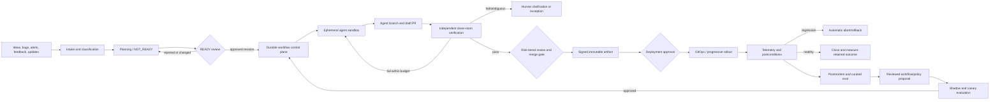

# Agent-managed software projects: evidence, architecture, and reusable workflows

## Decision

A software project can now be **largely agent-operated at the task level**, but it cannot responsibly be made fully self-governing.

The production-credible unit is:

> **A properly planned, bounded task enters a durable workflow; a least-privilege agent produces a proposal or draft PR; independent systems verify it; protected policy and accountable people approve consequential actions; telemetry measures the outcome; failures become reviewed evaluation cases.**

This is substantially different from asking one long-running agent to own the backlog, code, review itself, deploy, and rewrite its own instructions. Public evidence supports the first design. It does not support the second.

The most important design choice is therefore not which coding model to buy. It is the **control system around the model**:

- a real ticket state machine and Definition of Ready;
- a durable, deterministic workflow engine as source of truth;
- ephemeral, isolated agent workers with short-lived credentials;
- protected, independent verification and merge rules;
- risk-tiered human gates;
- signed artifacts, progressive delivery, and tested rollback;
- correlated telemetry and a governed improvement loop.

No reviewed product demonstrates a reliably autonomous `plan → build → review → deploy → observe → repair → learn` loop across general software projects. GitLab Duo exposes broad agentic SDLC flows, while Sentry provides a narrower observability-to-fix bridge; OpenHands, hosted coding agents, CI/CD, GitOps, and evaluation tools cover other pieces. The safe answer is a composed architecture, not an “autonomous engineering employee.” See [GitLab Duo Agent Platform](https://docs.gitlab.com/user/duo_agent_platform/), [Sentry Seer](https://docs.sentry.io/product/ai-in-sentry/seer/), [OpenHands](https://github.com/All-Hands-AI/OpenHands), and [Microsoft’s Agentic SDLC Starter](https://github.com/microsoft/agentic-sdlc-starter).

## Scope, method, and evidence limits

Research is current to **2026-09-13** and emphasizes 2019-present. Fourteen tracks covered commercial coding agents, open-source frameworks, specification workflows, CI/CD, dependency and security maintenance, observability and remediation, quality gates, governance, academic systems, production cases, orchestration, feedback loops, reference architectures, and build-versus-buy choices.

All 14 result files pass the research schema: **19/19 required fields each**. The corpus contains **488 source records and 387 unique URLs** before title-level deduplication. Primary sources include product documentation, repositories, standards, papers, benchmark projects, and first-party postmortems. Independent research and practitioner evidence were used to challenge product claims. The detailed implementation companion is [`workflow-blueprint.md`](./workflow-blueprint.md). The independent challenge memo is [`synthesis-audit.md`](./synthesis-audit.md). The full source list is in [`evidence-index.md`](./evidence-index.md), and the structured records are in [`results/`](./results/).

Important limits:

1. Vendor documentation is live and often undated.
2. There is no normalized, independently audited 2026 dataset comparing accepted changes, escaped defects, reviewer time, incidents, and full cost across vendors.
3. Coding benchmarks measure patches against test harnesses, not safe production operation. [SWE-Bench+](https://arxiv.org/abs/2410.06992) found solution leakage and weak-test effects that reduced one reported SWE-agent result from 12.47% to 3.97% after filtering.
4. Production stories often omit task selection, failures, reviewer labor, post-merge defects, and operating cost.
5. Repeated citations across the 14 tracks are often the same cornerstone study, not 14 independent confirmations.
6. “Assigned,” “resolved,” “passed,” “merged,” “accepted,” “retained,” and “deployed safely” use different denominators. The report does not compare them as if they were one success metric.
7. Broad discovery search through Serper was unavailable. Researchers compensated with direct official documents, repository traversal, academic sources, and direct URL checks. This weakens universal “no system exists” claims, but not the positive claims about cited systems.

## Key findings

### What is solved, and what is not

| Capability | Maturity | Safe operating boundary |
|---|---|---|
| Issue forms, backlog states, protected branches, CI, approvals, audit | Production-ready | Use as the deterministic backbone. |
| Dependency update and vulnerability PRs | Production-ready with controls | Narrow allowlists; exact-head CI; trusted sources; protected auto-merge predicates; rollback. |
| Clear issue to draft PR | Conditionally useful | One repository, bounded scope, reproducible environment, strong tests, limited permissions, human merge. |
| Test generation and AI review | Useful as evidence generation | Run and filter outputs; never use AI confidence or coverage alone as approval. |
| CI failure diagnosis and candidate repair | Conditionally useful | Draft patch; clean-room verification; capped retries; escalate ambiguity. |
| Telemetry correlation and root-cause suggestions | Conditionally useful | Recommendation, editable plan, draft PR, or pre-approved reversible runbook. |
| Progressive deployment and automatic rollback | Production-ready as deterministic automation | Immutable artifact; SLO-based canary; independent postconditions. |
| Multi-agent fan-out | Emerging and situational | Only for separable work with objective contracts; measure benefit over one agent. |
| Cross-repository features and large migrations | Emerging | Human-approved architecture and phased plan; checkpoints; manual merge/deploy. |
| Novel AI-selected production remediation | Experimental | Prefer rollback or a known runbook; otherwise require incident commander approval. |
| Autonomous product intent, roadmap ownership, self-review, policy changes | Unsupported | Keep human-owned. |
| Unattended end-to-end project ownership | Unsupported | Do not deploy this design. |

The evidence is mixed on productivity. A constrained GitHub Copilot experiment reported **55.8% faster** completion ([paper](https://arxiv.org/abs/2302.06590)). METR’s early-2025 study of experienced maintainers found work was **19% slower** with AI ([study](https://metr.org/blog/2025-07-10-early-2025-ai-experienced-os-dev-study/)). METR’s 2026 follow-up produced possible speedup point estimates but explicitly judged causal interpretation weak because of selection and time-accounting bias ([update](https://metr.org/blog/2026-02-24-uplift-update/)). Answer.AI reported only **3 successes in 20 Devin tasks**, with 14 failures and 3 inconclusive ([case report](https://www.answer.ai/posts/2025-01-08-devin.html)). These results can coexist because task selection, repository familiarity, workflow, model, and success definitions differ.

The implication is simple: **do not procure on benchmark rank or lines of code. Run a repository-specific shadow trial and measure retained outcomes.**

## Detailed evidence and workflow design

### Reference architecture



### Two planes

**Control plane:** deterministic software owns state transitions, leases, retries, timeouts, idempotency, budgets, approvals, authorization, event history, and audit. GitHub/GitLab plus a queue is sufficient at small scale. Temporal offers durable histories, task queues, and retries when volume and long-running workflows justify it: [workflows](https://docs.temporal.io/workflows), [task queues](https://docs.temporal.io/task-queue), [retry policies](https://docs.temporal.io/encyclopedia/retry-policies).

**Execution plane:** replaceable coding agents run in disposable environments. They receive only the approved ticket revision, repository snapshot, scoped tools, budget, and short-lived credentials. An LLM must not be the scheduler, authorization boundary, or canonical state store.

### Trust boundaries

Use different identities for:

1. **Planner/proposer** — reads context and drafts a plan; cannot mark its own plan approved.
2. **Implementer** — writes only to an agent branch; cannot alter protected workflow policy.
3. **Verifier** — runs trusted checks from the protected default branch in a clean environment.
4. **Reviewer/approver** — accepts product and technical risk; human for consequential work.
5. **Builder/signer** — emits provenance-bound immutable artifacts.
6. **Deployer** — changes declared environment state only after policy approval.
7. **Observer/remediator** — reads telemetry; can invoke only allowlisted runbooks unless a human approves more.

This separation follows secure-development and supply-chain principles in [NIST SSDF](https://csrc.nist.gov/pubs/sp/800/218/final), [SLSA requirements](https://slsa.dev/spec/v1.2/requirements), and GitHub’s [Actions hardening guidance](https://docs.github.com/en/actions/security-for-github-actions/security-guides/security-hardening-for-github-actions).

## Workflow 1: planned ticket to verified change

### Required state machine

```text
INBOX
  → TRIAGED
  → NOT_READY
  → PLANNING
  → READY_REVIEW
  → READY / APPROVED
  → IMPLEMENTING
  → VERIFYING
  → REVIEW
  → MERGE_QUEUED
  → DEPLOYING
  → OBSERVING
  → DONE
```

Exceptional states: `NEEDS_CLARIFICATION`, `BLOCKED`, `FAILED_BUDGET`, `SECURITY_REVIEW`, `ROLLED_BACK`, and `CANCELLED`.

`INBOX` authenticates, normalizes, deduplicates, and privately routes security reports. `TRIAGED` assigns a type, owner, priority hint, risk floor, and repository. Product priority remains human-owned.

Opening, assigning, or labeling a ticket **must not start implementation**. The implementation trigger is a transition to `READY/APPROVED` for an immutable ticket/spec revision. Approval should bind `work_item_id + spec_revision + plan_revision + policy_version + expiry`; relevant changes invalidate it. A time-boxed read-only or isolated spike may answer an empirical planning question, but its prototype output cannot silently become the production implementation.

### Definition of Ready

A ticket is READY only when all applicable items are explicit:

#### Product intent

- Problem and affected user or system.
- Expected value or operational outcome.
- Current behavior and desired behavior.
- Scope and explicit non-goals.
- Positive and negative acceptance criteria expressed as observable outcomes.
- Product owner for ambiguity.

#### Evidence and context

- Bug reproduction, failing test, trace, screenshot, or justified reproduction exception.
- Relevant repositories, services, interfaces, schemas, and owners.
- Linked previous decisions, incidents, ADRs, and related tickets.
- Known constraints and compatibility requirements.

#### Technical plan

- Proposed approach and credible alternatives considered.
- Expected files/components and public interfaces affected.
- Decomposition into independently verifiable sub-tasks.
- Dependencies and sequencing.
- Test plan: unit, integration, contract, end-to-end, security, performance, and manual checks as applicable.
- Data migration, backward compatibility, observability, rollout, and rollback plan.

#### Risk and authorization

- Risk tier and blast radius.
- Required reviewers/code owners.
- Required secrets, network destinations, tools, and write scopes.
- Cost/time/token budget and retry ceiling.
- Zero unresolved blocking questions.
- Product and technical approval of the exact `spec_revision` and `plan_revision`.

If scope, acceptance criteria, risk, dependency, or architecture changes materially, READY is invalidated and the ticket returns to PLANNING. Approval never floats across a changed plan.

GitHub provides issue forms, sub-issues, PR linking, and protected branches as substrate: [issue form schema](https://docs.github.com/en/communities/using-templates-to-encourage-useful-issues-and-pull-requests/syntax-for-githubs-form-schema), [sub-issues](https://docs.github.com/en/issues/tracking-your-work-with-issues/using-issues/adding-sub-issues), and [protected branches](https://docs.github.com/en/repositories/configuring-branches-and-merges/managing-protected-branches/about-protected-branches). GitHub’s own coding-agent guidance emphasizes well-scoped tasks and acceptance criteria: [best practices](https://docs.github.com/en/copilot/using-github-copilot/coding-agent/best-practices-for-using-copilot-to-work-on-tasks).

### Clarification loop

The planning agent must ask rather than infer when ambiguity affects product behavior, security, data loss, compatibility, legal/privacy obligations, architecture, or rollout safety.

1. Classify each unknown as blocking or non-blocking.
2. Group blocking questions into one concise clarification request.
3. Attach options, trade-offs, and the agent’s recommendation where evidence permits.
4. Set state to `NEEDS_CLARIFICATION`; do not consume implementation budget.
5. Incorporate the answer as a new spec revision.
6. Re-run READY validation and approvals.
7. Escalate after a fixed number of loops or elapsed time rather than inventing intent.

Low-impact implementation details can be delegated if the plan explicitly grants that discretion and tests define the boundary.

### Execution

1. Control plane snapshots the approved ticket, plan, policy, code commit, and tool manifest.
2. Create an ephemeral sandbox with no production secrets and default-deny or allowlisted network access.
3. Give the implementer a short-lived token that can write only to its branch.
4. Reproduce the issue or establish the baseline before editing.
5. Implement the smallest coherent change. Update relevant tests and documentation.
6. Run untrusted local checks for fast feedback.
7. Produce a structured handoff: diff summary, decisions, tests, evidence, residual risk, and deviations from plan.
8. Open a draft PR. The agent cannot approve or merge it.

Hosted workers include [GitHub Copilot coding agent](https://docs.github.com/en/copilot/concepts/agents/cloud-agent/about-cloud-agent), [Codex cloud](https://developers.openai.com/codex/cloud), [Claude Code GitHub Actions](https://code.claude.com/docs/en/github-actions), and [Devin](https://docs.devin.ai/). Open-source choices include [OpenHands](https://github.com/All-Hands-AI/OpenHands), [Aider](https://aider.chat/docs/git.html), and mini-SWE-agent. Their role should remain replaceable.

### Independent verification

Trusted CI must rebuild and test the exact PR head without trusting scripts, test results, or policy modified on the agent branch.

Required checks by risk include:

- build, format, lint, and type checks;
- changed behavior tests plus regression suite;
- negative and boundary tests;
- dependency, secret, SAST, and IaC scans;
- contract/schema and migration checks;
- fuzzing or property tests for suitable high-risk surfaces;
- mutation or test-quality checks where weak oracles are a known risk;
- artifact provenance and policy evaluation;
- merge-queue rerun against current base.

AI review and generated tests can suggest missing cases, but executable evidence decides. One [study of professional AI-assisted review](https://arxiv.org/abs/2411.11401) found high retention of surfaced findings but surfaced only 42% of injected issues; it did not show a time saving. Coverage also says code ran, not that assertions are correct. Use protected rules, such as GitHub [rulesets](https://docs.github.com/en/repositories/configuring-branches-and-merges/managing-rulesets/about-rulesets), rather than agent self-confidence.

### Review and close

A human reviews at least product semantics, architecture, security-sensitive code, migrations, and exceptions. Lower-risk work can eventually use policy-based auto-merge only after local evidence supports it.

A ticket closes only after:

- acceptance criteria are mapped to evidence;
- the merged SHA and artifact digest are recorded;
- deployment and observation windows complete where applicable;
- no rollback or severe regression occurred;
- reviewer and agent effort are recorded for economics.

## Workflow 2: dependency and security maintenance

This is the strongest early automation candidate.

### Trigger

A scheduled dependency scan, advisory, SCA/SAST finding, secret finding, or supported autofix event.

### Flow

1. Normalize package, current version, target version, advisory, severity, exploitability, reachability, and supplier/provenance data.
2. Group compatible low-risk updates to reduce noise; isolate risky upgrades.
3. Classify:
   - **allowlisted patch/dev-only update:** eligible for automatic proposal and possibly guarded auto-merge;
   - **minor runtime update:** proposal plus human exception policy;
   - **major, workflow, compiler, auth, database, or supply-chain-sensitive update:** human-approved plan;
   - **active exploit/critical vulnerability:** expedited security workflow, not weakened checks.
4. Generate lockfile and manifest changes in a branch.
5. Run exact-head build, tests, dependency review, license policy, vulnerability scan, and artifact provenance.
6. Observe a release-soak period when registry compromise or regression risk matters.
7. Merge only if every repository-enforced predicate passes and rollback is fast.
8. Canary runtime-critical changes and monitor.

[Dependabot](https://docs.github.com/en/code-security/dependabot/dependabot-version-updates/configuration-options-for-the-dependabot.yml-file) and [Renovate](https://docs.renovatebot.com/key-concepts/automerge/) provide mature proposal mechanics. An observational study found 65.42% acceptance of Dependabot security PRs, but acceptance was not proof of correctness ([MSR 2021](https://doi.org/10.1109/MSR52588.2021.00037)). Neither bot proves semantic compatibility. CodeQL Autofix is also a proposal that requires review; GitHub documents its limitations in [responsible-use guidance](https://docs.github.com/en/code-security/code-scanning/managing-code-scanning-alerts/responsible-use-autofix-code-scanning).

### Safe autonomy

Auto-merge only when all are true:

- package and update class are allowlisted;
- supplier and artifact provenance satisfy policy;
- no install-script or CI workflow privilege change;
- deterministic tests and scans pass at the exact head;
- change stays under size and blast-radius limits;
- there is no data/schema migration;
- soak period, canary, and automatic rollback policy are satisfied;
- audit and human override remain available.

## Workflow 3: CI failure diagnosis and repair

### Trigger

A failed trusted build on a human or agent PR, or a scheduled/default-branch build.

### Flow

1. Deduplicate failures by repository, commit, job, signature, and time window.
2. Classify infrastructure outage, flaky test, deterministic regression, dependency issue, policy failure, or unknown.
3. Retry only when the failure class has an approved retry policy. Cap attempts.
4. For deterministic code failures, provide the agent with logs, commit diff, last passing commit, environment manifest, and ticket acceptance criteria.
5. Ask for a diagnosis and minimal patch. Do not silently weaken or delete a failing test.
6. Verify from a clean environment using policy from the protected branch.
7. If the patch alters scope or acceptance behavior, return the underlying ticket to PLANNING.
8. Otherwise update the draft PR and request review.
9. Escalate unknown, flaky, or repeated failures with the complete run history.

GitLab documents a dedicated [Fix CI/CD Pipeline Flow](https://docs.gitlab.com/user/duo_agent_platform/flows/foundational_flows/fix_pipeline/). The general pattern is useful, but approval and protected verification should remain outside the fixer.

## Workflow 4: observability to remediation

### Trigger and evidence packet

Normalize alert, logs, metrics, traces, deploy/change events, topology, ownership, runbooks, recent incidents, feature flags, and SLO/error-budget impact. Prefer open correlation fields using [OpenTelemetry signals](https://opentelemetry.io/docs/concepts/signals/) and [W3C Trace Context](https://www.w3.org/TR/trace-context/).

### Response ladder

Use increasing authority only when evidence warrants it:

1. **Summarize and route.** Deduplicate and assign ownership.
2. **Diagnose.** Form ranked hypotheses with supporting and contradicting evidence.
3. **Recommend.** Propose rollback, flag disablement, capacity action, or code fix.
4. **Draft.** Open an incident ticket, editable plan, runbook invocation request, or draft PR.
5. **Execute known reversible runbook.** Only for pre-approved, bounded actions with independent postconditions.
6. **Novel action.** Require incident commander approval.

Sentry Seer is best understood as RCA and an editable plan leading to a draft fix, not autonomous deployment: [Seer](https://docs.sentry.io/product/ai-in-sentry/seer/) and [Autofix](https://docs.sentry.io/product/ai-in-sentry/seer/autofix/).

Independent evidence remains weak for general remediation. [ITBench](https://arxiv.org/abs/2502.05352) reported only **13.81% diagnosis** and **11.43% mitigation pass@1** for its best cited configuration, with **0% hard repair** in the tested setup. Vendor figures such as Sentry’s 94.5% RCA claim use different, unpublished evaluation details and cannot be compared directly.

### Production action rules

An agent may automatically execute only if the action is:

- explicitly allowlisted and parameter-bounded;
- reversible and idempotent;
- small in blast radius;
- protected by concurrency and rate limits;
- verified by an independent health/SLO check;
- aborted or rolled back automatically on failed postconditions;
- fully audited.

Prefer rollback, traffic shift, or feature-flag disablement over a novel live-code fix. Kubernetes probes and reconciliation, established runbooks, and progressive delivery are deterministic automation—not evidence that an AI should receive broad production write access.

## Workflow 5: release, deploy, observe, and rollback

1. Build once from the reviewed merge commit.
2. Sign and record the immutable artifact, SBOM, source SHA, builder identity, and attestations.
3. Promote the same digest across environments; do not rebuild mutable variants.
4. Change desired state through a reviewed GitOps commit. [OpenGitOps principles](https://opengitops.dev/) provide the foundation.
5. Require environment approval by risk tier.
6. Deploy to a canary or small cohort.
7. Evaluate technical SLOs and product acceptance signals over a defined window. [Argo Rollouts analysis](https://argo-rollouts.readthedocs.io/en/stable/features/analysis/) is one implementation option.
8. Automatically pause or roll back on hard thresholds.
9. Expand progressively only while postconditions remain healthy.
10. Record final artifact, environment, approvals, metrics, and outcome against the ticket revision.

An agent may recommend a deployment or generate the GitOps proposal. It should not mint its own production authority or bypass protected environment approvals.

## Workflow 6: feedback and safe improvement

Connect user feedback, support tickets, errors, traces, change failures, review comments, rollbacks, and cost data into a governed learning loop.

1. **Correlate:** link each outcome to ticket revision, plan, agent/model/tool versions, source commit, artifact, deployment, and telemetry window.
2. **Triage:** classify privacy, security, severity, recurrence, and whether agent behavior contributed.
3. **Postmortem:** perform blameless causal analysis. Preserve both successes and failures.
4. **Curate evaluation:** turn the failure into a versioned, privacy-reviewed case with fixed inputs, expected invariants, hidden tests where needed, and adjudication instructions.
5. **Propose the smallest change:** prompt, retrieval, tool, workflow, model, policy, or deterministic check. Never let the agent silently edit its own grader.
6. **Offline evaluate:** compare candidate with current version on frozen and fresh cases; report uncertainty and per-risk slices.
7. **Shadow:** run without authority on live traffic.
8. **Canary:** grant narrow authority with spend, latency, error, and safety budgets.
9. **Review and promote:** independent owner approves a versioned change.
10. **Delayed verify:** measure regression, rare failures, and retained benefit; rollback if thresholds fail.

OpenAI and Anthropic provide useful evaluation guidance: [OpenAI evaluation best practices](https://developers.openai.com/api/docs/guides/evaluation-best-practices) and [Anthropic on agent evals](https://www.anthropic.com/engineering/demystifying-evals-for-ai-agents). The safe loop must remain portable: evaluation vendors and APIs change.

Agents must not change their own hidden tests, expected results, promotion thresholds, authorization policy, audit trail, or evaluation inclusion rules.

## Risk tiers and human gates

| Tier | Examples | Agent authority | Human gates |
|---|---|---|---|
| **R0: analysis only** | Summaries, duplicate detection, planning draft, RCA hypotheses | Read-only; create comments/drafts | Review only when decision is consequential |
| **R1: low-risk reversible** | Docs, formatting, generated tests, allowlisted dev dependency patch | Branch/PR; guarded auto-merge only after proven local policy | Exceptions and sampled review |
| **R2: normal code** | Small bug or feature in one service | Draft PR; no merge/deploy | READY approval and accountable merge review |
| **R3: high risk** | Auth, payments, privacy, public API, schema migration, infrastructure, major dependency | Plan, prototype, draft only | Product/architecture/security approval; code-owner review; deploy approval |
| **R4: critical/irreversible** | IAM/policy changes, secrets, destructive data operation, broad production mutation, self-modifying controls | Denied by default | Explicit authorized operator with dual control or manual execution |

Risk can move upward automatically based on touched paths, permissions, data classification, dependency type, blast radius, and novelty. It must not move downward solely because an agent claims confidence.

### Mandatory human involvement

Keep people in the loop for:

- product intent and trade-offs;
- approval of the initial autonomy policy and risk mapping;
- ambiguous or changing requirements;
- READY approval for R2+ work;
- architecture and cross-system plans;
- security/privacy/legal exceptions;
- semantic code review where deterministic evidence is insufficient;
- protected merge until local results justify a narrower policy;
- production deployment for R3/R4;
- novel incident remediation;
- evaluation labels and policy/prompt promotion;
- any override or expansion of authority.

Human-in-the-loop should be **exception- and risk-driven**, not a ritual click. Provide the approver with the plan revision, diff, executable evidence, residual risk, and rollback—not an opaque “approve agent” button. Human review is necessary but not sufficient: high-volume plausible diffs can cause anchoring and rubber-stamping, so enforce qualified code owners, review-size limits, deterministic evidence, and separation of duties.

### Exception and break-glass policy

Default to deny. An exception must record the exact failed rule and hashes, business or incident reason, owner, risk tier, alternatives, bounded scope, compensating controls, start/expiry, rollback/kill switch, approvers, and a follow-up ticket or evaluation case.

- The proposing agent cannot request and approve its own exception.
- No permanent wildcard exceptions; expired exceptions fail closed.
- Never waive audit preservation, secret-handling rules, self-approval bans, artifact identity, or review of irreversible actions.
- Emergency break-glass should require an incident commander, the narrowest reversible action, logged rationale, two-person confirmation where feasible, and a post-incident planning/evaluation backfill.
- Review active exceptions regularly and measure age, recurrence, and incident correlation.

## Security model

Assume repository text, issues, dependencies, logs, webpages, tool output, and MCP responses may contain adversarial instructions. OWASP identifies both [prompt injection](https://genai.owasp.org/llmrisk/llm01-prompt-injection/) and [excessive agency](https://genai.owasp.org/llmrisk/llm062025-excessive-agency/) as core risks. AgentDojo demonstrates that defenses retain meaningful residual attack and utility trade-offs ([paper](https://arxiv.org/abs/2406.13352)).

Minimum controls:

- default-deny capability grants per task;
- offline-by-default or destination-allowlisted egress;
- no standing production, cloud-admin, signing, or secrets-manager credentials;
- short-lived, audience-bound tokens and explicit repository/branch scope;
- separate untrusted agent execution from trusted CI;
- immutable policy, workflows, and protected tests from the default branch;
- sanitize and validate agent outputs before shell, SQL, YAML, API, or deployment use;
- pin actions/tools; verify dependencies and artifacts;
- redact sensitive telemetry and prevent it from entering prompts/evals without review;
- cap tokens, money, wall time, processes, network, retries, files changed, and diff size;
- durable audit of prompts, tool calls, inputs, outputs, approvals, commits, and artifacts;
- never run untrusted PR code with secrets through privileged `pull_request_target` patterns; follow [GitHub Security Lab guidance](https://securitylab.github.com/resources/github-actions-preventing-pwn-requests/);
- treat ephemeral isolation as one layer, not a guarantee: in-run token theft, malicious install scripts, cache poisoning, runner escape, and network/MCP exfiltration still require separate controls; the [`tj-actions/changed-files` compromise](https://unit42.paloaltonetworks.com/github-actions-supply-chain-attack/) is a concrete supply-chain warning;
- kill switch, token revocation, cancellation, and tested rollback;
- periodic adversarial tests against prompt injection, exfiltration, confused-deputy, and destructive-action paths.

## Control-plane record and event contracts

Each work item should have a machine-readable record similar to:

```yaml
work_item_id: ENG-123
kind: feature | bug | dependency | security | ci_failure | incident
state: READY_REVIEW
spec_revision: 7
plan_revision: 4
source_commit: abc123
risk_tier: R2
owners:
  product: user-id
  technical: user-id
acceptance_criteria:
  - id: AC-1
    statement: observable behavior
    evidence_required: test-or-metric
non_goals: []
blocking_questions: []
permissions:
  repositories: [org/repo]
  write_scope: agent-branch-only
  network_allowlist: []
budgets:
  wall_minutes: 45
  attempts: 2
  cost_usd: 10
required_checks: []
rollout_plan: {}
rollback_plan: {}
approvals: []
agent_runs: []
artifacts: []
deployments: []
outcomes: []
```

Recommended immutable events include:

- `work_item.created`
- `planning.requested`
- `clarification.requested|answered`
- `ready.submitted|approved|rejected|invalidated`
- `agent_run.started|checkpointed|completed|failed|cancelled`
- `proposal.created`
- `verification.passed|failed`
- `review.approved|changes_requested`
- `merge.queued|completed`
- `artifact.signed`
- `deployment.approved|started|paused|completed|rolled_back`
- `postcondition.passed|failed`
- `incident.linked`
- `evaluation_case.proposed|approved`
- `workflow_version.promoted|rolled_back`

Every consumer must be idempotent. Use leases and attempt numbers to prevent duplicate agents, patches, or deploys. Reconcile desired versus observed state after crashes instead of trusting that a callback happened exactly once.

## PStack note

The strongest match for the mentioned PStack is poteto’s [`pstack` in `cursor/plugins`](https://github.com/cursor/plugins/tree/main/pstack). Because “PStack” names unrelated projects, this identity remains uncertain until confirmed.

Its workflow is directionally aligned with this report:

- the [feature playbook](https://github.com/cursor/plugins/blob/main/pstack/skills/poteto-mode/playbooks/feature.md) studies the subsystem and architecture before delegation;
- the [multi-phase plan](https://github.com/cursor/plugins/blob/main/pstack/skills/poteto-mode/playbooks/multi-phase-plan.md) treats the plan as a deliverable and waits for explicit operator approval;
- the [bug-fix playbook](https://github.com/cursor/plugins/blob/main/pstack/skills/poteto-mode/playbooks/bug-fix.md) requires reproduction, root-cause evidence, a scoped plan, and failing-before/passing-after verification.

PStack is useful as a playbook pattern, not evidence that the approach improves production outcomes. No independent controlled study was found that isolates PStack or other spec frameworks from disciplined templates and review.

## Build versus buy

### Recommended starting stack

For a GitHub-hosted project:

- **Intake and state:** GitHub Issues/Projects with enforced issue forms and a READY check.
- **Agent worker:** trial one hosted worker—GitHub Copilot coding agent, Codex cloud, Claude Code Actions, or Devin—behind a common adapter.
- **Automation:** GitHub Actions plus a small queue/state service; add Temporal only when durable multi-step volume demands it.
- **Verification:** repository-native tests, CodeQL or equivalent, dependency review, secret scanning, protected rulesets, merge queue.
- **Dependencies:** Dependabot or Renovate.
- **Artifacts:** OIDC, provenance/attestations, SBOM, immutable registry.
- **Deploy:** GitOps plus progressive delivery, such as Argo CD/Rollouts where appropriate.
- **Observe:** OpenTelemetry plus the existing monitoring/error platform; optionally Sentry Seer for suggestion/draft workflows.
- **Evaluation:** versioned cases in the repository or neutral data store, with an evaluation runner not controlled by the coding agent.

For a GitLab-centered environment, GitLab Duo’s planning, development, review, and CI-fix surfaces make it the closest integrated buy option, but production telemetry, governance, and learning still need external controls.

For self-hosting or customization, OpenHands is the strongest general open-source platform in the reviewed evidence. Aider or mini-SWE-agent can serve as lightweight workers. Temporal plus LangGraph can support a custom durable control plane, but this is a higher-engineering option. Start with one agent; add specialists only after an A/B test shows better retained results.

### Buy the worker; own the control layer

Initially buy a hosted worker and build only a **thin vendor-neutral layer** for:

- ticket/spec schema and readiness;
- policy/risk classification;
- workflow state and audit;
- permission/budget broker;
- normalized agent-run and evidence envelope;
- independent verification;
- telemetry and local evaluation.

This avoids rebuilding coding sandboxes before demand is known, while preventing one vendor from becoming the policy, memory, audit, and evaluation authority.

Self-host only when privacy, network isolation, custom models/tools, or measured sustained volume justify platform operations and on-call burden.

## Implementation or next steps

Reusable starting artifacts are available in [`templates/ticket.md`](./templates/ticket.md), [`templates/exception.md`](./templates/exception.md), and [`templates/postmortem-eval.md`](./templates/postmortem-eval.md). Adapt them to repository-specific policies rather than treating them as universal thresholds.

### Rollout plan

### Phase 0 — baseline and policy (1–2 weeks)

- Measure current lead time, reviewer time, change-failure rate, rollback rate, escaped defects, and task mix.
- Define risk tiers, protected paths, permissions, budgets, and kill switch.
- Make tests and developer setup reproducible.
- Introduce the ticket state machine and Definition of Ready before adding coding autonomy.

**Exit:** historical baseline exists; policy tests prove an agent cannot merge, deploy, expose secrets, or modify protected controls.

### Phase 1 — shadow planning (2–4 weeks)

- Agent classifies and drafts plans but does not code.
- Compare plan completeness, questions, decomposition, and risk labels with human decisions.
- Build the first private evaluation set from real tickets.

**Exit:** high agreement on risk and readiness; dangerous omissions stay below an agreed threshold; users find plans useful.

### Phase 2 — low-risk draft PRs (4–8 weeks)

- Enable R1 and selected R2 tasks in ephemeral sandboxes.
- Require human merge and record failure/no-op outcomes.
- Keep task assignment manual or tightly filtered.

**Exit:** retained acceptance, escaped defects, reviewer time, and cost beat baseline for selected task classes without security-policy violations.

### Phase 3 — narrow maintenance autonomy

- Add dependency/security PRs and guarded auto-merge for proven allowlists.
- Add scheduled documentation/test upkeep where deterministic gates are strong.
- Canary every policy expansion.

**Exit:** rollback/change-failure rates remain within budget across a meaningful sample and observation window.

### Phase 4 — CI and observability proposals

- Diagnose CI failures and incidents.
- Allow draft fixes and pre-approved reversible runbooks only.
- Keep novel remediation and production code changes human-approved.

**Exit:** measurable MTTR or toil reduction without increased false actions or incident severity.

### Phase 5 — selective scaling

- Add multi-agent decomposition only for separable work.
- Add cross-repository plans with explicit human checkpoints.
- Re-evaluate vendors using local data; do not automatically expand authority.

There is no evidence-based phase in which the system should approve its own policy or gain unrestricted production authority.

## Measurement and go/no-go criteria

Do not use PR count, commits, lines of code, or benchmark score as the primary outcome.

### Ticket and planning quality

- percentage rejected at READY and why;
- blocking-question count and clarification latency;
- plan churn after implementation begins;
- acceptance-criteria coverage;
- unplanned scope-change rate;
- decomposition accuracy and dependency misses.

### Engineering outcomes

- accepted and **retained after 30/90 days** changes per task class;
- first-pass trusted-CI rate;
- reviewer minutes and number of review cycles;
- escaped defect rate and severity;
- revert/rollback and change-failure rate;
- lead time and deployment frequency, interpreted with quality;
- generated-test survival and mutation effectiveness;
- AI-review precision/recall from adjudicated samples.

### Reliability and security

- denied action and policy-violation attempts;
- prompt-injection/exfiltration test success;
- credential and network-scope exceptions;
- duplicate execution and stuck-workflow rate;
- revocation and rollback latency;
- false remediation and failed postcondition rate;
- SLO impact and recurrence after incident closure.

### Economics

Use:

```text
cost per retained accepted change =
  (seat/model/API + sandbox/CI + control-plane operations
   + human planning/review/rework + expected incident loss)
  / changes still accepted after the observation window
```

Report medians and p95 tails by task class. Compare with the same repository’s human-only baseline. Vendor sticker prices and vendor-estimated “hours saved” are not enough.

### Promotion rule

Expand automation only when a predeclared sample and observation window show:

- non-inferior escaped defects and change-failure rate;
- lower lead time, toil, or cost for that task class;
- no severe permission/policy failure;
- acceptable reviewer burden;
- effective rollback;
- stable performance on fresh, private cases.

If evidence is inconclusive, keep the current authority level.

## Conflicts and uncertainty

### Key conflicts and how to interpret them

### High vendor throughput versus weak independent outcomes

Cognition reports substantial Devin production activity and improved merge rates, while Answer.AI’s small independent trial reported 3/20 successes. These are not direct contradictions: task mix, environment investment, user skill, and success definitions differ. They show that **repository and workflow fit dominate generic product claims**.

### AI speeds developers up versus slows them down

The 55.8% Copilot improvement came from one constrained implementation task. METR’s 19% slowdown came from experienced maintainers in familiar repositories. Later METR data may indicate improvement but suffers severe selection bias. The correct conclusion is not an average productivity number; it is to stratify by task and measure locally.

### High benchmark solve rates versus uncertain correctness

SWE-bench and later variants enabled useful progress, but weak tests, solution leakage, contamination, harness changes, and compute budgets complicate leaderboard interpretation. In one matched setup, SWE-bench Live reported OpenHands plus Claude 3.7 at 43.20% on Verified versus 19.25% on fresh Live issues ([paper](https://arxiv.org/abs/2505.23419)); freshness does not prove contamination, but it blocks naive transfer. [SWE-rebench](https://arxiv.org/abs/2505.20411) and [SWE-Bench+](https://arxiv.org/abs/2410.06992) are also key critiques. Use benchmarks for controlled regression, not merge authorization or ROI forecasting.

### High RCA vendor claims versus low SRE benchmark scores

Sentry’s 94.5% RCA claim and ITBench’s low pass@1 measure different populations, labels, tools, and outcomes. Neither proves autonomous recovery. The shared evidence supports recommendation and draft workflows, plus deterministic runbooks for narrow cases.

## Recommendation

Build a **governed software delivery loop**, not a self-owning agent.

Start by making work machine-ready: enforce PLANNING and READY as real states. Then attach a replaceable coding worker that can produce draft changes in isolation. Keep verification, authorization, deployment, and learning in deterministic systems owned by the project. Automate low-risk maintenance first, followed by clear issue-to-PR work. Add CI and observability proposals next. Grant action authority only to narrow, reversible, pre-approved runbooks after local evidence.

This approach can make a project feel “mostly self-managed” operationally: work is classified, planned, implemented, checked, queued, deployed, monitored, and turned into improvement proposals with minimal routine intervention. Humans remain responsible at the places where current systems are weakest and consequences are highest: intent, ambiguity, policy, semantic approval, exceptions, and irreversible action.

## Sources

### Selected sources

- [GitHub Copilot cloud agent](https://docs.github.com/en/copilot/concepts/agents/cloud-agent/about-cloud-agent)
- [GitHub coding-agent best practices](https://docs.github.com/en/copilot/using-github-copilot/coding-agent/best-practices-for-using-copilot-to-work-on-tasks)
- [OpenAI Codex cloud](https://developers.openai.com/codex/cloud)
- [Claude Code GitHub Actions](https://code.claude.com/docs/en/github-actions)
- [Devin documentation](https://docs.devin.ai/)
- [OpenHands repository](https://github.com/All-Hands-AI/OpenHands)
- [GitLab Duo Agent Platform](https://docs.gitlab.com/user/duo_agent_platform/)
- [Temporal workflows](https://docs.temporal.io/workflows)
- [NIST Secure Software Development Framework](https://csrc.nist.gov/pubs/sp/800/218/final)
- [OWASP Prompt Injection](https://genai.owasp.org/llmrisk/llm01-prompt-injection/)
- [OWASP Excessive Agency](https://genai.owasp.org/llmrisk/llm062025-excessive-agency/)
- [SLSA v1.2 requirements](https://slsa.dev/spec/v1.2/requirements)
- [OpenGitOps principles](https://opengitops.dev/)
- [Argo Rollouts analysis](https://argo-rollouts.readthedocs.io/en/stable/features/analysis/)
- [OpenTelemetry signals](https://opentelemetry.io/docs/concepts/signals/)
- [Sentry Seer](https://docs.sentry.io/product/ai-in-sentry/seer/)
- [Renovate automerge](https://docs.renovatebot.com/key-concepts/automerge/)
- [SWE-bench](https://arxiv.org/abs/2310.06770)
- [SWE-Bench+](https://arxiv.org/abs/2410.06992)
- [SWE-rebench](https://arxiv.org/abs/2505.20411)
- [METR early-2025 developer study](https://metr.org/blog/2025-07-10-early-2025-ai-experienced-os-dev-study/)
- [METR 2026 uplift update](https://metr.org/blog/2026-02-24-uplift-update/)
- [Answer.AI’s Devin report](https://www.answer.ai/posts/2025-01-08-devin.html)
- [DORA 2024 report](https://dora.dev/research/2024/dora-report/)
- [AgentDojo](https://arxiv.org/abs/2406.13352)
- [PStack repository](https://github.com/cursor/plugins/tree/main/pstack)

For the complete bibliography and source metadata, see [`evidence-index.md`](./evidence-index.md).
