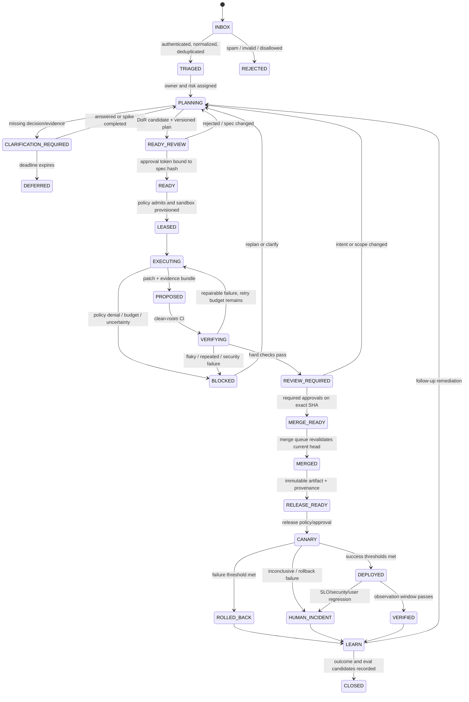

# Reusable Workflow Blueprint for a Mostly Agent-Managed Software Project

**Status:** evidence-reviewed implementation blueprint, synthesized from 14 validated research tracks.
**Operating principle:** agents propose, deterministic systems verify and enforce, and accountable humans decide intent and high-impact actions. A green agent-written test is evidence, not authorization.

## 1. Autonomy contract

Use these labels in every workflow and policy:

- **SAFE NOW** — suitable for unattended execution only inside a pre-approved capability profile, with immutable logs, bounded cost/retries, independent checks, and an automatic stop/rollback path.
- **CONDITIONAL** — may advance automatically only after a repository-specific pilot proves the task class, checks, and rollback. Sample successful cases for human audit.
- **HUMAN GATE** — an accountable person must approve the exact version/hash being acted on.
- **UNSUPPORTED** — evidence does not justify unattended operation. The agent may investigate and draft a proposal, but it may not decide or execute the consequential action.

**SAFE NOW:** intake normalization; deduplication; repository search; planning drafts; isolated read-only investigation; low-risk code proposals on a task branch; deterministic lint/test/scan; draft PR creation; known, idempotent operational runbooks with strictly bounded impact; automatic rollback on a predeclared canary failure.

**UNSUPPORTED:** autonomous roadmap/product intent; silent resolution of ambiguity; self-approval; alteration of its own gates, hidden tests, audit data, or credentials; direct protected-branch writes; general novel incident repair; irreversible data/schema operations; broad IAM/security changes; and end-to-end unattended issue-to-production ownership. Academic evidence measures candidate-patch competence, not safe ownership, and fresh/audited evaluations expose weak-oracle and contamination hazards ([SWE-Bench+](https://arxiv.org/abs/2410.06992), [SWE-bench Live](https://arxiv.org/abs/2505.23419)).

## 2. Lifecycle state machine

### State invariants

1. No transition to `READY` without a Definition of Ready record and approval token.
2. No coding lease exists for `PLANNING` or `CLARIFICATION_REQUIRED`. A disposable, read-only or isolated spike is allowed, but it must be labeled `prototype=true` and cannot become the production PR.
3. Approval binds `work_item_id + spec_revision + artifact/SHA + policy_version + expiry`. Any relevant change invalidates approval.
4. Only the control plane changes state. Agent prose never does.
5. Every terminal outcome is explicit: accepted, rejected, deferred, rolled back, escaped defect, duplicate, or policy denied.

This makes the issue an auditable contract rather than a prompt. GitHub itself recommends well-scoped tasks with complete acceptance criteria, and requires normal review of agent PRs ([task guidance](https://docs.github.com/en/copilot/using-github-copilot/coding-agent/best-practices-for-using-copilot-to-work-on-tasks), [review guidance](https://docs.github.com/en/copilot/using-github-copilot/coding-agent/reviewing-a-pull-request-created-by-copilot)).

## 3. Definition of Ready (DoR)

A ticket is `READY` only when all required items are checked, or a named exception is recorded.

### Problem and intent

- [ ] Reporter, decision owner, technical owner, repository, and affected service are named.
- [ ] The problem, affected user/system, observed behavior, and expected outcome are explicit.
- [ ] Value/priority and an appetite (time/cost ceiling) are set.
- [ ] Scope, non-goals, compatibility promises, and prohibited areas are explicit.
- [ ] Security, privacy, legal, and data sensitivity flags are complete.

### Evidence and acceptance

- [ ] A bug has a reproducible failing case on the pinned base SHA, or a named owner approves a documented reproduction exception.
- [ ] Acceptance criteria are observable, atomic, and written before implementation.
- [ ] Criteria include normal, negative/error, authorization, and relevant performance/operability paths.
- [ ] Each criterion maps to an independent test, fixture, manual observation, or telemetry query.
- [ ] Test commands, environments, protected fixtures/holdouts, and expected results are named.
- [ ] The authoring agent cannot weaken/delete the acceptance oracle without a new gate.

### Plan and boundaries

- [ ] Repository/history has been inspected and the likely change surface is listed.
- [ ] For a bug, the plan states a root-cause hypothesis and confidence. For a feature, it states design and alternatives/tradeoffs.
- [ ] API, schema, data migration, dependencies, infrastructure, permissions, and cross-service effects are listed.
- [ ] Tasks fit the configured one-repository/branch/PR/time/diff budget, or are decomposed into an acyclic child-task DAG.
- [ ] Parallel child tasks have disjoint writes; shared schema/invariants are serialized.
- [ ] Required tools, paths, egress domains, and secrets fit an existing capability profile.
- [ ] Stop conditions and escalation owner are named.

### Delivery and ownership

- [ ] Risk tier and required approvers are assigned.
- [ ] Rollout steps, canary cohort, success/failure/inconclusive thresholds, observation window, and rollback handle exist.
- [ ] SLOs/logs/metrics/traces needed to verify the change exist, or instrumentation is a prerequisite task.
- [ ] Reviewer/code owners and release owner are named.
- [ ] There are no unresolved blocking questions.
- [ ] Product owner approves behavior/no-gos; technical owner approves design/decomposition/evidence; specialists approve tier-specific concerns.
- [ ] The stored readiness token references the exact spec revision/hash.

Use structured issue forms to reject missing required intake data ([GitHub issue-form schema](https://docs.github.com/en/communities/using-templates-to-encourage-useful-issues-and-pull-requests/syntax-for-githubs-form-schema)). For larger work, store repository-native spec → plan → task artifacts; Spec Kit is one available mechanism, not proof of outcomes ([Spec Kit](https://github.com/github/spec-kit)).

## 4. Clarification loop

1. **Detect.** A deterministic validator or planner flags one of: missing product decision, contradictory requirement, irreproducible bug, non-observable acceptance predicate, unknown dependency, cross-team/cross-repo coupling, privilege expansion, estimate above limit, or unsafe rollback.
2. **Classify.** Separate an empirical unknown from a value/policy decision.
   - Empirical: agent proposes a time-boxed, isolated spike with question, method, budget, and expected artifact.
   - Value/policy/risk: route to the named human decision owner. The agent may present options and evidence but cannot choose.
3. **Ask one bounded question.** Include the missing fact, why it blocks readiness, evidence, 2–3 options with tradeoffs, recommended default, decision owner, and deadline.
4. **Persist.** Transition to `CLARIFICATION_REQUIRED`; revoke any implementation lease. Store question and answer as versioned events.
5. **Resolve.** Planner updates the spec, acceptance trace matrix, risks, and plan. The DoR runs again. Any prior READY token is invalid.
6. **Timeout.** Defer, narrow, split, or close with reason. Never guess and code.

**Proposal-first hard rule:** an implementation agent cannot open a production implementation PR until `READY`. It may only return a planning artifact or disposable spike. This matches evidence that a plan should be a deliverable followed by an explicit operator go ([pstack multi-phase plan](https://github.com/cursor/plugins/blob/main/pstack/skills/poteto-mode/playbooks/multi-phase-plan.md)).

## 5. Risk tiers and autonomy

| Tier | Typical work | Default autonomy | Required controls |
|---|---|---|---|
| **R0 Mechanical** | docs typo, formatting, generated-file refresh with deterministic oracle | **SAFE NOW** to branch, verify, and draft PR; **CONDITIONAL** auto-merge after pilot | no behavior change; small diff; current-head checks; easy revert; audit sample |
| **R1 Bounded low risk** | small bug with failing regression, test addition, patch/minor dependency update | **SAFE NOW** to propose; **CONDITIONAL** merge/canary | full DoR; clean-room CI; one independent reviewer during pilot; rollback proven |
| **R2 Material** | user-visible behavior, shared library, minor schema-compatible API, major dependency, multi-service | agent may plan/code in branch; **HUMAN GATE** at plan and PR/release | domain/code owner; broader tests; staged rollout; explicit compatibility and rollback |
| **R3 High/critical** | auth/crypto, payments, personal data, destructive migration, IAM, CI/workflow policy, infrastructure, public API break, package publish, Sev-1/2 repair | **PROPOSAL ONLY**; **HUMAN GATE** for plan, capability, PR, release; often two-person | specialist review; protected evidence; rehearsal/backup; tightly scoped credentials; incident commander |
| **R4 Unsupported/unknown** | ambiguous roadmap, novel autonomous prod repair, no usable oracle, irreversible/no rollback, agent changing own controls | **UNSUPPORTED** for execution | human-led work; agent limited to evidence gathering and draft proposals |

Risk escalates automatically for a large diff, changed tests/gates/CODEOWNERS, new package/registry/maintainer, permission or network expansion, cross-repository state, absent telemetry, flaky verification, or rollback uncertainty. It does not de-escalate by agent vote.

## 6. Roles and identities

- **Requester:** supplies problem/evidence. Cannot authorize capabilities merely by issue text.
- **Product owner:** owns value, priority, user behavior, compatibility, and no-gos.
- **Planner agent:** produces the versioned spec, questions, risk recommendation, DAG, verification and rollback plan. It has read-only repo access by default.
- **Readiness approver / technical owner:** validates feasibility, decomposition, acceptance oracle, and operability. It is accountable for the READY token.
- **Implementation agent:** receives only a READY task and scoped task identity. It writes one branch/worktree and returns a proposal. It cannot approve, merge, deploy, or edit control-plane policy.
- **Verifier identity:** clean CI principal, separate from the implementation agent. It rebuilds the patch at the exact SHA and signs results.
- **Reviewer:** independent human/code owner. AI review is advisory and cannot satisfy a required human count.
- **Security/data/operations specialists:** mandatory for R3 and relevant R2 changes.
- **Release controller:** deterministic GitOps/CI identity holding deploy capability only after environment policy is satisfied.
- **Incident commander:** human kill-switch owner for major incidents, ambiguous remediation, and rollback failure.
- **Workflow controller:** durable, non-LLM state machine. It owns leases, retries, budgets, gates, idempotency, and reconciliation.
- **Audit/eval curator:** reviews outcomes, sanitizes traces, curates holdouts, and approves changes to prompts/models/policies/evaluators.

Each agent run uses a short-lived identity bound to tenant/repo/branch/paths/tool verbs/egress/budget/expiry. External text is untrusted data. Tool calls pass a deterministic policy proxy; the prompt is not a security boundary. OWASP describes prompt injection and excessive agency as core risks ([prompt injection](https://genai.owasp.org/llmrisk/llm01-prompt-injection/), [excessive agency](https://genai.owasp.org/llmrisk/llm062025-excessive-agency/)).

## 7. Issue-to-PR workflow

1. **Intake — SAFE NOW.** Authenticate webhook actor; copy raw event; normalize and deduplicate; route security reports privately. Produce immutable `work_item` and correlation ID. No code assignment.
2. **Triage — CONDITIONAL.** Rules classify type, owner, priority hints, risk floor, affected repos, and budget. Humans retain product priority and abuse/disclosure decisions.
3. **Plan — SAFE NOW as proposal.** Planner reproduces/locates, drafts what/why/how, alternatives, child DAG, acceptance trace matrix, capability needs, rollout and rollback.
4. **Clarify / READY — HUMAN GATE.** Run DoR. Approvers sign the spec hash. A spec change returns to planning.
5. **Provision — SAFE NOW.** Fresh pinned container/VM/worktree; read-only base; locked dependencies; no production credentials; network deny by default; setup secrets removed before agent loop; wall-time/token/command/diff caps.
6. **Implement — SAFE NOW as proposal.** One leased owner edits a dedicated branch, records commands and assumptions, and runs focused checks. Scope/capability expansion stops the run.
7. **Clean-room verify — SAFE NOW.** Discard the authoring environment. Apply patch to a clean checkout; run format/type/unit/integration/contract/security/secret/dependency/license checks and protected regressions. A bug regression must fail on base and pass on candidate.
8. **Repair loop — CONDITIONAL.** Feed structured failures back for at most `N` classified attempts. Never retry policy denials, ambiguity, deterministic repeated failures, security findings, or unknown side effects.
9. **Draft PR — SAFE NOW.** Include issue/spec hash, plan conformance, risk tier, diff summary, acceptance matrix, dependency changes, tests, provenance, cost, open risks, and rollback. Use a separate publisher identity.
10. **Review — HUMAN GATE by default.** Reviewer inspects semantics and tests, not only summary. R2/R3 requires specialists. New commits invalidate approval and checks.
11. **Merge queue — CONDITIONAL for R0/R1 only.** Protected rules revalidate the exact current head. The authoring agent cannot approve or merge. GitHub’s cloud agent uses this strong handoff by default ([risks and mitigations](https://docs.github.com/en/copilot/concepts/agents/cloud-agent/risks-and-mitigations), [protected branches](https://docs.github.com/en/repositories/configuring-branches-and-merges-in-your-repository/managing-protected-branches/about-protected-branches)).

## 8. Dependency and security maintenance

1. Build a versioned dependency graph/SBOM on merge and schedule, including direct/transitive packages, containers, Actions, build tools, dev dependencies, owner, criticality, exposure, and digest.
2. Normalize SCA/SAST/secret/IaC/container alerts by package/advisory/path/fixed version. Record scanner/version/timestamp.
3. Rank with actual resolved path/reachability, fix availability, KEV, EPSS, exposure, and business impact—not CVSS alone ([CISA KEV](https://www.cisa.gov/known-exploited-vulnerabilities-catalog), [EPSS](https://www.first.org/epss/model)).
4. Bot proposes the minimum fixed version for a vulnerability. Group only compatible low-risk updates. Routine releases may use a cooling period; urgent exploited vulnerabilities follow the incident SLA.
5. Rebuild lockfile in a restricted environment and run compatibility/security/license/provenance checks. Dependency review can block new vulnerable/disallowed dependencies ([GitHub dependency review](https://docs.github.com/en/code-security/supply-chain-security/understanding-your-software-supply-chain/about-dependency-review)).
6. **CONDITIONAL auto-merge:** R0/R1 patch/minor update, known registry/maintainer, no lifecycle/workflow change, complete lockfile, all independent checks, canary and rollback, and proven repository history. Renovate supports policy-driven automerge, but the project must supply the safety policy ([Renovate automerge](https://docs.renovatebot.com/key-concepts/automerge/)).
7. **HUMAN GATE:** major version; runtime-critical/auth/crypto/database/network package; new package/registry/maintainer; install/build/workflow script; broad transitive churn; generated semantic fix; no-fix or conflicting scanners.
8. A scanner/autofix is a proposal. GitHub explicitly warns CodeQL Autofix may be incorrect or insecure ([responsible use](https://docs.github.com/en/code-security/code-scanning/managing-code-scanning-alerts/responsible-use-autofix-code-scanning)). A green latest version does not prove supplier trust; the event-stream compromise is the counterexample ([incident](https://blog.npmjs.org/post/180565383195/details-about-the-event-stream-incident)).

## 9. CI-failure repair

1. Trigger only from a completed CI event on an allowlisted branch/repository. Deduplicate by workflow/run/job/head SHA/failure fingerprint.
2. Classify: infrastructure/transient, flaky, deterministic code regression, dependency/setup, policy/security, or unknown.
3. **SAFE NOW:** rerun once for a known transient; gather logs; localize; propose a patch for deterministic low-risk failures. Start from the failing immutable SHA.
4. Validate in a second clean environment. Ensure bot commits retrigger required checks. Block recursive bot-on-bot loops.
5. **CONDITIONAL:** up to 2–3 repair attempts inside unchanged scope/capabilities and cost budget. Each attempt is a child record, not a rewritten history.
6. **HUMAN GATE:** workflow/test-gate changes, flaky/irreproducible failure, security finding, secret/network request, broad refactor, repeated same failure, head drift, or missing product oracle.
7. **UNSUPPORTED:** granting more privilege simply because CI failed, modifying protected tests to green, auto-deploying a novel repair, or running unreviewed agent-authored workflows with secrets. GitHub’s default approval for agent-authored Actions should remain enabled, and Actions tokens must be least privilege ([Actions hardening](https://docs.github.com/en/actions/security-for-github-actions/security-guides/security-hardening-for-github-actions)).

## 10. Observability-to-remediation

1. Instrument logs, metrics, traces, release/change IDs, feature flags, artifact digest, PR and agent-run ID through OpenTelemetry/W3C context ([OpenTelemetry](https://opentelemetry.io/docs/specs/otel/overview/), [W3C Trace Context](https://www.w3.org/TR/trace-context/)). Redact at source and monitor collector drops.
2. Detect user-impact/SLO symptoms with persistence, hysteresis, missing-data rules, dedupe, and an error-budget policy.
3. Enrich with recent deploy/config/topology and similar resolved incidents. Preserve raw evidence/provenance.
4. Deterministic rules match known signatures first. An RCA agent ranks hypotheses with citations and uncertainty; correlation is not cause.
5. **SAFE NOW:** execute only a versioned, idempotent, recently drilled runbook for a known signature and a bounded resource. Examples: restart one unhealthy replica, scale within fixed bounds, disable a pre-approved flag, abort a canary, or select the last attested artifact.
6. Preflight lock/dedupe, desired state, current actions, freeze window, blast/error budget, backup, and compensator. Use short-lived least-privilege action credentials.
7. Verify postconditions and SLO recovery. Stop after one failed action or conflicting/missing signals.
8. Code defects re-enter `PLANNING → READY → PR → CI → CANARY`. Never patch production directly.
9. **HUMAN GATE:** unknown/ambiguous cause, stateful/destructive/global/security action, customer communication, novel code, multiple regions, rollback failure, or Sev-1/2.
10. **UNSUPPORTED:** general autonomous diagnosis-to-production repair. In ITBench, the best tested model achieved only 13.81% diagnosis and 11.43% mitigation pass@1 and 0% hard repair in the evidence set. Sentry’s practical boundary is RCA/plan/draft PR, not auto-merge/deploy ([Sentry Seer](https://docs.sentry.io/product/ai-in-sentry/seer/autofix/)).

## 11. Release and deploy

1. Merge queue emits a signed immutable artifact, SBOM and provenance. Do not rebuild differently between approval and deploy; otherwise re-attest.
2. GitOps/release controller—not the coding agent—holds environment credentials and reconciles reviewed desired state.
3. Deploy dev/staging, then shadow if side effects can be suppressed, then the smallest representative canary.
4. Predeclare PASS, FAIL, and INCONCLUSIVE thresholds for errors, latency, saturation, security and business guardrails; cap exposure/time/spend/error budget.
5. **SAFE NOW:** machine promotion between low-risk stages when all predicates are objective and healthy.
6. **CONDITIONAL:** R0/R1 production promotion after local evidence, proven automatic rollback, no freeze, and policy approval.
7. **HUMAN GATE:** R2/R3 production, migrations, permissions, public API, billing, auth, safety controls, exhausted error budget, or INCONCLUSIVE analysis. Protected environments enforce named approval ([GitHub environments](https://docs.github.com/en/actions/reference/workflows-and-actions/deployments-and-environments)).
8. Argo Rollouts is one implementation for metric-gated pass/abort/pause; inconclusive must pause, not become success ([analysis](https://argo-rollouts.readthedocs.io/en/stable/features/analysis/)).

## 12. Rollback

A rollback plan is part of READY, not an incident-time invention.

- Record last-known-good artifact/config/schema, rollback command/runbook, owner, maximum recovery time, validation queries, data compatibility window, and conditions where rollback is unsafe.
- Automatic rollback is **SAFE NOW** only for a canary to an already attested compatible artifact or a pre-approved reversible flag/config change.
- Every action uses `incident_id/action_id/attempt` idempotency, a per-resource lock, intent/outbox record, and postcondition check.
- Halt downstream deploys, preserve evidence, announce state, and verify user-facing SLO recovery after rollback.
- **HUMAN GATE:** destructive or backward-incompatible schema/data changes, irreversible external effects, corrupted data, cross-region failover, rollback that also fails, or control-plane impairment.
- A failed rollback transitions to `HUMAN_INCIDENT`; the agent cannot repeat blindly or approve a forward fix.

## 13. Feedback-to-eval improvement loop

`OBSERVE → TRIAGE → LEARN → CURATE → PROPOSE → OFFLINE_VERIFY → GATE → SHADOW/CANARY → VERIFY → REVIEW`

1. Correlate each run/change/deploy with model, prompt, tools, policy, image, base SHA, inputs, outputs, cost, tests, reviewer edits, SLO/user outcome, and retention class.
2. Deduplicate and classify feedback. A thumbs-up/down is not ground truth. Privacy-sensitive/high-impact feedback gets human adjudication.
3. For incidents/repeated failures, write a blameless timeline and owned actions. Convert a reproduced failure into a minimized, de-identified eval candidate ([Google SRE postmortem culture](https://sre.google/sre-book/postmortem-culture/)).
4. Curate provenance/consent/license, independent labels, slice tags, temporal/project holdouts, and a signed dataset changelog. Keep failed experiments as evidence, not automatic training data.
5. Agent drafts a minimal prompt/router/tool/code/runbook/policy change with hypothesis, expected metric, exposure, and rollback. It cannot edit hidden evals, approval policy, or audit logs.
6. Run deterministic checks plus repeated stochastic trials, adversarial/metamorphic slices, cost/latency comparisons, and capability vs near-100%-pass regression suites. Calibrate LLM graders against blinded experts ([OpenAI eval practices](https://developers.openai.com/api/docs/guides/evaluation-best-practices), [Anthropic agent evals](https://www.anthropic.com/engineering/demystifying-evals-for-ai-agents)).
7. Reject any safety invariant regression. A composite score alone cannot promote.
8. Shadow, then canary the workflow/model/policy version. Predeclare success/failure/inconclusive rules and kill switch.
9. **HUMAN GATE:** new rubric/ground truth, grader disagreement, evaluator/model change, permissions, policy, dependency, security, high blast radius, or exhausted error budget.
10. Review drift, recurrence, exception expiry, evaluator quality, and sampling monthly. Agents remain proposal-first; recursive self-modification is **UNSUPPORTED**.

## 14. Event and control-plane data model

Use a durable workflow engine or transactional database/outbox. Do not use chat history as project state. Delivery is generally at-least-once, so external effects require idempotency and reconciliation.

### Core records

| Record | Required fields |
|---|---|
| `work_item` | `id`, `tenant`, `source_event_id`, `idempotency_key`, `type`, `repo`, `base_sha`, `requested_outcome`, `provenance`, `untrusted_content_refs`, `owner_ids`, `risk_tier`, `priority`, `budget`, `state`, `created_at` |
| `spec_revision` | `id`, `work_item_id`, `revision`, `content_hash`, `problem`, `scope`, `non_goals`, `acceptance_criteria[]`, `oracle_refs[]`, `plan_dag_ref`, `dependencies[]`, `capabilities_requested[]`, `rollout`, `rollback`, `open_questions[]` |
| `readiness_decision` | `spec_hash`, checklist results/exceptions, approver principals/roles, decision, timestamp, expiry, signature |
| `step_attempt` | `step_id`, `attempt`, `lease_owner`, `agent/model/prompt/tool/image/policy versions`, `input_hashes`, `capability_lease_id`, `started/heartbeat/ended`, `status`, `cost`, `failure_class` |
| `capability_lease` | principal, repo/branch/path scopes, tool verbs, egress domains/methods, secret handles, CPU/time/token/diff limits, issued/expiry/revoked, policy digest |
| `artifact` | type, immutable URI, digest, producer identity, source/base SHA, SBOM/provenance/signature, retention/data class |
| `verification` | artifact/SHA, gate manifest version, check name, independent runner identity, result, logs, flake evidence, timestamp/signature |
| `approval` | exact artifact/spec/policy hashes, action scope, principal/role/quorum, reason, issued/expiry, invalidated_by |
| `side_effect` | action ID/idempotency key, resource, intent/outbox, preconditions, request digest, remote receipt, result, compensator, reconciliation state |
| `deployment` | artifact digest, environment/cohort, change/release IDs, thresholds, observation window, current/desired state, rollback handle, outcome |
| `telemetry_case` | trace/incident/alert IDs, service/release, raw evidence refs, hypotheses/confidence, SLO impact, dedupe key, owner |
| `outcome_eval` | retained/reverted/incident/escape label, reviewer edits, user/SLO outcome, eval-candidate status, consent/provenance, dataset version |
| `audit_event` | append-only sequence, event type, actor, work item/attempt, previous/new state, input/output hashes, denial/exception, timestamp |

### Controller rules

- Validate webhook signatures and unique event IDs.
- One durable workflow per work item; store large artifacts outside workflow history by digest.
- Typed DAG nodes declare schemas, dependencies, owner/capabilities, timeout/heartbeat, maximum attempts, side-effect class, and gate.
- Lease with heartbeat; reclaim only after expiry. Joins, risk assignment, and policy are deterministic.
- Retry only classified transient failures with capped exponential backoff/jitter. Invalid input, policy denial, budget exhaustion, deterministic failure, and unknown side effect go to clarification/dead letter.
- Before retrying a side effect, reconcile the remote receipt. Never blindly replay merge/deploy/secret rotation.
- A controller loop reconciles desired `approved SHA deployed and healthy` with actual repo/CI/deployment state.
- Pin versions for replay. Curated memory has namespace, provenance, confidence, ACL, TTL, and deletion; raw agent transcript is non-authoritative.

A conventional control plane should contain the probabilistic agents, not the reverse. Temporal documents durable execution and event history; Kubernetes documents reconciliation ([Temporal](https://docs.temporal.io/workflow-execution/event), [Kubernetes controllers](https://kubernetes.io/docs/concepts/architecture/controller/)).

## 15. Human gates and exception policy

### Mandatory gates

- **Intent/readiness:** ambiguous behavior, priority/value tradeoff, unresolved oracle, architecture, cross-repo work.
- **Capability escalation:** any new repo/path write, network domain, secret, MCP/A2A peer, cloud/production role, sandbox exception.
- **Specialist change:** auth/crypto, secrets/IAM, privacy/legal, billing, public API, database/data migration, infrastructure, workflow/agent policy, dependency/supply-chain exception.
- **PR:** all generated behavior changes during rollout; all R2/R3 indefinitely unless strong local evidence changes policy.
- **Release:** all R2/R3 production and any missing rollback/observability.
- **Incident:** unknown cause, missing/conflicting signals, repeated action, rollback failure, Sev-1/2.
- **Control evolution:** model/prompt/router/tool/image/policy/evaluator/memory-schema changes.

Humans approve the exact artifact and scope. Requester, authoring agent, verifier, and approver identities remain distinct. GitHub’s design proves this separation is implementable: the coding agent cannot approve or merge its own PR and workflows wait for authorized approval by default ([GitHub risk controls](https://docs.github.com/en/copilot/concepts/agents/cloud-agent/risks-and-mitigations)).

### Exception record

An exception must contain: `exception_id`, exact failed rule/check and hashes, business/incident reason, owner, risk tier, alternatives considered, bounded scope, compensating controls, start/expiry, rollback/kill switch, required approvers, and follow-up ticket/eval.

- Default outcome is deny.
- The authoring agent cannot request and approve its own exception.
- No permanent wildcard exception. Expired exceptions fail closed.
- No bypass for audit deletion, secret exposure, self-approval, unknown artifact, or unreviewed irreversible action.
- Emergency break-glass needs the incident commander, narrow reversible patch/action, logged rationale, two-person confirmation where feasible, and a post-incident DoR/spec/eval backfill within a set SLA.
- Review active exceptions weekly; trend count, age, recurrence, and resulting incidents.

## 16. Minimum viable and advanced stacks

### Minimum viable stack

- GitHub or GitLab issues with required forms/templates, labels/states, CODEOWNERS and protected branches/rulesets.
- One hosted coding agent or isolated self-hosted OpenHands runner, limited to one task/branch/draft PR. OpenHands supports issue label/mention intake and PR handoff ([GitHub integration](https://docs.openhands.dev/openhands/usage/cloud/github-installation)).
- CI in GitHub Actions/GitLab CI with least-privilege tokens, clean jobs, locked dependencies, required unit/integration/lint/type checks, secret/SAST/dependency/license scans.
- Renovate or Dependabot for maintenance.
- A small controller service plus Postgres: webhook verification, state machine, idempotency, budget/retry policy, approval hashes, outbox, audit events.
- Ephemeral container/VM/worktree; network deny/allowlist; short-lived repository token; no production credentials.
- Artifact/object store for logs, diffs, attestations, SBOM and eval fixtures.
- OpenTelemetry correlation plus existing monitoring/incident tool.
- Existing CD with protected environments, canary and tested rollback.

**Do not build first:** free-form multi-agent swarms, autonomous production access, self-modifying policies, or a universal confidence score. Start with one planner and one implementation agent; add roles only at objective boundaries.

### Advanced stack

- Durable orchestration such as Temporal; per-capability/version queues, leases/heartbeats, dead letters, sagas/compensators, and reconciliation controllers.
- OPA or equivalent policy-as-code gateway for every shell/network/repo/cloud action ([OPA](https://www.openpolicyagent.org/docs)).
- Credential broker with OIDC, short TTL and downstream authorization; egress proxy/private registry mirrors; stronger VM/microVM isolation.
- Typed plan DAG and artifact schemas; signed commits/attestations and SLSA provenance ([SLSA 1.2](https://slsa.dev/spec/v1.2/)).
- Independent specialist agents for localization, tests, security and review only where an objective verifier exists; compare their marginal value against a single-agent baseline.
- GitOps plus Argo Rollouts; feature flags; SLO/error-budget engine; deterministic remediation runbook catalog.
- OTel trace warehouse, prompt/model/tool registry, annotation queue, versioned eval datasets, blinded expert adjudication, offline replay and shadow/canary for control-plane releases.
- Multi-tenant quotas, cost attribution, compliance retention/deletion, anomaly detection and a global kill switch.

## 17. Staged rollout

### Stage 0 — Baseline and controls (2–4 weeks)

- Measure 4–8 prior weeks if available: cycle time by state/task class, review minutes, CI cost, rework/reopen, revert, escaped defect, incidents and security findings.
- Define taxonomy, R0–R4, DoR, ownership, required checks, branch/environment protection, capability profiles, audit retention and kill switch.
- Threat-model issue/repo/log/tool content as untrusted. Test token and workflow protections.
- Exit: 100% of pilot tasks have immutable IDs, risk owner, acceptance method, and traceable baseline.

### Stage 1 — Shadow planning

- Planner drafts specs/questions/DAGs but humans continue existing work. Compare plan completeness, missed constraints, and clarification quality.
- No code or write credentials.
- Exit: agreed readiness precision, no unresolved critical security gaps, and planner reduces rather than increases planning/review time.

### Stage 2 — Proposal-only R0/R1

- Agent codes only READY tickets in sandboxes and opens draft PRs. All PRs get human review; no auto-merge/deploy. Cap concurrency, retries, spend and diff.
- Randomize or stagger eligible tasks against the baseline where practical.
- Exit after sufficient local sample: acceptable retained-change rate, escaped defects no worse than baseline, bounded tail cost, and no unauthorized side effect.

### Stage 3 — Conditional low-risk autonomy

- Allow R0 and proven R1 classes to auto-merge after independent checks; keep sampled human audit. Canary and automatic rollback remain mandatory.
- Add dependency patch/minor updates and classified CI repair separately, each with its own metrics and rollback.
- Revoke a class automatically when escape/revert/policy-denial thresholds breach.

### Stage 4 — Operations proposals and known runbooks

- Connect telemetry to RCA/draft-PR. Auto-run only known, idempotent, bounded operational runbooks after drills. Novel repairs remain human-led.
- Measure diagnosis precision and actual recovery, not number of suggestions.

### Stage 5 — Advanced orchestration and governed improvement

- Add durable multi-agent DAGs only where single-agent failure data supports them. Replay production traces offline; canary model/prompt/policy changes.
- Never graduate R4. Re-evaluate R2/R3 autonomy only with denominator-based local evidence, specialist sign-off, and demonstrated rollback.

## 18. KPIs and decision rules

Report medians, p95/tails, denominators, confidence intervals where meaningful, and slices by risk/task class/repository/model. Pair throughput with stability; do not use LOC, PR count, merge rate, or tokens alone. DORA evidence shows perceived/local gains can coexist with worse throughput and stability ([2024 DORA report](https://dora.dev/research/2024/dora-report/)).

### Planning and flow

- `% tickets entering implementation with valid READY token` — target 100% outside logged emergencies.
- DoR first-pass rate; clarification rate; unanswered clarification age.
- Planning lead time, time by state, queue age p50/p95.
- Scope-change-after-READY and return-to-planning rate.
- Acceptance criteria changed after code started — target near zero.
- Decomposition defects: cross-PR conflicts, dependency cycles, shared-write collisions.

### Quality and safety

- Candidate success, accepted-and-retained at 30 days, and human rescue rate by tier.
- Rework, reopen, revert/rollback and escaped-defect rates.
- Regression failing-on-base/passing-on-candidate coverage.
- Flake rate; false-green/false-red adjudication; test/gate tampering attempts.
- Security-policy denials, unauthorized side effects (**target zero**), secret findings and provenance completeness.
- Human-review finding rate and reviewer edits by severity; sampled auto-merge precision.

### Delivery and operations

- Deployment frequency, change lead time, change-failure rate and recovery time, always sliced by agent/human and risk tier.
- Canary abort/inconclusive/false-decision rate and exposure before rollback.
- SLO/error-budget delta; incident recurrence; rollback success and time.
- RCA top-hypothesis precision; known-runbook success; novel-remediation escalation rate.

### Economics and loop health

- Cost per accepted retained change = `(agent/model + sandbox/CI + orchestration/ops + human spec/review/rework + expected incident loss) / retained changes`.
- Tokens, CI minutes, wall time, retries, reviewer/on-call minutes p50/p95.
- Marginal quality and cost of multi-agent vs single-agent baseline.
- Production failures converted into reviewed evals; signal→triage→eval→approved-change time.
- Grader-to-expert agreement by slice; dataset freshness/leakage/provenance; policy/model canary aborts.
- Exception count/age/recurrence and expired exceptions remaining open (**target zero**).

**Promotion rule:** predeclare thresholds per task class. Require stable or improved escaped-defect/change-failure/SLO results, a material cycle-time or cost benefit, adequate sample size, successful rollback drills, and zero critical unauthorized actions. Otherwise hold or roll back autonomy. Field productivity evidence is mixed, including a 19% slowdown in an early-2025 experienced-maintainer RCT, so local controlled measurement is required ([METR](https://metr.org/blog/2025-07-10-early-2025-ai-experienced-os-dev-study/)).

## Final boundary

This design can make a project **mostly agent-operated at the proposal, execution, verification, triage, and routine-maintenance layers**. It must remain **human-accountable at intent, readiness, privilege expansion, high-risk review/release, novel incident command, and control-policy evolution**. That is not a temporary UX preference. It is the supported boundary of the evidence: present systems reliably hand off bounded candidate changes; no reviewed source validates a fully autonomous plan→production→observe→repair→learn software project.
